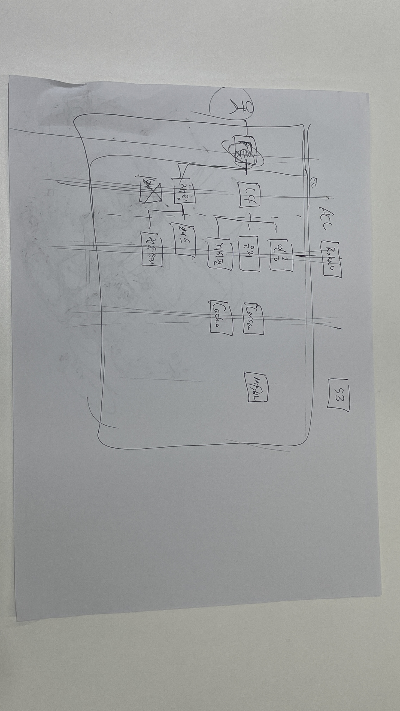

# 전체 시스템 설계

마지막 업데이트 날짜: 2023-07-28  
작성자: 김예진

> **목차**
>
> 1. [설계 변천사](#설계-변천사)
> 2. [손그림](#손그림)
> 3. [v1 - 손그림 디지털화](#v1---손그림-디지털화)
> 4. [v2 - V1 추상화](#v2---v1-추상화)
> 5. [컨님 그림](#컨님-그림)
> 6. [v3 - 레이어 적용](#v3---레이어-적용)
> 7. [v4 - v3 업데이트](#v4---v3-업데이트)
> 8. [v5 - monolithic architecture로 수정](#v5---monolithic-architecture로-수정)

# 설계 변천사

## 배경

# 손그림

# v1 - 손그림 디지털화

# v2 - V1 추상화

# 컨님 그림

# v3 - 레이어 적용

# v4 - v3 업데이트

# v5 - monolithic architecture로 수정

