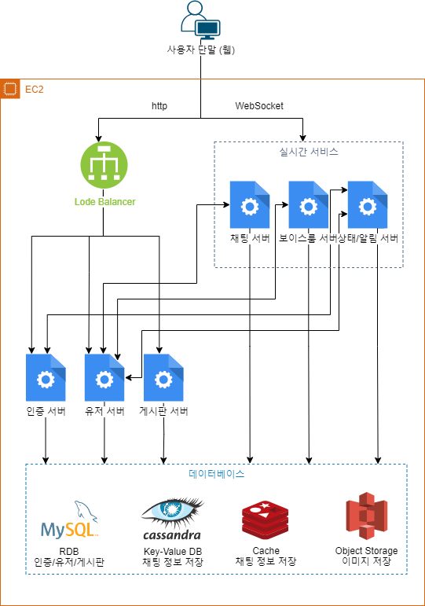
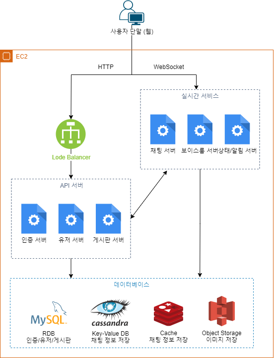
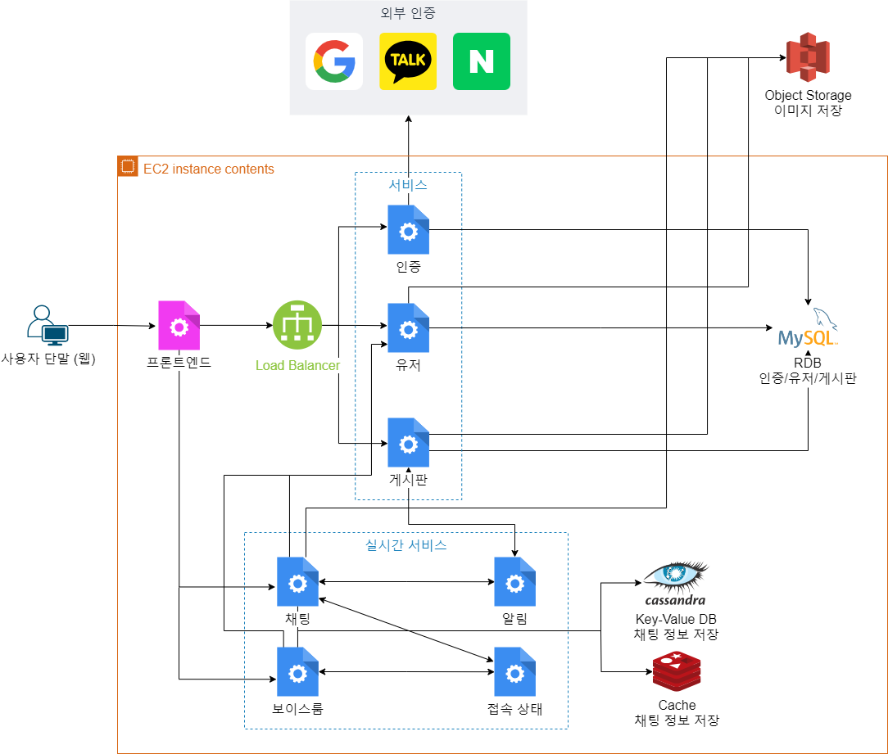
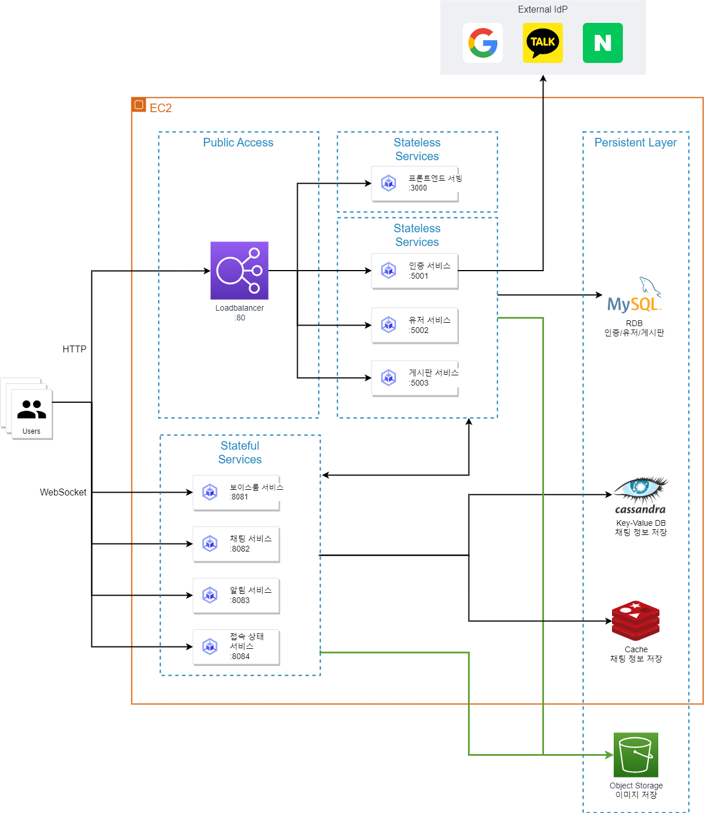
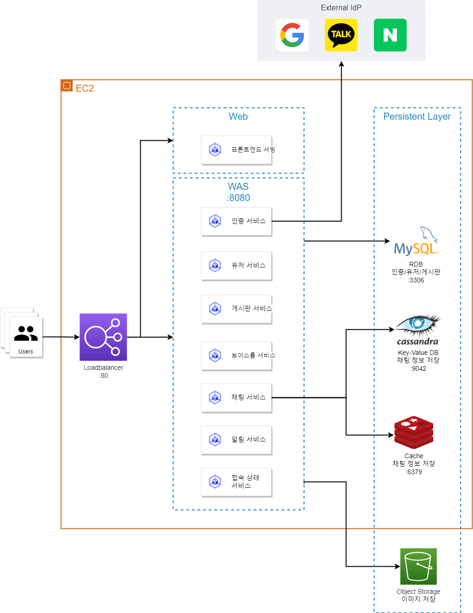
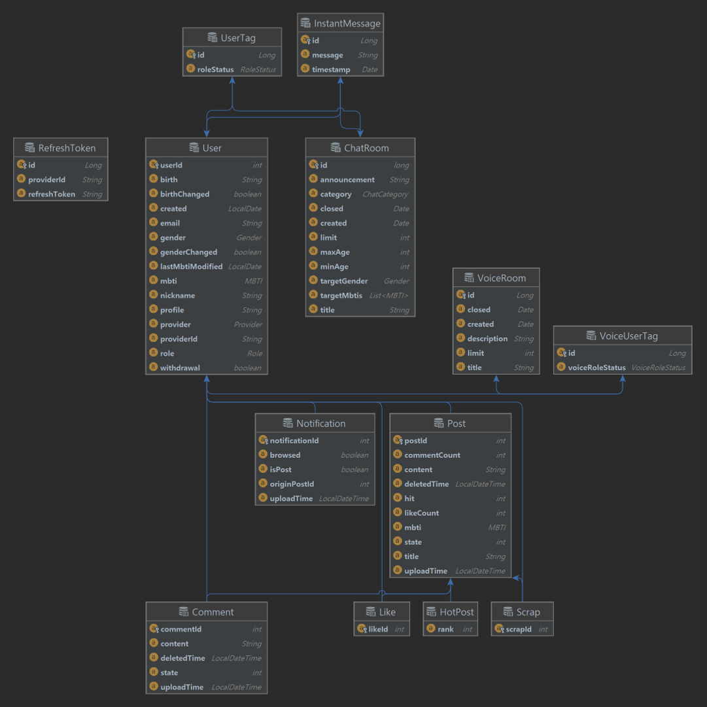
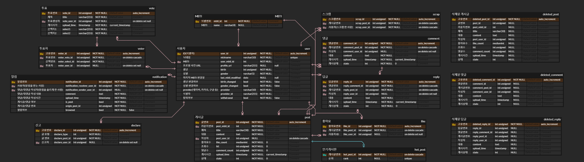

# 설계

## 링크 바로 가기

> 1. [시스템 설계](system-architecture.md)
>    - [architecture.drawio](system-architecture/architecture.drawio)
> 2. [데이터베이스 설계](database.md)

# 설계 미리보기

|                       v1                       |                       v2                       |                       v3                       |                       v4                       |                       v5                       |
| :--------------------------------------------: | :--------------------------------------------: | :--------------------------------------------: | :--------------------------------------------: | :--------------------------------------------: |
|  |  |  |  |  |

# ERD 미리보기

## WeHee ERD

## 우리집(게시판) 관련 확장된 ERD

