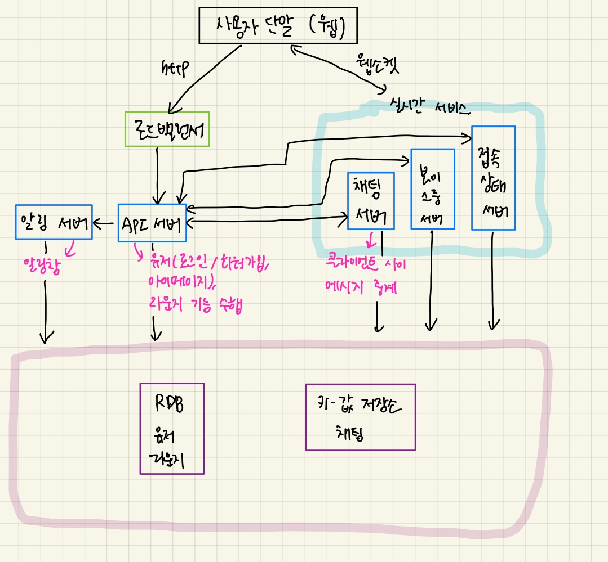

# 전체 시스템 설계

> **목차**
>
> 1. [설계안](#설계안)
> 2. [기능적 시스템 분류](#기능적-시스템-분류)
>    1. [라운지](#라운지)
>    2. [채팅](#채팅)
>    3. [보이스룸](#보이스룸)
> 3. [기술적 시스템 분류](#기술적-시스템-분류)
>    1. [무상태 서비스](#무상태-서비스)
>    2. [상태유지(stateful) 서비스](#상태유지stateful-서비스)

# 설계안

# 기능적 시스템 분류

## 1. 라운지

라운지 기능에 대한 설계는 [여기](lounge/README.md)를 참고하세요.

## 2. 채팅

라운지 기능에 대한 설계는 [여기](chatting/README.md)를 참고하세요.

## 3. 보이스룸

라운지 기능에 대한 설계는 [여기](voice-room/README.md)를 참고하세요.

# 기술적 시스템 분류

## 1. 무상태 서비스

- 기능
  - 유저(로그인, 회원가입, 사용자 프로파일 표시)
  - 라운지
- 무상태 서비스는 로드밸런서 뒤에 위치
  - 로드밸런서: 요청을 그 경로에 맞는 서비스로 이동시킴

## 2. 상태유지(stateful) 서비스

- 기능
  - 채팅
  - 보이스룸
- 각 클라이언트가 채팅 서버와 독립적인 네트워크 연결 유지

