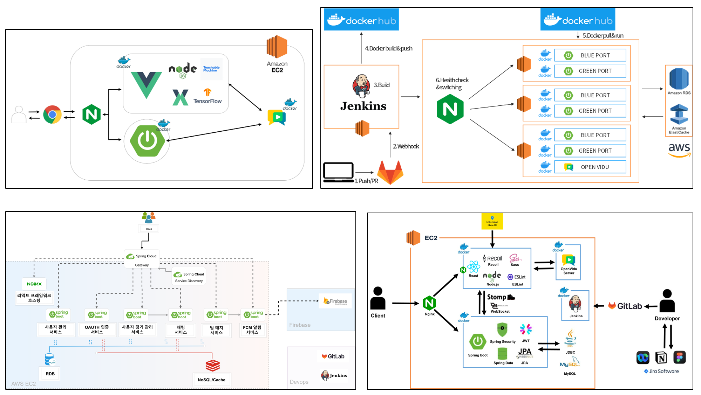
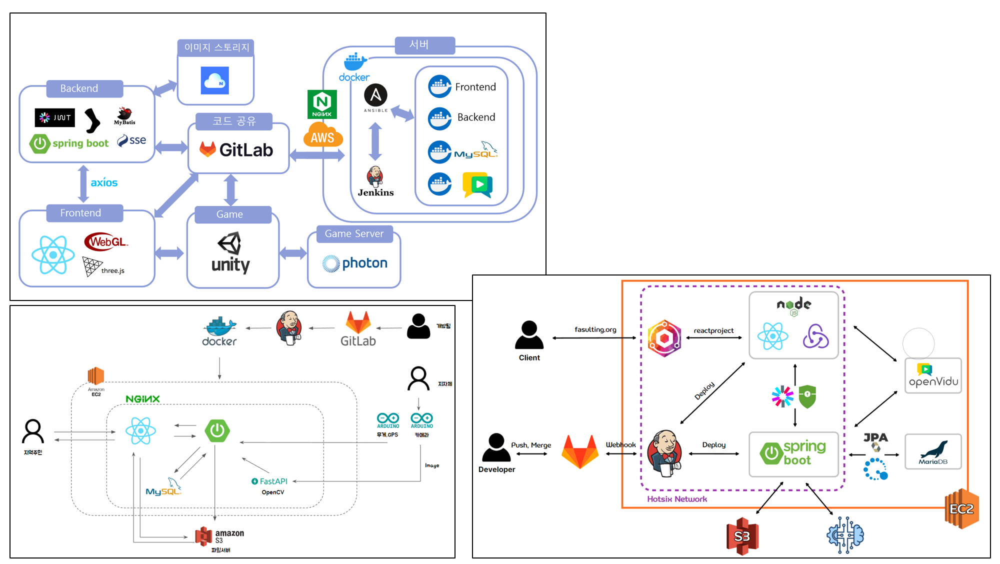

# 전체 시스템 설계

마지막 업데이트 날짜: 2023-07-31  
작성자: 김예진

> **목차**
>
> 1. [설계 변천사](#설계-변천사)
>    1. 배경
>    2. 이 그림들의 문제는?
>    3. 어떤 그림을 그리고 싶은가?
>    4. 이 글에서의 주의사항
> 2. [손그림](#손그림)
>    1. 손그림 의도
>    2. 질의 결과
> 3. [v1 - 손그림 디지털화](#v1---손그림-디지털화)
>    1. v1 의도
>    2. v1 피드백
> 4. [v2 - V1 추상화](#v2---v1-추상화)
>    1. v2 의도
>    2. v2 피드백
> 5. [컨님 그림](#컨님-그림)
>    1. 컨닠 그림 설명
>    1. 컨님 그림에 이은 피드백
> 6. [v3 - 레이어 적용](#v3---레이어-적용)
>    1. v3 의도
>    2. v3 피드백
> 7. [v4 - v3 업데이트](#v4---v3-업데이트)
>    1. v4 의도
>    2. v4 피드백
> 8. [v5 - monolithic architecture로 수정](#v5---monolithic-architecture로-수정)
>    1. v5 의도
>    2. 설계도를 직접 그려본 후기

# 설계 변천사

## 배경

위의 그림들은 [SSAFY 공통 프로젝트 우수작들의 설계도](#아키텍처-출처)이다. 공통 프로젝트 기획 발표를 앞두고 이 설계도 그림들을 참고해 우리 팀의 설계도를 그려보기로 했다. 발표를 위해 설계도 그림을 준비하게 됐다지만, 그래도 이 그림들을 그리는 목적이 무엇인지는 알아야 하지 않겠는가? [가상 면접 사례로 배우는 대규모 시스템 설계 기초](../review/study/system-design-interview.md)에서 읽고 배운대로, 이번 시스템 설계도 그리기 작업에서는 `시스템이 어떤 요구사항에 의해 만들어지고 관리되는지를 중점으로` 그림을 이해하고 직접 그려보기로 했다.

## 위 그림들의 문제는?

### 1. 'CI/CD를 수행했음'만을 강조

7개 그림들의 특징이 각기 달라 '모든 그림들이 가지고 있는 문제'라고는 하지 못하겠지만, 전체적으로 CI/CD를 하고 있다는 점을 '강조'하기 위한 수단으로 그림이 그려졌다는 생각이 들었다. 거의 모든 그림이 User에서부터 시작해 EC2 내부로 이어지고 그 이후부터는 1. 어떤 프로세스를 거쳐 다시 User에게 정보가 전달되거나 2. 개발자가 코드를 업로드하면 EC2 내부로 변경 내역이 전달되는 식으로 그림이 나뉘어졌다.

### 2. 시스템 설계와 관련 없는 기술 스택 나열

아무래도 개발자가 어떤 것을 할 줄 아는지 가장 직관적으로 표현하기 좋은 수단이 '그림'이니만큼, 설계 단계에서 거의 유일한 그림인 시스템 설계도에서 자신이 사용한/사용할 줄 아는 기술스택들을 모두 그림에 넣어버리는 경향이 생겨버리는 것이 아닌가 하는 생각이 든다. 그렇게 되면 시스템 설계에는 설계 자체에는 필요 없는 기술 스택의 로고가 무작위적으로 추가될 수 밖에 없는데, 그러는 순간부터 그림은 원래 의도와는 달리 틀려진다. 

위 그림들 중 도커로 여러 기술 스택을 감싼 경우를 보면 그림이 의도가 '설계'와는 다르다는 것을 쉽게 알 수 있다. 도커는 React도 컨테이너로 만들어 관리하고 ESLint도 컨테이너로 만들어 관리하는가? 프론트엔드 코드를 만들어 도커로 감쌌다는 것을 표현한 의도는 대강 이해할 수 있겠다만, 엄밀하게 그 그림은 틀린 정보를 담고 있다.

### 3. 적절한 시스템 설계도 예시가 없음

이것은 위의 그림을 그린 사람들의 잘못이 아니라 환경의 문제이다. `시스템을 설계`한다는 것은 배포와 그 이후 운영까지 고려한다는 것이고, 이 부분은 학부(대학생, 신입으로 취업을 준비하는 취준생) 수준에서 고려하기 어렵기 때문이다. 게다가 단순히 서비스를 만드는 것이 목적인 경우 시스템까지 고려하는 것은 능력과 요구사항 밖의 일이기도 하다. 어쩌다 운영에 대한 비기능적 요구사항까지 고려하면서 프로젝트를 진행한다고 하더라도, '좋은 시스템'이 무엇인지 배워보거나 생각해본 경험이 없는 이들은 예시들을 찾아보면서 어깨 넘어 배울 수밖에 없다.  

그리하여 나온 그림들이 바로 위의 그림들이다. 설계한 것은 보여 주고 싶고, 공개된 예시들은 모두 CI/CD를 하는 것과 사용하는 기술 스택들을 나열하는 것 뿐이니 이런 그림이 나오게 되는 것이다. 우리는 더 좋은 예시가 필요하다.

## 어떤 그림을 그리고 싶은가?

시스템 설계도의 목적 자체에 충실한 그림을 그리고 싶다. 유저가 WeHee의 기능을 이용하고자 할 때 어떤 과정을 거쳐서 기능이 실행되게 되는지, DB와는 어떻게 연동이 되는지, 그리하여 어떻게 유저에게 서비스가 제공되는지 그리는 것이다. 그리고 서비스가 어떻게 구현과 연동되는지 직관적으로 알 수 있게 하는 것이 목표이다. 여기서 지양하고자 하는 점은 거창한 그림을 그리려 하거나, 사용하는 기술 스택들을 단순히 나열하는 것이다.

## 이 글에서의 주의사항

이 글은 내가 설계도를 그리며 하던 고민들, 오가던 대화들을 복기해 작성하는 글이다. 따라서 작성자인 나의 역량에 따라 내가 이해하지 못한 부분은 틀리게 적거나 아예 누락해서 적을 수도 있다.

# 손그림

## 손그림 의도

사용자가 서비스에 접근하려고 할 때 어떤 서버들을 거치게 되는지, 서버들의 종류는 어떤 특성으로 어떻게 분류되는지 나누려고 했다. 가장 먼저 무상태 서비스와 상태 서비스를 나누었다. 상태가 유지되어야 하는 서비스는 채팅과 보이스룸 서비스이고, 채팅에서 사용자의 접속 상태를 보여주기 위해 접속 상태 서비스도 추가했다. 그 이외의 서비스는 자동으로 무상태 서비스로 나뉜다. 무상태 서비스는 HTTP로 통신하고, 로드밸런서가 각 기능에 맞는 서버로 서비스 요청을 나눠 보낸다. 실시간 서비스는 WebSocket으로 통신하며, 로드밸런서 없이 바로 서비스 서버로 접근한다.  

모든 서비스는 DB와 연동되는데, 각 서비스의 특성에 따라 RDB로 연결되거나 키-값 저장소로 연동된다.

## 질의 결과

`서비스에서 사용하는 기술 스택을 설계도에 넣는 것이 맞는 그림인가`라는 것을 주제로 컨님께 질문을 드렸다. 무작정 모든 기술 스택을 그림 안에 넣는 것은 잘못된 것이지만 직접 구현하지 않는 서비스에 대해서는 그림을 넣는 것이 맞고, 다른 것으로 쉽게 대체 가능한 기술 스택의 경우에는 넣지 않는 것이 좋다고 하셨다.

예컨대 MySQL과 Redis같은 것들은 그림 안에 넣고, 다른 서비스로 쉽게 대체 가능한 Nginx와 같은 것들은 '로드밸런서'와 같은 프로세서 명으로 표기하는 것이다.

# v1 - 손그림 디지털화

## v1 의도

손그림을 보기 쉽게 디지털로 변환했다. 그리고 DB도 더 세분화했다. RDB로는 MySQL을 선택해 넣고, 키-값 저장소는 Cassandra와 Redis를 넣었다. 그리고 이미지를 저장하기 위한 Object Storage로 S3를 선정해 넣었다.

## v1 피드백

- 각 서버별로 무슨 일을 하는지 간단하게 1줄씩 넣어주면 좋다
- 서버와 데이터베이스가 어떻게 연동되는지 자세하게 연결 관계를 그리는 것이 좋다.
- S3는 EC2 밖의 서비스이므로 밖으로 빼는 것이 맞다.
- 각 기능별로 레이어를 나눠 그림을 그리는 것이 좋다.

# v2 - v1 추상화

## v2 의도

v1의 그림이 연결 관계 때문에 너무 복잡해지는 것 같아 API 서버들과 실시간 서비스들간의 관계만 추상화해 나타내기로 했다.

## v2 피드백

시스템 설계도는 어떻게 시스템이 작동하는지 알려주는 그림이기 때문에 위의 그림과 같은 추상화는 지양하는 것이 좋다. 따라서 v1같이 연결관계를 명확히 그려야 한다.

# 컨님 그림

## 컨님 그림 설명

v1과 v2 그림을 모두 보여드린 후 설계도에 대한 의견을 들었고, 컨님이 직접 개선된 설계도도 그려주셨다. 위의 그림에는 프로세스에 대한 레이어가 나뉘어져 있다. 유저가 프론트엔드로 요청을 보내는 단계가 한 단계 추가되었고, 그 다음 레이어는 공개 레이어(public layer)로, L4 스위치와 WebSocket을 이용해 구동되는 채팅 서버가 해당 레이어 위에 배치된다. 공개 레이어 뒤에는 비공개 레이어(private layer)가 오게 되고, 여기에는 L4 스위치로부터 분기되는 비실시간 서버들이 위치하게 된다. 채팅 서버로부터 이어지는 접속 상태 서버 등도 비공개 레이어에 위치하게 된다. 다음은 데이터베이스 레이어로, 영속성을 기준으로 레이어가 나뉜다. 휘발성 메모리가 앞에, 영속성 메모리가 뒤의 레이어에 위치하게 된다.  

인증 시에 사용되는 IdP와 이미지를 저장하기 위해 사용되는 S3는 EC2 외부에 있으므로 EC2 group 밖에 표기한다.

## 컨님 그림에 이은 피드백

- 우리는 단일 EC2 위에서 서비스를 운영할 것이고, 각 기능들도 별도의 프로세스가 아닌 한 개의 프로세스로 실행될 것이므로 '서버'라는 단어를 쓰는 것은 적절하지 않다.
- '서버' 대신 '서비스'라는 단어를 사용하는 것이 적절하다.

# v3 - 레이어 적용

## v3 의도

컨님의 그림을 디지털로 변환한 버전이다. 각 기능마다 레이어를 분명히 나누었고, '서버'라는 단어를 삭제했다. 각 서비스마다의 연관 관계도 화살표로 자세히 표기했다.

## v3 피드백

- 프론트엔드가 로드밸런서 앞에 위치한 것은 옛 스타일이다. 프론트엔드를 실행하는 방법에는 1. 직접 빌드하는 방법 2. 빌드한 결과를 파일로 만들어 실행하는 방법이 있는데, 우리가 사용할 방법은 이 그림과 맞지 않다. (아직까지 이 피드백에 대한 이해가 명료하게 되지 않았다. 앞으로 설계도가 변화하거나 개발 중 이 피드백에 대한 의미를 이해하게 되면 이 부분에 그 뜻을 추가할 예정이다.)

# v4 - v3 업데이트

## v4 의도

- 레이어 세분화
  - 각 레이어가 무슨 레이어인지 명확히 표기하도록 함
- 프론트엔드 서비스 위치 변경
  - 아직 내용 이해 못 함
- 포트 추가: 각 서비스마다 사용할 포트 추가
  - 공개 서비스는 80xx로 배정
  - 프론트엔드는 3000으로 배정
  - 비공개 서비스는 5xxx로 배정
- 그 외
  - S3 로고가 옛날 로고여서 최신 로고로 변경

## v4 피드백

- 이 그림은 '서버'라는 말이 사라졌을 뿐, MSA를 표방하고 있다. 우리가 실질적으로 구현하는 코드는 MSA를 따르지 않고 monolothic하므로 그에 맞게 그림을 수정해야 한다.
  - 포트 삭제
  - Stateless 및 stateful services에 대한 명칭 삭제
  - 백엔드 서비스를 WAS 레이어 내부로 통합 

# v5 - monolithic architecture로 수정

## v5 의도

MSA 형식으로 구성되어 있던 설계도를 monolothic 구성으로 변경했다.

## 설계도를 직접 그려본 후기

설계도를 그릴 때 `이다음에 배포하면 이렇게 되겠지`, `MSA로 구현하면 이렇게 되겠지`라는 희망사항이 계속 들어가다보니 직접적인 구현과는 조금 멀어진 그림을 계속 그려온 것 같다. 게다가 DB를 어떻게 사용할 것인지에 대한 충분한 지식과 경험 없이 그림부터 그리려고 하니 이 설계가 맞는지도 잘 모르겠다. 지금 내 수준에서 그림을 그리고 시작하는 것이 맞는가? 아니, 지금 수준에서 설계도를 그리는 것이 맞기는 한 것인가? 하는 생각들이 들었다.  

설계도를 그리는 것에 대한 의의를 아직 체감하지 못했다고 하더라도, 최소한 어떤 부분들을 공부해야 하는지에 대해서는 얼마간의 힌트를 얻었다. 유저가 서비스를 이용할 때 어떤 통신 프로토콜을 거치는지, 각 서비스가 어떤식으로 DB와 데이터를 주고 받는지 공부해야 한다. 그 이외에도 `state`가 웹서비스에서 가지는 의미, 각 레이어가 뜻하는 바를 더 공부해야 한다는 것을 배웠다. 

------

### 아키텍처 출처

- [colortherock](https://github.com/Color-the-rock/colortherock)
- [planit_upstream_mirror](https://github.com/Gukss/planit_upstream_mirror)
- [playground](https://github.com/skylove308/playground)
- [tutorecorder](https://github.com/devTaemin/tutorecorder)
- [METASSAFY](https://github.com/jiwon199/METASSAFY)
- [fasulting](https://github.com/sungjeongeon/fasulting)
- [OurKitty](https://github.com/jaypakkorea/OurKitty)
