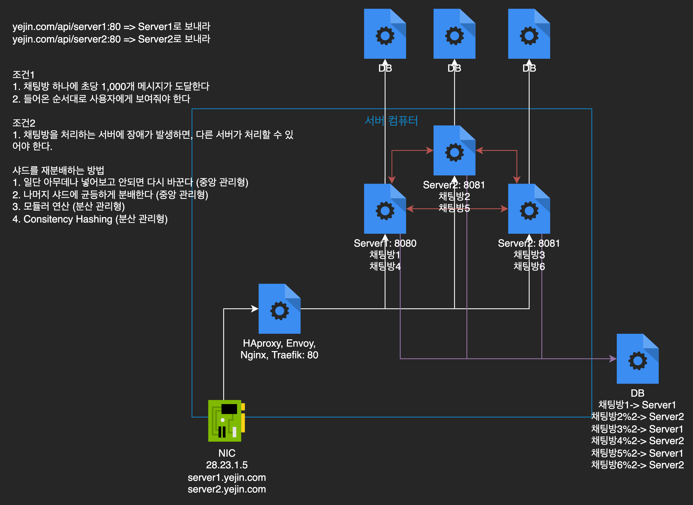
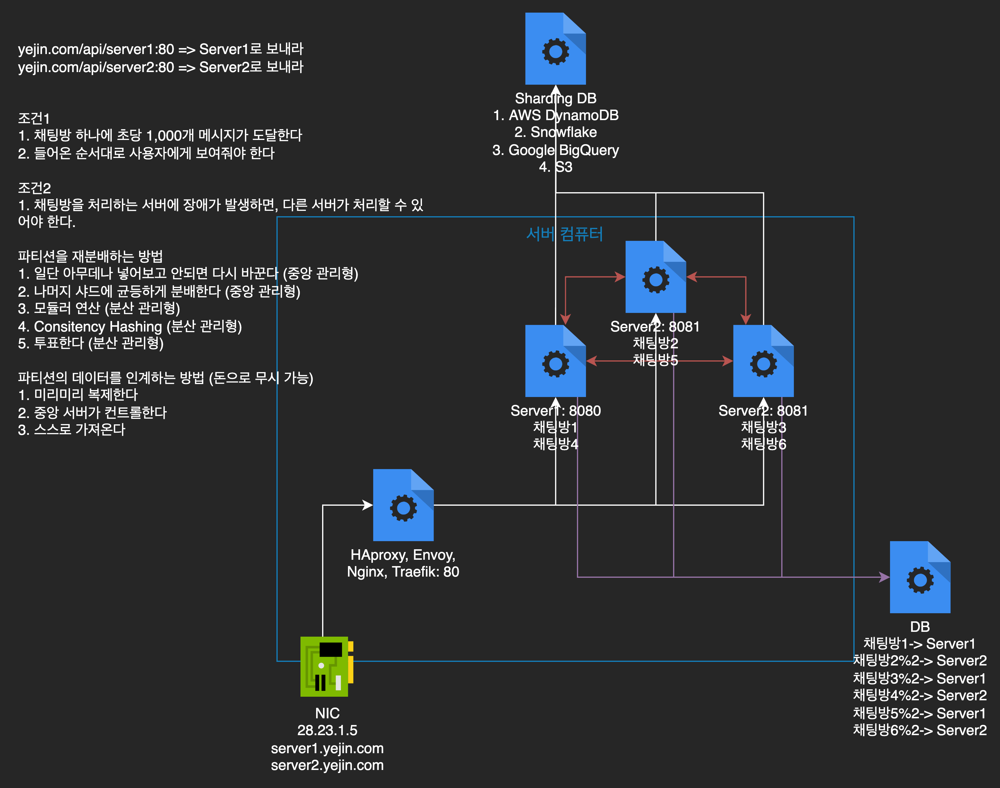

# 채팅 시스템을 구현한다면, 어느 정도 수준의 설계까지 구현 가능할 것인가?

공통 프로젝트에서 다른 조원들이 어떤 포지션과 어떤 로드맵을 가지고 가야 좋을까 고민하느라, 정작 내것은 잘 챙기지 못하고 있다는 것을 문득 깨달았다. 물론 네트워크도 공부 중이고, 채팅 설계와 관련된 책도 읽었고 했다지만... 그래서 어떤 설계를 가져올 것이고 어떻게 구현할 것인지에 대해서는 아직까지 구체화 된 부분이 없다.

> **목차**
>
> 1. [구현(또는 사용)해보고 싶은 기술들(이것도 다가 아님)](#1. 구현(또는 사용)해보고 싶은 기술들 (이것도 다가 아님))
>    1. [리스트](#1-1. 리스트)
>    1. [우선순위](#1-2. 우선순위)
>    1. [문제 및 대응](#1-3. 문제 및 대응)
> 1. [간단하게 알아보고 생각한 부분](#2. 간단하게 알아보고 생각한 부분)
>    1. [실질적으로 구현할 부분](#2-1. 실질적으로 구현할 부분)
>    2. [직접 구현하지는 않겠지만 따로 공부는 해둘 내용](#2-2. 직접 구현하지는 않겠지만 따로 공부는 해둘 내용)
> 1. [기획 변경 제안](#3. 기획 변경 제안)

# 1. 구현(또는 사용)해보고 싶은 기술들 (이것도 다가 아님)

## 1-1. 리스트

- 샤딩
- 캐싱
- 알림
- 유저 상태 관리 (활성화/비할성화)
- 서버 가상화
- 클라우드 사용(EC2 위에 채팅 서버를 올릴 것이고, 만약 DynamoDB를 사용한다면야 자동으로 해결되지 않을까 하는 생각)
- 대규모로 유저가 유입되었다고 할 때의 상황 그 자체
- 기억 안 남 + 더 생각해봐야 함

## 1-2. 우선순위

아직 모름

## 1-3. 문제

기억나는대로 컨설팅 내용을 복기해보자면 + 어떻게 해결할 것인지

### 문제1. 샤딩을 하기 위해 '채팅'이라는 기술을 가져다 붙이는건 좋지 않다.

**이유**

- 샤딩을 적용한다고 하면, 서비스를 제공하다가 샤딩이 불가피해져서 사용하기 때문에 '샤딩' 자체가 목적이면 샤딩 사용 이유에 대한 이해도가 떨어짐 
- 설계가 어설퍼질 확률이 매우 높음

**원인 파악**

- 잘못된 인과관계: '샤딩을 해보고 싶다' → '채팅을 구현하면서 샤딩을 연습해봐야지'
- 구현에 대한 실질적인 목표가 없어서 다음과 같은 문제 발생
  - 샤드를 파고든다고 하면 서버부터 시작해 DB의 재분배를 처리하는 문제(DB), 더 깊이 내려가면 최적화와 장애 대처를 위한 디스크 단계까지 끝도 없이 내려간다는 문제 발생
  - 와중에 백엔드 경험 자체가 전무인 내가 서버 로드밸런싱부터 서버 자체를 구현(서비스 구현)하는 것, 서버 재분배에 대한 문제를 해결하는 것, 서버가 데이터를 인계하는 것까지 구현하는 것이 말이 안 됨

**해결(제안)**

1. '샤딩을 해보고 싶다' → '채팅을 구현하면서 샤딩을 연습해봐야지'라는 인과관계를 변경
   1. 대규모 채팅 서비스를 운영한다고 가정
   2. 서버 한 대로 채팅 서비스를 운영하기 힘든 상황 발생 → 채팅 서버를 여러대로 나눔
   3. 각 채팅 서버가 한 DB를 참조한다고 할 때, DB 병목 현상이 발생할 확률이 높음 → DB 분산
   4. 샤딩 완성(채팅 기능을 설계할 때 샤드를 도입해야 하는 이유가 생김 → 샤드 구현)

2. 목표 구체화(구현)

   

   - 위의 그림에서 중앙 관리형 DB 서버를 제외하고 구현(분산형으로 서버를 관리하기 위해)
   - 샤드 재분배 방법으로는 분산형으로 서버를 관리하고 재분배를 최소화하기 위해 Consistency Hashing 적용

### 문제2. 비용을 어떻게 감당할 것인가? 오히려 샤딩을 도입하는게 더 비효율적일 수도 있는데?

**원인**

API 호출량이 많아서 + DB저장량이 많아져서(데이터를 중복 저장하면 더 비싸지는...) + EC2를 여러대 써서

**해결(제안)** - EC2를 한 대만 사용한다고 하더라도 충분히 샤드를 구현할 수 있다

- EC2(가상 서버 뿐만 아니라 물리 서버까지도 적용 가능)의 NIC을 이용하면 도메인별로 or Private IP를 사용하는 방식으로 한 서버 내에 여러대의 서버 구축 가능

- 하나의 서버 안에 여러개의 가상 서버를 구축하는 경우, port를 다르게 설정할 수 있다면야 네트워크 문제도 해결 가능

  - 그 역할을 Load Balancer가 수행

  - Reverse Proxy를 지원하는 Load Balancer에 HAproxy, Envoy, Nginx, Traefix 등이 있음

  - HAproxy는 유행이 지났고, Nginx가 가장 많이 쓰고, Envoy/Traefix는 요즘 뜨는 기술이라고 함 → Nginx 사용

- 실제 현업에서도 이 경험을 적극 활용할 수 있다

  - 프로덕션 레벨에서 사용하는 EC2 한 대는 기본 20만원부터 시작하고, EC2 한 대 당 하나의 웹서버만 띄우면 돈이 너무나도 아까워지는 상황 발생
  - 내가 가고 싶어하는 서비스기업/대기업은 필연적으로 대규모 서비스를 제공할 수밖에 없고, 대규모 서비스를 운영하면서 EC2 내부에 여러개의 웹 서버 프로세스를 띄워야 할 경우가 많이 발생할 수 있음
  - Go나 C#을 이용해 샤딩을 구현한다고 들었는데 Java로라도 직접 구현하고 공부한 경험이 있다면 도움이 되겠지? 

# 2. 간단하게 알아보고 생각한 부분

## 2-1. 실질적으로 구현할 부분

- 샤드 재분배에 사용할 중앙 DB 서버는 구현 안 함
  - 서버를 분산적으로 관리하고 서버의 재분배를 최소화하기 위해
  - 중앙 DB를 사용하면 SPOF(Single Point of Failure)가 될 확률이 매우 높기 때문에 사용하지 않는 것이 더 좋을 것 같음

## 2-2. 직접 구현하지는 않겠지만 따로 공부는 해둘 내용

공통 프로젝트에서 위의 조건을 만족하고, 파티션도 재분배하고, 파티셔니의 데이터를 인계하는 것까지 모두 직접 설계하고 구현하는 것은 말도 안된다. 하지만 알아두면 좋은 내용들이니, 미리 공부할 내용의 큰 틀을 짜둔다.

### 파티션의 데이터를 인계하는 방법 - 돈으로 무시하는 방법

- 자체적으로 Sharding DB를 지원하는 DB를 이용
- 이미 Sharding이 지원이 되므로 DB 하나를 사용한다고 하더라도 물리적인 데이터 한계를 걱정할 필요가 없음
- AWS Dynamo, Snowflake, Google BigQuery, S3 등 사용 가능

### 파티선의 데이터를 인계하는 방법 - 직접 구현

- 공부해야 하는 이유
  - 만약 카카오에서 카카오톡 채팅 데이터를 AWS Dynamo DB를 이용해 저장한다면? 어마어마한 요금 폭탄을 맞게 되지 않을까?
  - 대규모로 서비스를 운영하는 곳이 있다면, 데이터 인계하는 부분을 직접 구현할 수밖에 없음
- 공부할 내용
  - 미리 복제하는 방법은 어떻게 구현할 것인가?
  - 중앙 서버가 컨트롤한다면, 왜 컨트롤하는가? 분산형으로 파티션을 재분배했는데 중앙 서버가 다시 데이터를 인계한다면 샤드를 하는 의미가 퇴색되는 것이 아닌가?
  - 하나의 채팅 서버가 여러 DB 서버와 연결되어 있다고 할 때, 서버 장애가 해결되면 직접 데이터를 가져와 복구시키는 방법은?

# 3. 기획 변경 제안

아무리 샤드를 직접 구현해보고 싶다고 하더라도, 채팅 서비스를 보여줄 수 없으면 의미가 없다. 가장 우선적으로는 한 대의 서버와 DB를 사용하는 방식으로 간단하게 채팅 서비스를 만들고(사실상 이것도 개발에 착수하면 힘들 수 있다), 그 다음 샤드에 뛰어든다.

아직까지 팀 구성이 어떻게 될지 모르겠지만, 이렇게 하면 2명이 채팅 서버를 구현한다고 할 때 약간 시간이 뜨는 경우가 발생할 수도 있겠다는 생각이 들었다. 이걸 해결하기 위해서는 기획적으로 비즈니스 로직을 추가하는 것이 좋아보이는데, 채팅 스레드를 구현하는 것을 연습해보면 좋지 않을까 하는 생각이 들었다. 거기에 빨간점으로 알림하는 것까지?

만약 비즈니스적으로 정의한 기능들을 모두 구현한 후에도 시간이 남으면 샤딩을 구현하는 방법이 있고, 채팅을 구현하고 나면 한 사람은 알림/한 사람은 샤드 구현으로 가는 방법도 있다. 어느 방법으로 가든 기획과 개발 계획에 변경이 어느 정도 필요해 보인다.