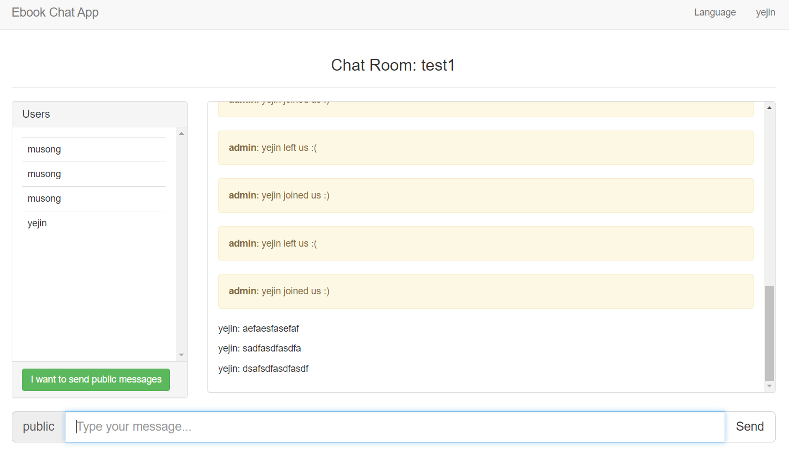

# 채팅 예시 프로젝트 실행 - Building Real-Time Apps with Spring, Cassandra, Redis, WebSocket and RabbitMQ

> **목차**
>
> 1. [예시 프로젝트](#예시-프로젝트)
>    1. [정보](#정보)
>    2. [사용 기술](#사용-기술)
>    3. [실행 화면](#실행-화면)
> 2. [적용 시 주의 사항](#적용-시-주의-사항)

# 예시 프로젝트

## 정보

- GitHub: [ebook-chat-app-spring-websocket-cassandra-redis-rabbitmq](https://github.com/jorgeacetozi/ebook-chat-app-spring-websocket-cassandra-redis-rabbitmq)
- 책 이름: Pro Java Clustering and Scalability: Building Real-Time Apps with Spring, Cassandra, Redis, WebSocket and RabbitMQ

## 사용 기술

- Spring
  - SpringBoot: 1.5.2
  - JDK 1.8
- Cassandra: 3.0
- Redis: 3.0.6
- MySQL: 5.7
- RabbitMQ (WebSocket): 3.6

## 실행 화면

### 문제 상황

실행 시 포트를 여러 개 설정해 실행시켜도 한 번에 한 명의 유저만 인식한다. '채팅' 자체는 동작하는 것을 확인할 수 있지만 여러 유저가 동시에 채팅하는 것을 볼 수가 없었다. 내부적으로 어떻게 동작하는지 아직 알지 못하기 때문에 좀 더 코드를 지켜봐야 할 것 같다.

# 적용 시 주의 사항

JDK 버전이 1.8이고, 도커에 올리는 redis, cassandra, mysql, rabbitmq-stomp 설정도 낡았다. 특히 프로젝트에 사용되는 RabbitMQ는 저자가 직접 만든 버전이고 최신 업데이트가 6년 전이기 때문에 새로운 프로젝트에 적용하기는 어렵다. 좋은 예시 코드로 참조하되, 현재 기술 버전에 맞춰서 다시 코딩을 하는 것만 해도 꽤나 오랜 시간이 걸릴 듯 하다.  

코드 작성 시기가 2023년을 기준으로 6년 전이기 때문에 여기에서 사용한 여러 가지 기술들이 요즘에도 사용하기에 최적화된 기술인지 검증하는 과정도 필요하다.  
