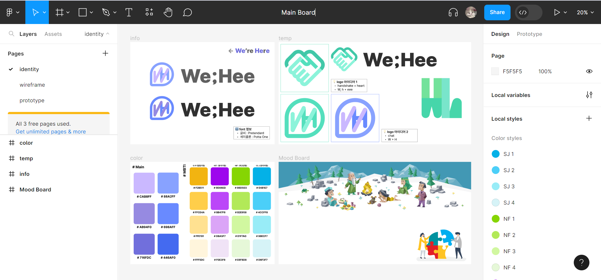
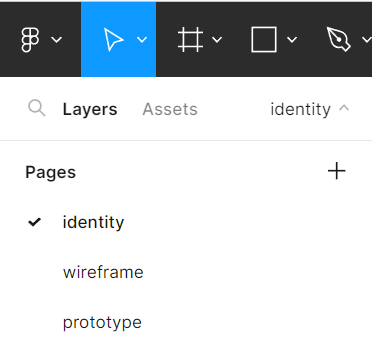
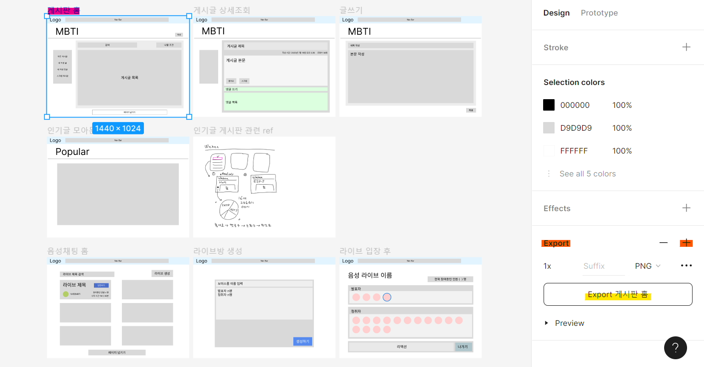

# Figma Guide

## [🔗 Figma Main Board Link](https://www.figma.com/file/LOZntT4iuXmIPDn6SDdfK3/Main-Board?type=design&node-id=30%3A10&mode=design&t=TNG9YVOE8LXixmGG-1)

> 위 피그마 링크 접속 시 보이는 화면입니다 !

- [identity](identity.md)
- prototype에 대해서는 완성되면 이어 공유하겠습니다!

## 다른 페이지 보기

처음 접속 시 로고와 컬러 팔레트, 무드 보드가 보일 거예요.

해당 부분에서 page를 전환해 원하는 작업물을 보실 수 있습니다.

## 작업물 PNG로 저장하기

> Pink → Orange → Yellow 순으로 따라가시면 됩니다.

PNG로 export하는 것은 최소 그룹 단위부터 최대 프레임까지 가능합니다. 

만약 그룹으로 묶이지 않은 것을 여러개 선택해 export할 시 각각 png로 저장되고 zip형태로 다운됩니다. 

