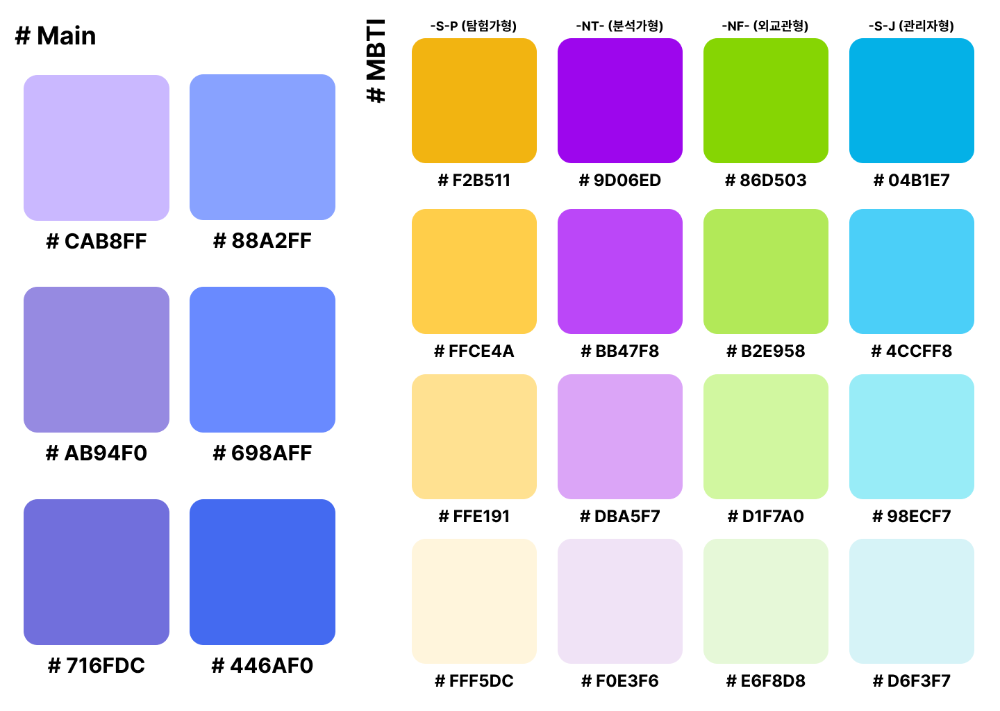
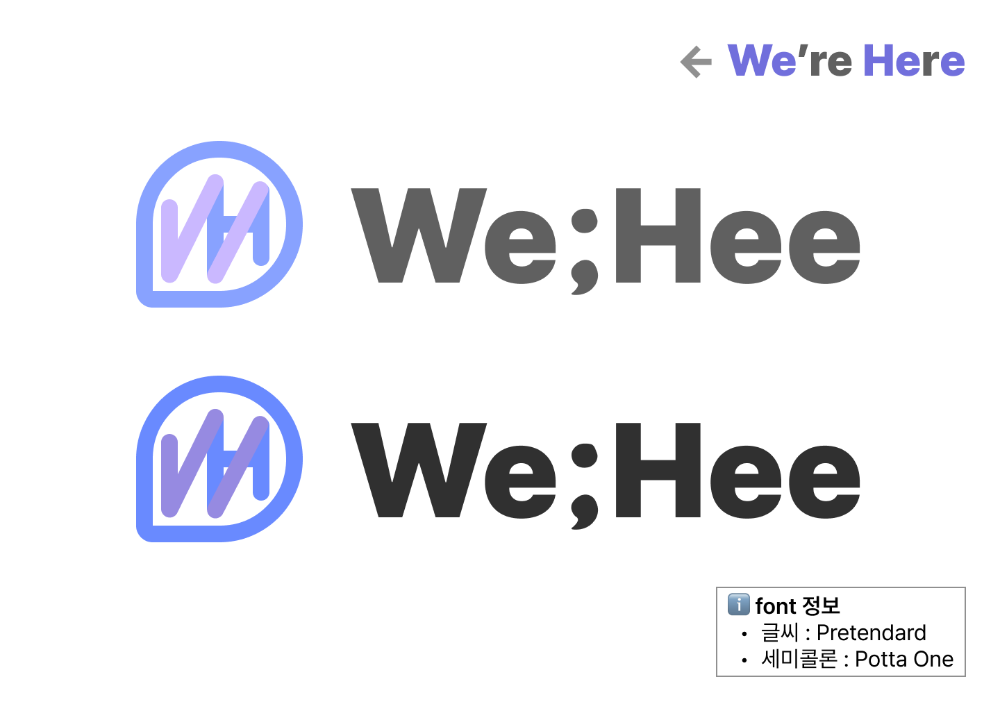

# We-Hee의 정체성을 드러낼...

## 1. Mood Board

- 무드 보드는 많이 작업하지 못했습니다.
- 위히가 연상되는 이미지를 보시면 언제든지 피그마에 직접 추가하시거나, MM으로 보내주세요!

## 2. Color Palette

### 2-1. MBTI

- 대중적으로 통용되는 MBTI 유형 검사 사이트인 `[**16personalities](<https://www.16personalities.com/>)`** 의 컬러를 차용하고자 함

### 2-2. Main

- Main = 보라, Sub = 블루 를 사용하려 합니다.

## 3. LOGO

- 말풍선 모양
  - 메인 서비스인 상담 채팅 기능을 보여주고자 함
- W와 H를 합친 모습