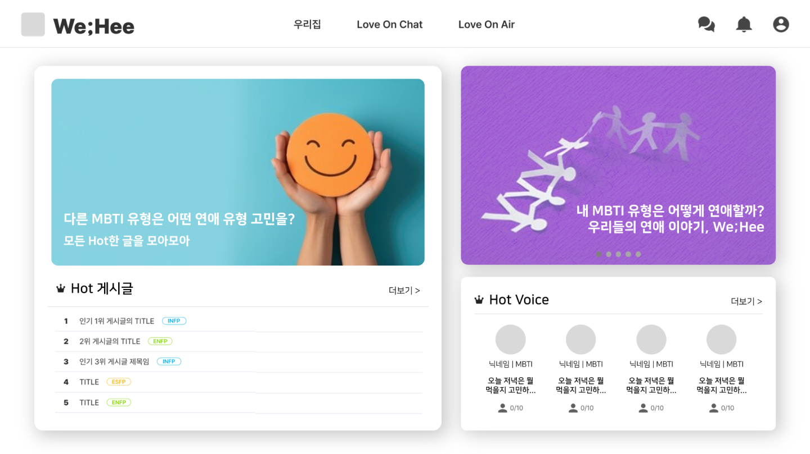
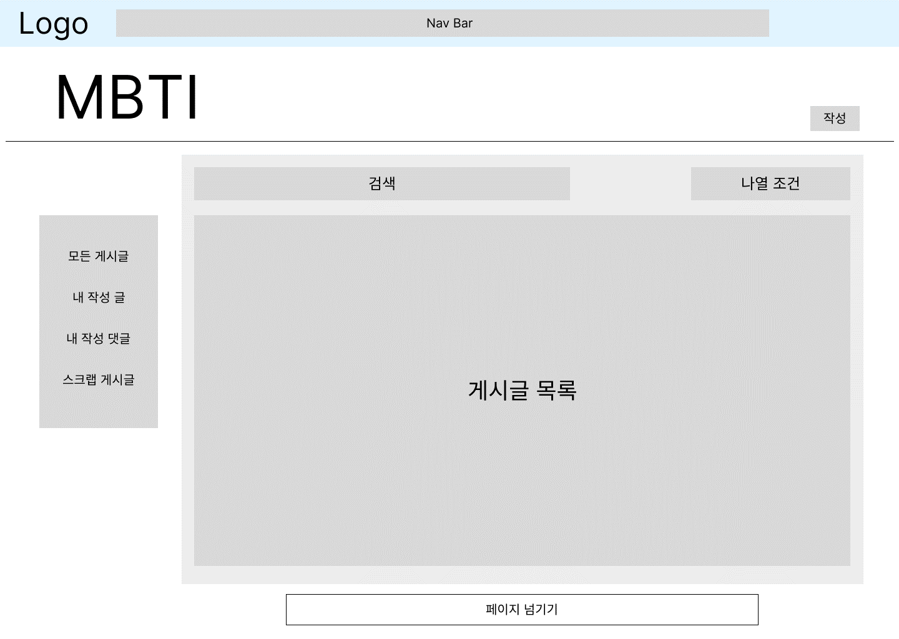
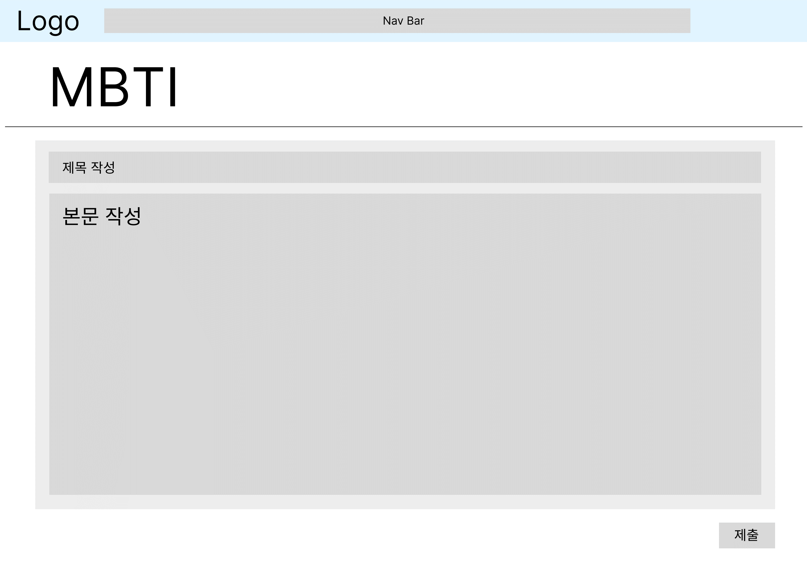
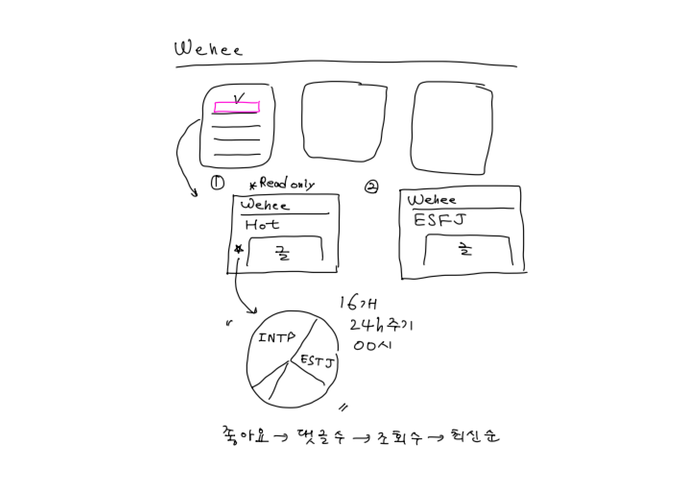
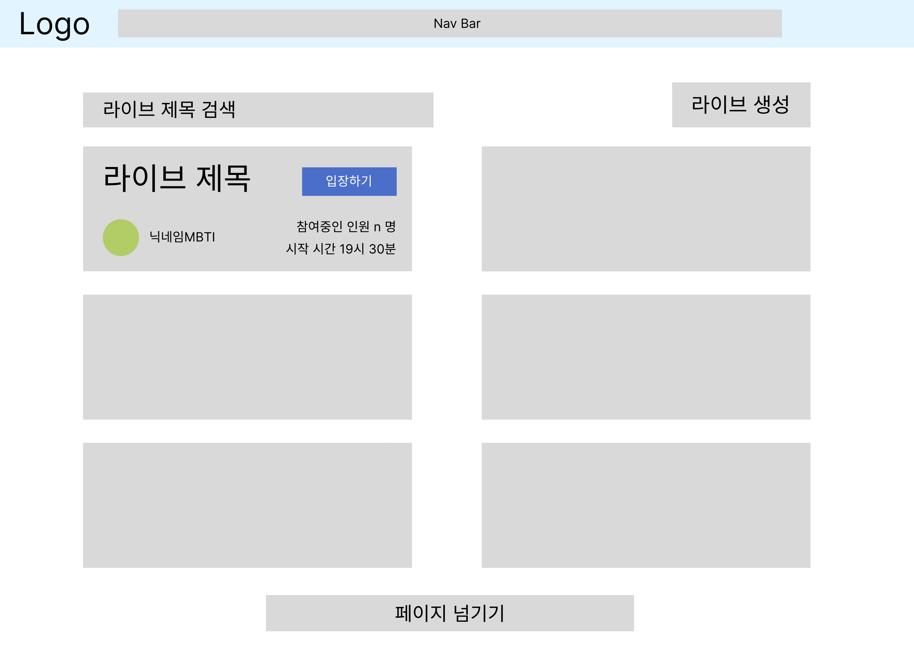
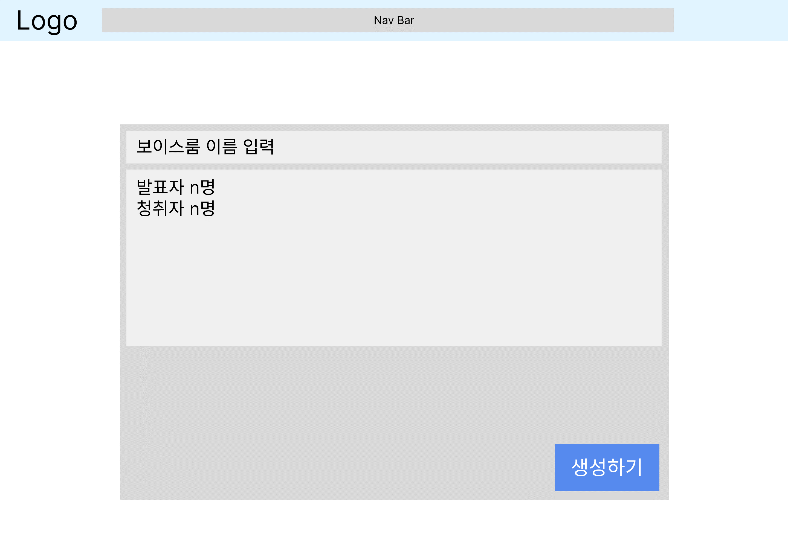
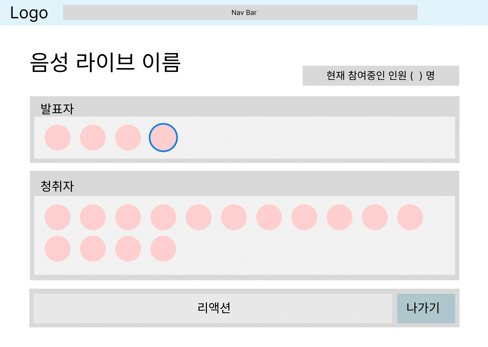

# 와이어프레임

마지막 업데이트 날짜: 2023-08-21
업무 담당자: 류나연
작성자: 김예진

> **목차**
>
> 1. [메인 화면](#1-메인-화면)
> 2. [게시판](#2-게시판)
> 3. [보이스룸](#3-보이스룸)

## 외부 링크

- [피그마 - WeHee Wireframe](https://www.figma.com/file/LOZntT4iuXmIPDn6SDdfK3/Main-Board?type=design&node-id=222-795&mode=design)

# 1. 메인 화면

# 2. 게시판

|  |  |  |
| :---------------------------------------------: | :---------------------------------------------: | :---------------------------------------------: |
|                    게시판 홈                    |                 게시글 상세조회                 |                     글쓰기                      |
|  |  |  |
|              인기글 모아둔 게시판               |             인기글 게시판 관련 ref              |                 게시판 투표 ref                 |

# 3. 보이스룸

|  |  |  |
| :---------------------------------------------: | :---------------------------------------------: | :---------------------------------------------: |
|                   음성채팅 홈                   |                  라이브방 생성                  |                 라이브 입장 후                  |