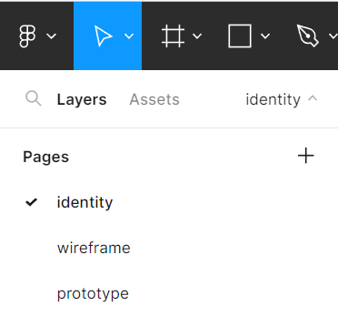
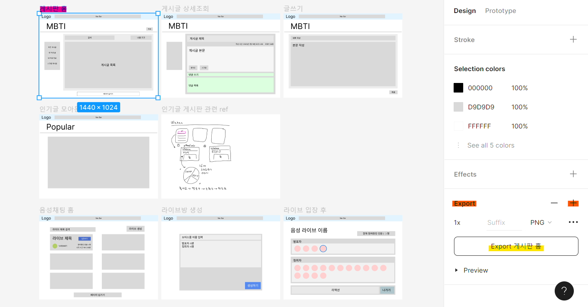

# 피그마 보는 간단 가이드

마지막 업데이트 날짜: 2023-08-21  
작성자: 유연정, 김예진

> **목차**
>
> 1. [다른 페이지 보기](#1-다른-페이지-보기)
> 2. [작업물 PNG로 저장하기](#2-작업물-png로-저장하기)

## 외부 링크 바로 가기

- [피그마 - identity](https://www.figma.com/file/LOZntT4iuXmIPDn6SDdfK3/Main-Board?type=design&node-id=30-10&mode=design)
- [피그마 - wireframe](https://www.figma.com/file/LOZntT4iuXmIPDn6SDdfK3/Main-Board?type=design&node-id=222-795&mode=design)
- [피그마 - prototype](https://www.figma.com/file/LOZntT4iuXmIPDn6SDdfK3/Main-Board?type=design&node-id=0-1&mode=design)

# 1. 다른 페이지 보기

피그마 접속 시 왼쪽 상단을 보면 페이지를 전환하는 부분이 있습니다. `identity`, `wireframe`, `prototype`을 클릭하면 각 제목에 해당하는 작업물을 열람할 수 있습니다.

# 2. 작업물 PNG로 저장하기

> Pink → Orange → Yellow 순으로 따라가시면 됩니다.

PNG로 export하는 것은 최소 그룹 단위부터 최대 프레임까지 가능합니다. 만약 그룹으로 묶이지 않은 것을 여러개 선택해 export할 시 각각 png로 저장되고 zip형태로 다운됩니다. 
