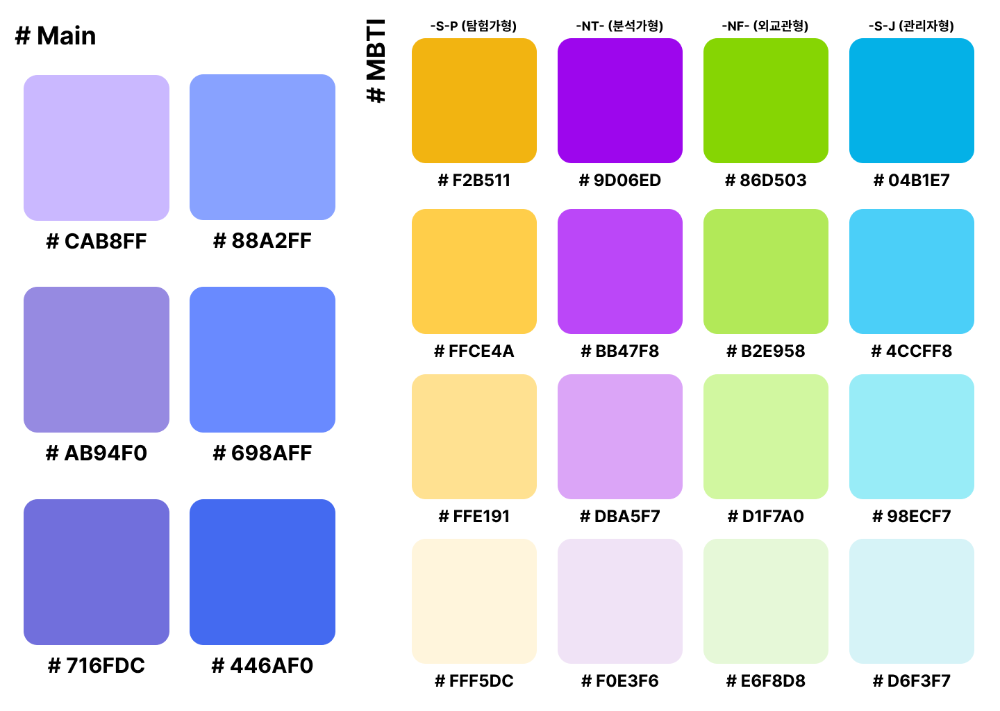

# 로고 및 컬러 팔레트

마지막 업데이트 날짜: 2023-08-21  
업무 담당자: 유연정  
작성자: 김예진

> **목차**
>
> 1. [로고](#1-로고)
>    1. [로고 정보](#로고-정보)
>    2. [WeHee 로고 1](#wehee-로고-1)
>    3. [WeHee 로고 2](#wehee-로고-2)
>    4. [WeHee 로고 3](#wehee-로고-3)
> 2. [컬러 팔레트](#2-컬러-팔레트)
>    1. [메인 및 서브 컬러](#메인-및-서브-컬러)
>    2. [MBTI 컬러](#mbti-컬러)

## 외부 링크

- [피그마 - WeHee Identity](https://www.figma.com/file/LOZntT4iuXmIPDn6SDdfK3/Main-Board?type=design&node-id=30-10&mode=design)

# 1. 로고

## 로고 정보

- 글씨: Pretendard
- 세미콜론: Potta One
- 모양
  - 말풍선 모양 - 메인 서비스인 상담 채팅 기능을 보여주고자 함
  - W와 H를 합친 모습

## WeHee 로고 1

|  |  |
| :----------------------------------------: | :----------------------------------------: |

## WeHee 로고 2

## WeHee 로고 3

# 2. 컬러 팔레트

## 메인 및 서브 컬러

- 메인: 보라
- 서브: 파랑

## MBTI 컬러

- 대중적으로 통용되는 MBTI 유형 검사 사이트인 [16personalities](https://www.16personalities.com)의 컬러를 차용
