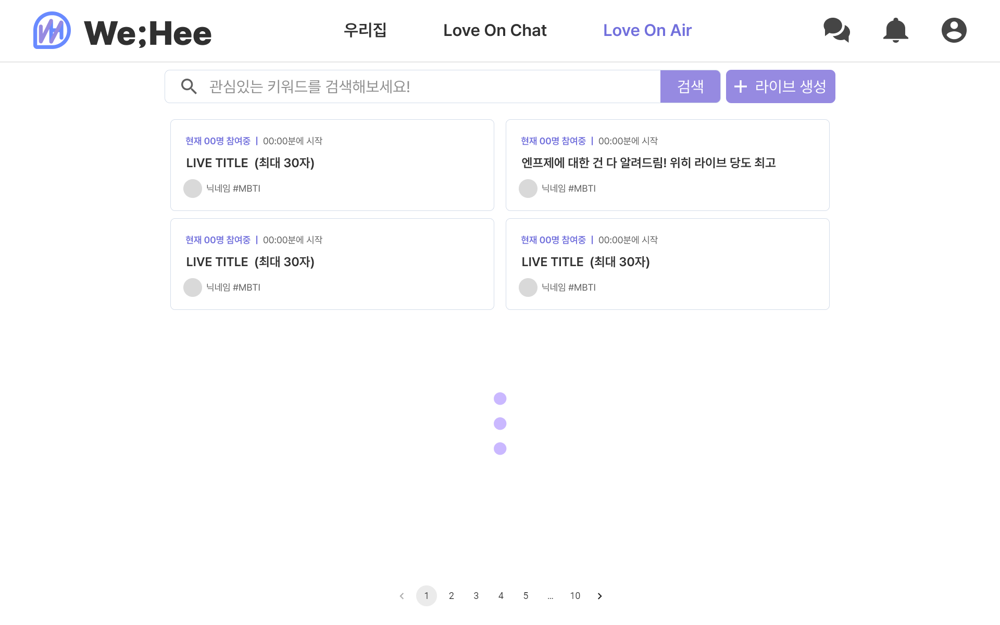
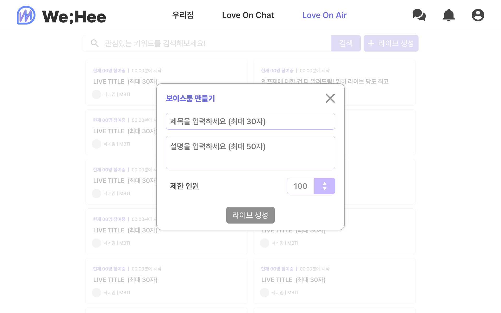
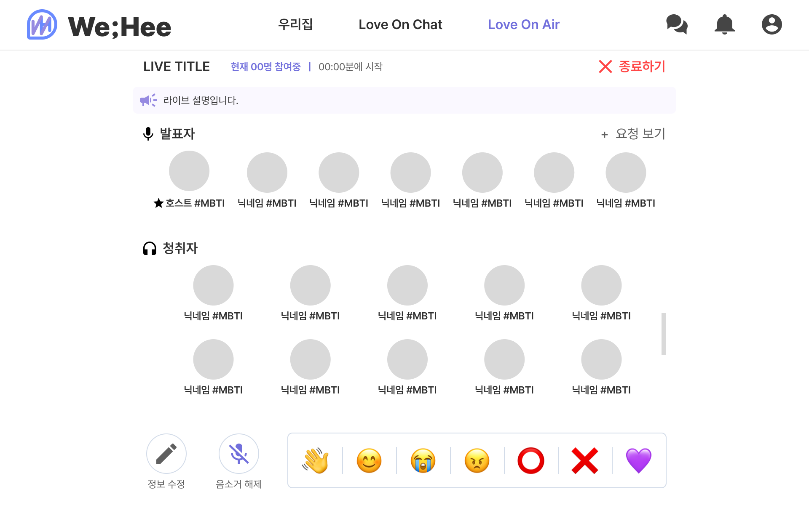
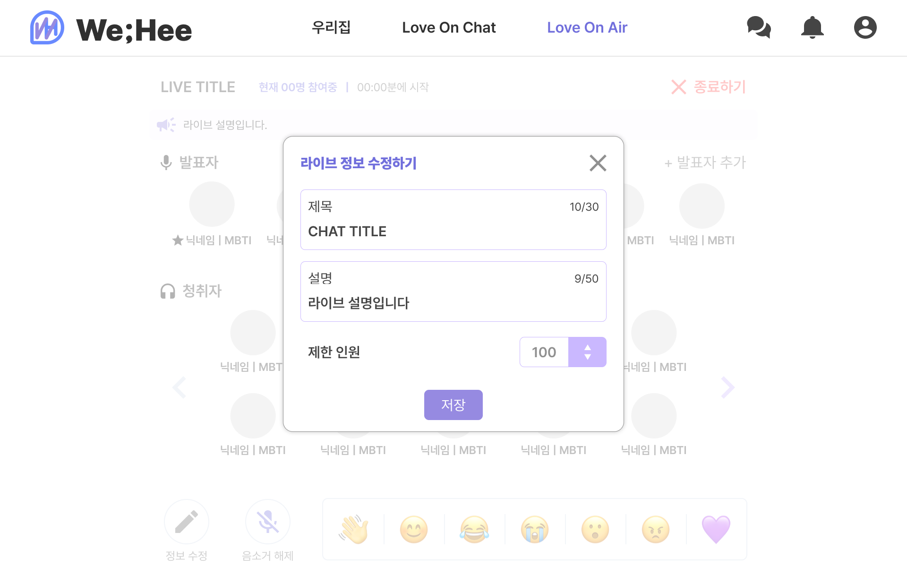
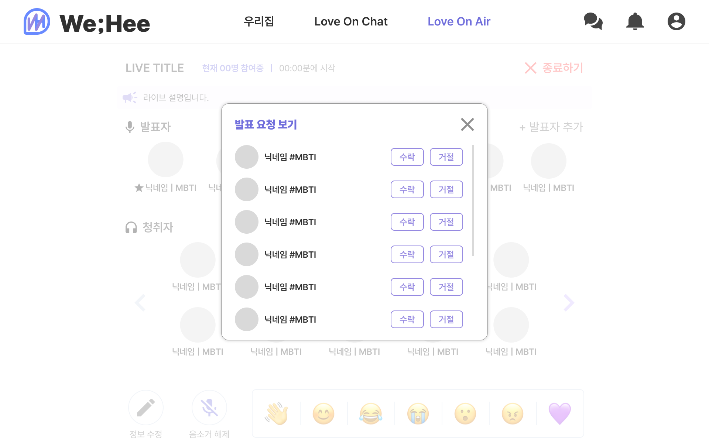
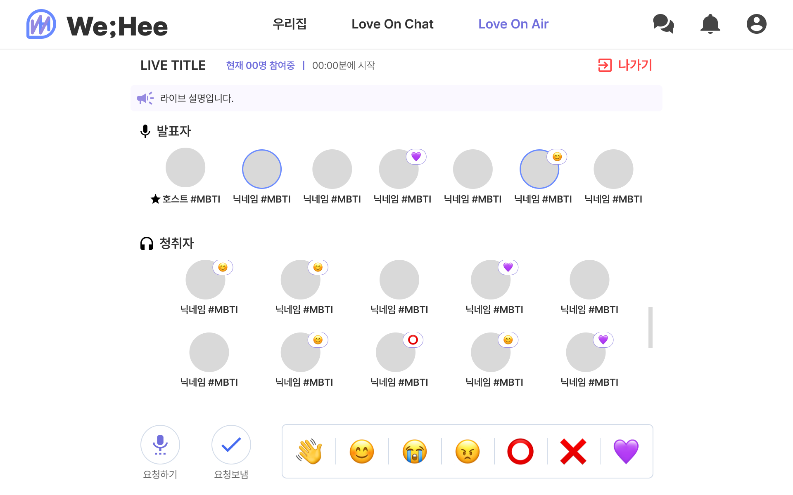
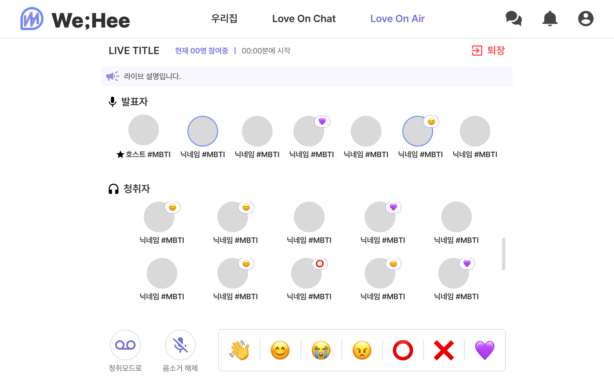
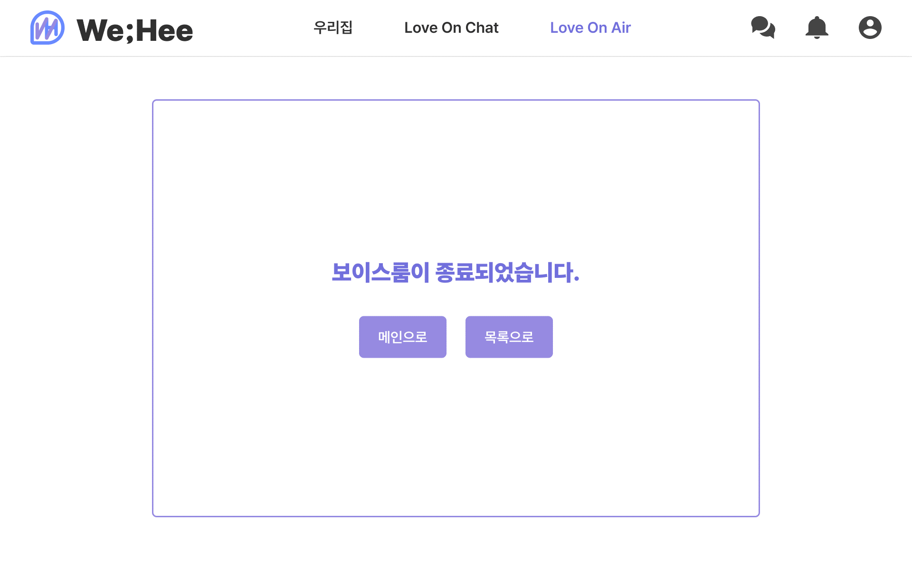

# 보이스룸 프로토타입

마지막 업데이트 날짜: 2023-08-21  
업무 담당자: 유연정  
작성자: 김예진

> **목차**
>
> 1. [보이스룸 메인](#1-보이스룸-메인)
> 1. [호스트 시점 보이스룸 기능 이용](#2-호스트-시점-보이스룸-기능-이용)
> 1. [일반 사용자 시점 보이스룸 기능 이용](#3-일반-사용자-시점-보이스룸-기능-이용)

## 외부 링크

- [피그마 - WeHee Prototype](https://www.figma.com/file/LOZntT4iuXmIPDn6SDdfK3/Main-Board?type=design&node-id=0-1&mode=design)

## 미리 보기

# 1. 보이스룸 메인

|  |  |
| :---------------------------------------------: | :---------------------------------------------: |
|                  보이스룸 목록                  |                  보이스룸 생성                  |

# 2. 호스트 시점 보이스룸 기능 이용

|  |  |  |
| :---------------------------------------------: | :---------------------------------------------: | :---------------------------------------------: |
|                  보이스룸 화면                  |               보이스룸 정보 수정                |              발표자 요청 수락/거절              |

# 3. 일반 사용자 시점 보이스룸 기능 이용

|  |  |  |
| :---------------------------------------------: | :---------------------------------------------: | :---------------------------------------------: |
|             보이스룸 화면 (청취자)              |             보이스룸 화면 (발표자)              |                보이스룸 종료 시                 |
