# 소셜 로그인을 이용한 인증 기능 구현하기

마지막 업데이트 날짜: 2023-08-02 <br>
작성자: 김예진

> **목차**
>
> 1. [요구사항 파악](#1-요구사항-파악)
>    1. [로그인](#로그인)
>    2. [회원가입](#회원가입)
>    3. [유저 테이블](#유저-테이블)
> 2. [예시 프로젝트 실행 및 분석](#2-예시-프로젝트-실행-및-분석)
>    1. [예시 프로젝트 정보](#예시-프로젝트-정보)
>    2. [실행 결과](#실행-결과)
>    3. [DB 분석](#db-분석)
>    4. [gradle 분석](#gradle-분석)
>    5. [config 클래스 분석](#config-클래스-분석)
> 3. Entity 구현

이 글은 소셜 로그인을 이용한 인증 기능 구현 개발기로, 시간의 순서에 따라 글이 작성되었습니다.

# 1. 요구사항 파악

## 로그인

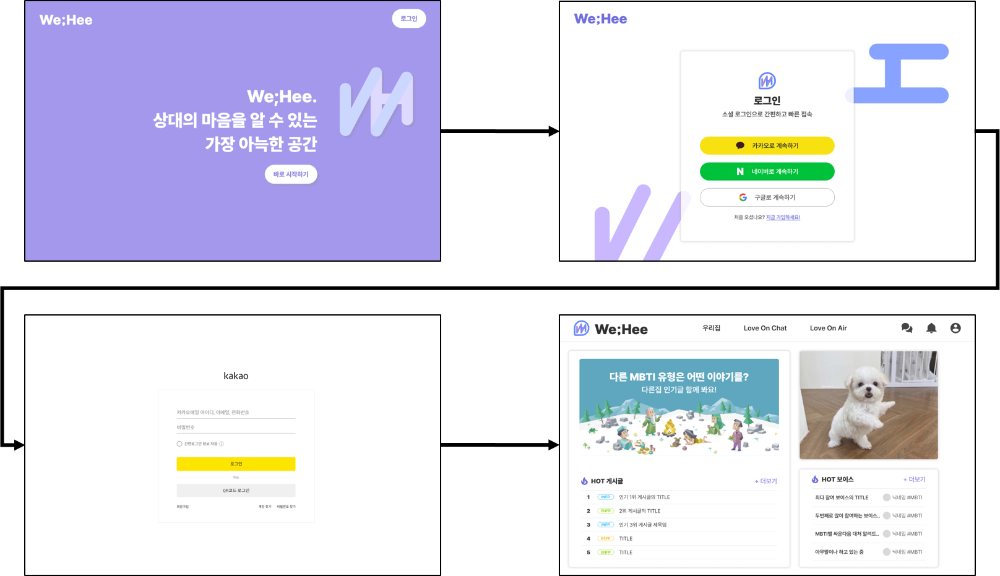

## 회원가입

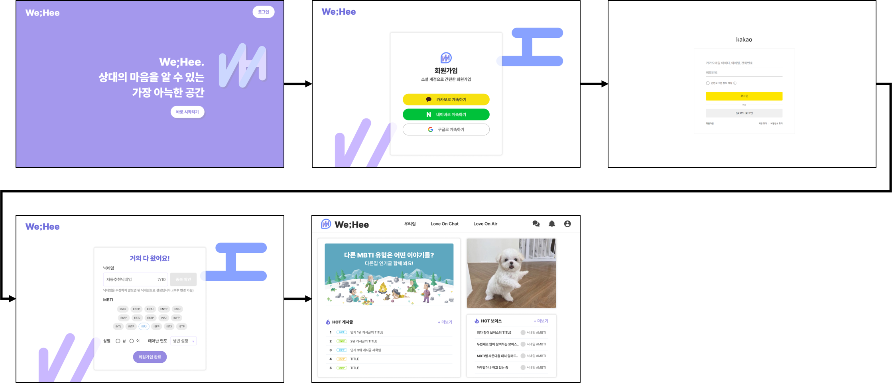

## 유저 요구사항

> 1. 정보 등록
>    1. 사용자는 소셜 회원가입을 할 수 있다.
>    2. 소셜 로그인 시, 가입하는 플랫폼이 다른 경우 다른 계정으로 간주한다.
>    3. 사용자는 첫 로그인 이후, 마이페이지에 본인의 생년, 성별, MBTI, 닉네임을 입력해야 한다.
>       1. 닉네임은 영어, 한글, 숫자만 가능하다.
>    4. 초기 닉네임은 랜덤으로 배정된다.
>    5. 사용자의 최종 닉네임은 ‘**닉네임 [MBTI]**’형식으로 정해진다.
>    6. 생년, 성별, MBTI를 입력하는 모달이 뜨고, 입력 없이 창을 닫는 경우 로그인 할 때마다 입력하는 모달이 뜬다.
>    7. 사용자는 자신의 프로필에 사진을 업로드할 수 있다.
> 2. 마이페이지 수정
>    1. 사용자들은 마이페이지 정보를 수정할 수 있다.
>    2. MBTI 유형 정보는 한 번 수정한 경우, 수정 시점을 기준으로 5주가 지나야 재수정이 가능하다.
>    3. 닉네임은 중복확인 이후에 변경할 수 있다.
>    4. 성별, 생년은 1번만 수정이 가능하다.
> 3. 회원 탈퇴
>    1. 사용자는 서비스에서 탈퇴할 수 있다.
>    2. 탈퇴한 사용자가 작성한 게시글 및 댓글은 삭제되지 않는다.
>    3. 사용자 닉네임은 ‘탈퇴한 사용자’로 바뀐다.

## 유저 테이블

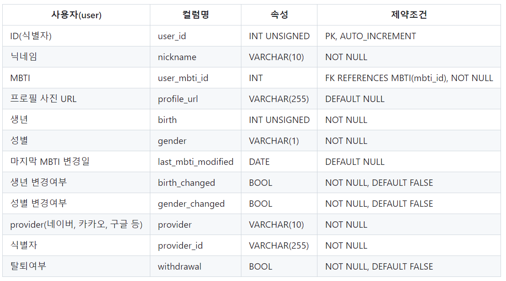

이 테이블에 createed 컬럼을 추가하고 싶다.

## 리프레시 토큰 테이블


# 2. 예시 프로젝트 실행 및 분석

## 예시 프로젝트 정보

- [OAuth를 이용한 소셜 로그인 구현](../review/study/social-login-using-oauth.md)
- sushistack
  - https://github.com/sushistack/oauth-login-fe
  - https://github.com/sushistack/oauth-login-be
- https://github.com/ikjo93/share-travel

## 실행 결과

### 실행 화면 및 DB 저장 내용


## DB 분석

### User 테이블 구조

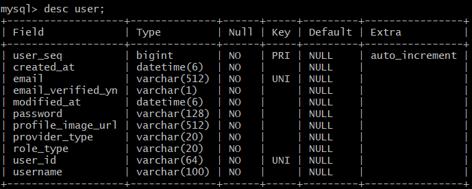

### WeHee와 비교 - User

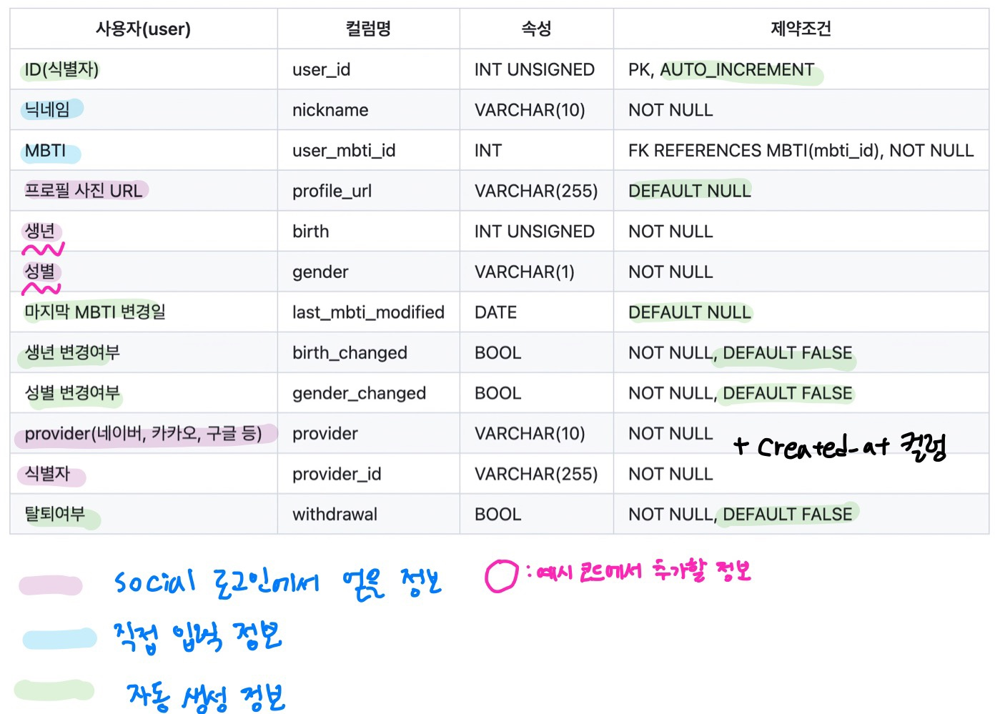

### USER REFRESH TOKEN 테이블 구조
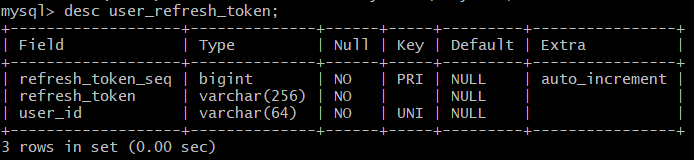

### WeHee와 비교 - Refresh Token

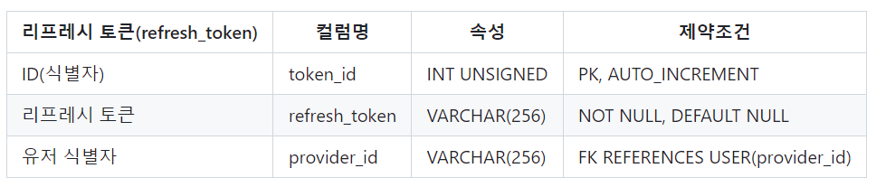

## gradle 분석

### 인증을 위한 의존성 추가

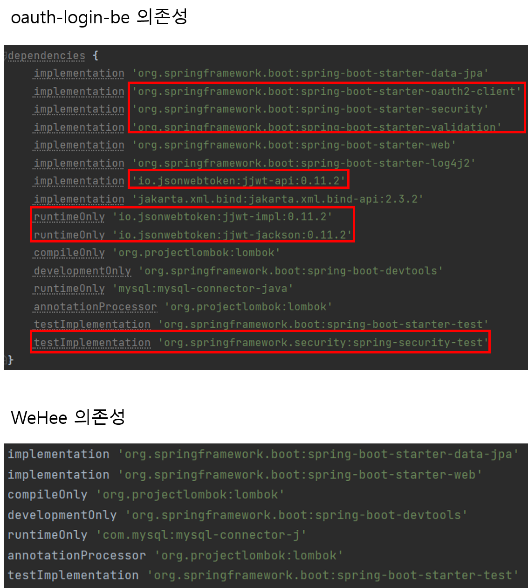

### build.gradle - configuration exclude

```groovy
configurations {
    all*.exclude group: 'org.springframework.boot', module: 'spring-boot-starter-logging'
    all*.exclude group: 'org.springframework.boot', module: 'logback-classic'
}
```

Spring Boot에서 의존성을 추가하면서 의도치 않게 다운 받은 jar 설정 파일을 제거하는 기능을 수행한다.

## config 클래스 분석

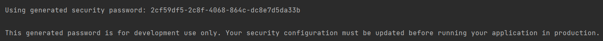

위의 의존성 추가까지 적용하고 난 후 실행을 하니 위와 같은 실행 결과가 나왔다. 검색을 해보니 Spring Security를 설정했기 때문이라고([참고](https://ict-nroo.tistory.com/118)). 이를 해결하기 위해 `SecurityConfig.java`에서 Spring Security 관련 설정을 하기로 했다.

### SecurityConfig.java

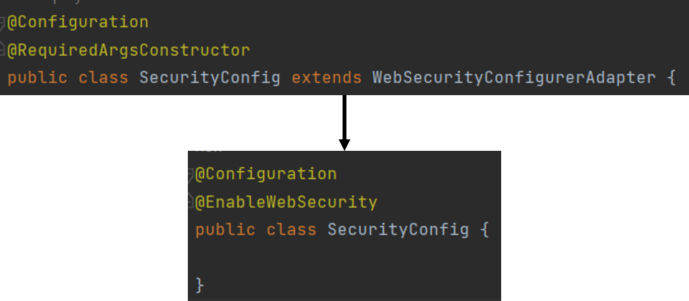

Adapter를 구현하기 위해 `WebSecurityConfiguraterAdapter`를 상속 받으려고 했는데 클래스가 deprecated된 것을 알게 되었다([참고](https://devlog-wjdrbs96.tistory.com/434)). 순간 의존성 추가할 때 설정한 버전을 예시 코드대로 낮출까 고민했는데 언젠간 이 귀찮은 작업을 또 하게 되는 순간이 오겠지... 하는 생각을 하며 그냥 진행하기로 했다. 일단 임시적으로 [Spring blog](https://spring.io/blog/2022/02/21/spring-security-without-the-websecurityconfigureradapter)를 참고해 내용을 간단하게 채웠다. <br>

일단 여기까지 하고 얼추 프로젝트 실행이 되는 것을 확인한 후 config는 잠시 뒤로 미루고 비즈니스 로직부터 짜기로 헀다.

# 3. Entity 및 Enum class구현

사용자 인증을 위한 entity는 User밖에 없다. 위에 있는 User 테이블 구조를 그대로 사용하되, MBTI만 enum class로 관리한다.

## User class

```java
@Getter
@NoArgsConstructor(access = AccessLevel.PROTECTED)
@AllArgsConstructor
@Entity
public class User {

    @Id @GeneratedValue(strategy = GenerationType.IDENTITY)
    private Long id;

    // 소셜 로그인에서 얻을 정보
    private String provider_id;
    private String provider;
    private int birth;
    private char gender;
    private String profile;

    // 사용자 입력 정보
    private String nickname;
    private MBTI mbti;

    // 자동 생성 정보(시스템 내부)
    @Temporal(TemporalType.DATE)
    private LocalDate last_mbti_modified;
    private boolean birth_changed;
    private boolean gender_changed;
    private boolean withdrawal;

    @Temporal(TemporalType.DATE)
    private LocalDate created;

}
```

- `access = AccessLevel.PROTECTED` 설정
  - 외부에서 클래스 생성 시 기본 생성자 호출을 막기 위함

- `Setter`를 생성하지 않아 외부로부터 변수가 쉽게 바뀌는 것을 막음
- `@GeneratedValue`에서 IDENTITY 옵션을 사용해 sequence table이 생성되는 것을 막음([참고](https://gmlwjd9405.github.io/2019/08/12/primary-key-mapping.html))
- `@Temporal` annotation으로 DB type에 맞게 DB가 저장되도록 함

## RefreshToken class

생략

## MBTI enum class

생략

## Provider enum class

생략

# 4. 기본 Service 및 Repository  class 구현

## UserRepository

생략

## UserService

생략

# 5. API 및 비즈니스 로직 개발

## 소셜 로그인 시퀀스 다이어그램


### 시퀀스 다이어그램 설명

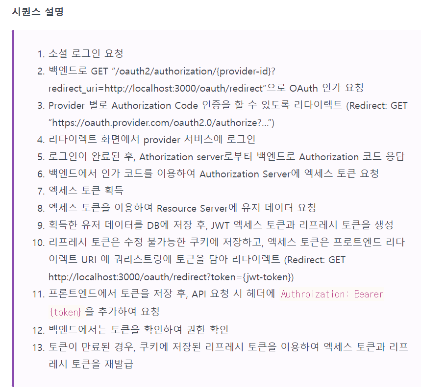

[출처](https://deeplify.dev/back-end/spring/oauth2-social-login#%EC%8B%9C%ED%80%80%EC%8A%A4-%EC%84%A4%EB%AA%85)

## `소셜 로그인하기` 버튼을 누를 때

프론트엔드에서는 `네이버로 로그인하기`버튼을 누르면 백엔드로 어떤 API를 호출할까?


1. 위의 그림에 따르면 GET 메소드가 다음과 같이 요청된다.

> /oauth2/authorization/naver?redirect_uri=http://localhost:3000/oauth/redirect

2. 웹서버로 해당 요청이 전달되고, provider-id에 따라 지정된 OAuth 2.0 provider가 해당 요청을 처리하게 요청을 처리하게 라우팅한다.
   - 백엔드에서 따로 코드를 짤 필요는 없음, `application.yml` 설정 이용

3. (provider) 로그인 페이지로 리다이렉트를 하면, 클라이언트는 provider 서비스에 로그인한다.

4. 클라이언트가 로그인에 성공하면 IdP 서버로부터 백엔드로 Authorization 코드가 응답된다.

5. 백엔드에서 인가 코드를 확인해 IdP 서버로 엑세스 토큰을 요청한다.

6. 계속...

## 예시 프로젝트 로그 분석

> 9-1
> =================================loadUser()==============CustomOAuth2UserService
> =================================->getOAuth2UserInfo()=======OAuth2UserInfoFactory
> =================================->UserPrincipal.create()=======UserPrincipal
> id:2815283392
> connected_at:2023-06-01T07:01:17Z
> properties:{nickname=정보, profile_image=정보, thumbnail_image=정보} kakao_account:{profile_nickname_needs_agreement=false, profile_image_needs_agreement=false, profile={nickname=정보, thumbnail_image_url=정보, profile_image_url=정보, is_default_image=false}, has_email=true, email_needs_agreement=false, is_email_valid=true, is_email_verified=true, email=정보}
> 
> 9-2, 9-3
>=================================onAuthenticationSuccess()===OAuth2AuthenticationSuccessHandler
> =================================->getOAuth2UserInfo()=======OAuth2UserInfoFactory
> =================================->createAuthToken2()=======AuthTokenProvider -- access token
> =================================->createAuthToken1()=======AuthTokenProvider -- refresh token
> 
> 토큰 필터
>=================================doFilterInternal()=========TokenAuthenticationFilter
> =================================->convertAuthToken()=======AuthTokenProvider
> =================================->getAuthentication()=======AuthTokenProvider
> 
> 11
>=================================getUser()==============UserController

# 6. 획득한 유저 테이블 DB 저장, JWT 엑세스 토큰과 리프레시 토큰 생성

## `UserPrincipal` 클래스 구현

`CustomOAuth2UserService` 클래스에서 `loadUser()`를 호출하면 OAuth2User 타입의 객체를 반환하는데, 이 객체는 UserPrincipal 클래스로 만들 수 있다. UserPrincipal 객체는 현재 인증된 사용자를 의미한다.

### Principal class 사용하는 이유?

> In Spring Boot OAuth 2.0, the `Principal` class is used to represent the currently authenticated user. It provides a convenient way to access user-related information after a successful authentication. The `Principal` object is automatically populated by the Spring Security framework once the user has been authenticated, and it allows you to access details about the authenticated user, such as their username, authorities, and other attributes.
>
> Here are some reasons why using the `Principal` class is beneficial in Spring Boot OAuth 2.0 development:
>
> 1. Easy access to user information: The `Principal` class abstracts away the details of how the user's information is obtained and authenticated. It provides a standardized way to access user-related data without dealing with low-level authentication mechanisms.
> 2. Simplified authorization: Once the user is authenticated, you can use the `Principal` object to check the user's roles, authorities, or custom attributes to make authorization decisions within your application.
> 3. Avoiding the need for manual retrieval: Without the `Principal` class, you would need to manually retrieve user information from the security context or session, which could be error-prone and cumbersome. Spring Security automatically handles this for you.
> 4. Integration with Spring Security: Spring Boot integrates seamlessly with Spring Security, and the `Principal` class is an essential part of the security framework. It helps maintain a consistent and standard way of accessing user information across different parts of your application.

## `CustomOAuth2UserService` 클래스 구현


