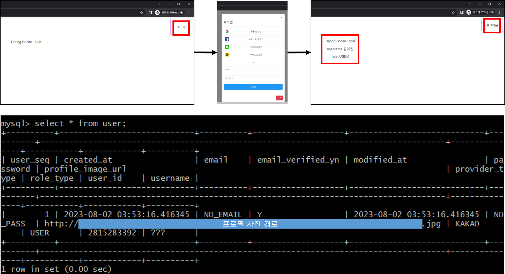

# 소셜 로그인을 이용한 인증 기능 구현하기

마지막 업데이트 날짜: 2023-08-02 <br>
작성자: 김예진

> **목차**
>
> 1. 요구사항 파악
>    1. 로그인
>    2. 회원가입
>    3. 유저 테이블
> 2. 예시 프로젝트 실행 및 분석
>    1. 예시 프로젝트 정보
>    2. 실행 결과
>    3. DB 분석
>    4. gradle 분석

# 1. 요구사항 파악

## 로그인


## 회원가입


## 유저 요구사항

> 1. 정보 등록
>    1. 사용자는 소셜 회원가입을 할 수 있다.
>    2. 소셜 로그인 시, 가입하는 플랫폼이 다른 경우 다른 계정으로 간주한다.
>    3. 사용자는 첫 로그인 이후, 마이페이지에 본인의 생년, 성별, MBTI, 닉네임을 입력해야 한다.
>       1. 닉네임은 영어, 한글, 숫자만 가능하다.
>    4. 초기 닉네임은 랜덤으로 배정된다.
>    5. 사용자의 최종 닉네임은 ‘**닉네임 [MBTI]**’형식으로 정해진다.
>    6. 생년, 성별, MBTI를 입력하는 모달이 뜨고, 입력 없이 창을 닫는 경우 로그인 할 때마다 입력하는 모달이 뜬다.
>    7. 사용자는 자신의 프로필에 사진을 업로드할 수 있다.
> 2. 마이페이지 수정
>    1. 사용자들은 마이페이지 정보를 수정할 수 있다.
>    2. MBTI 유형 정보는 한 번 수정한 경우, 수정 시점을 기준으로 5주가 지나야 재수정이 가능하다.
>    3. 닉네임은 중복확인 이후에 변경할 수 있다.
>    4. 성별, 생년은 1번만 수정이 가능하다.
> 3. 회원 탈퇴
>    1. 사용자는 서비스에서 탈퇴할 수 있다.
>    2. 탈퇴한 사용자가 작성한 게시글 및 댓글은 삭제되지 않는다.
>    3. 사용자 닉네임은 ‘탈퇴한 사용자’로 바뀐다.

## 유저 테이블


# 2. 예시 프로젝트 실행 및 분석

## 예시 프로젝트 정보

- [OAuth를 이용한 소셜 로그인 구현](../review/study/social-login-using-oauth.md)
- sushistack
  - https://github.com/sushistack/oauth-login-fe
  - https://github.com/sushistack/oauth-login-be
- https://github.com/ikjo93/share-travel

## 실행 결과

### 실행 화면 및 DB 저장 내용



## DB 분석

### User 테이블 구조


### WeHee와 비교


## gradle 분석

### 인증을 위한 의존성 추가


### build.gradle - configuration exclude

```groovy
configurations {
    all*.exclude group: 'org.springframework.boot', module: 'spring-boot-starter-logging'
    all*.exclude group: 'org.springframework.boot', module: 'logback-classic'
}
```

Spring Boot에서 의존성을 추가하면서 의도치 않게 다운 받은 jar 설정 파일을 제거하는 기능을 수행한다.

## config 클래스 분석


위의 의존성 추가까지 적용하고 난 후 실행을 하니 위와 같은 실행 결과가 나왔다. 검색을 해보니 Spring Security를 설정했기 때문이라고([참고](https://ict-nroo.tistory.com/118)). 이를 해결하기 위해 `SecurityConfig.java`에서 Spring Security 관련 설정을 하기로 했다.

### SecurityConfig.java


Adapter를 구현하기 위해 `WebSecurityConfiguraterAdapter`를 상속 받으려고 했는데 클래스가 deprecated된 것을 알게 되었다([참고](https://devlog-wjdrbs96.tistory.com/434)). 순간 의존성 추가할 때 설정한 버전을 예시 코드대로 낮출까 고민했는데 언젠간 이 귀찮은 작업을 또 하게 되는 순간이 오겠지... 하는 생각을 하며 그냥 진행하기로 했다. 일단 임시적으로 [Spring blog](https://spring.io/blog/2022/02/21/spring-security-without-the-websecurityconfigureradapter)를 참고해 내용을 간단하게 채웠다.