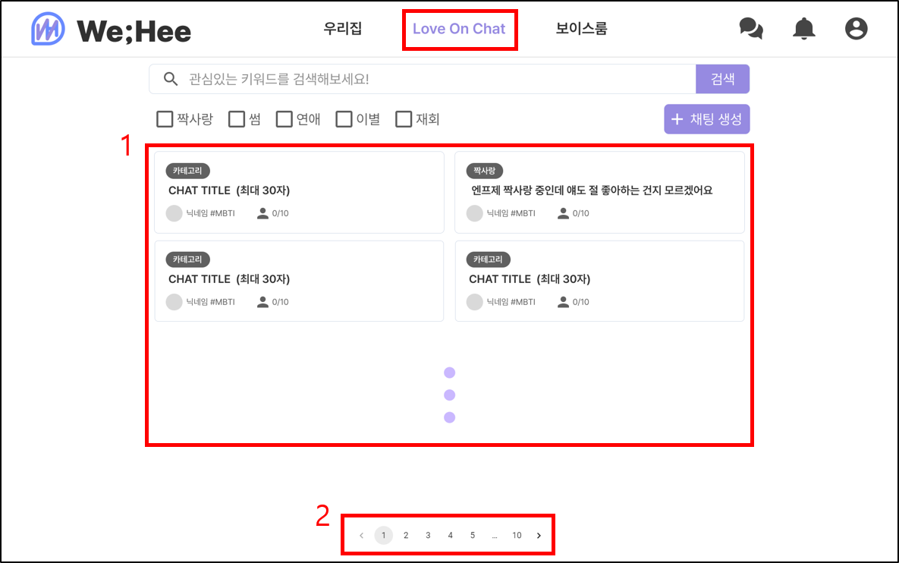
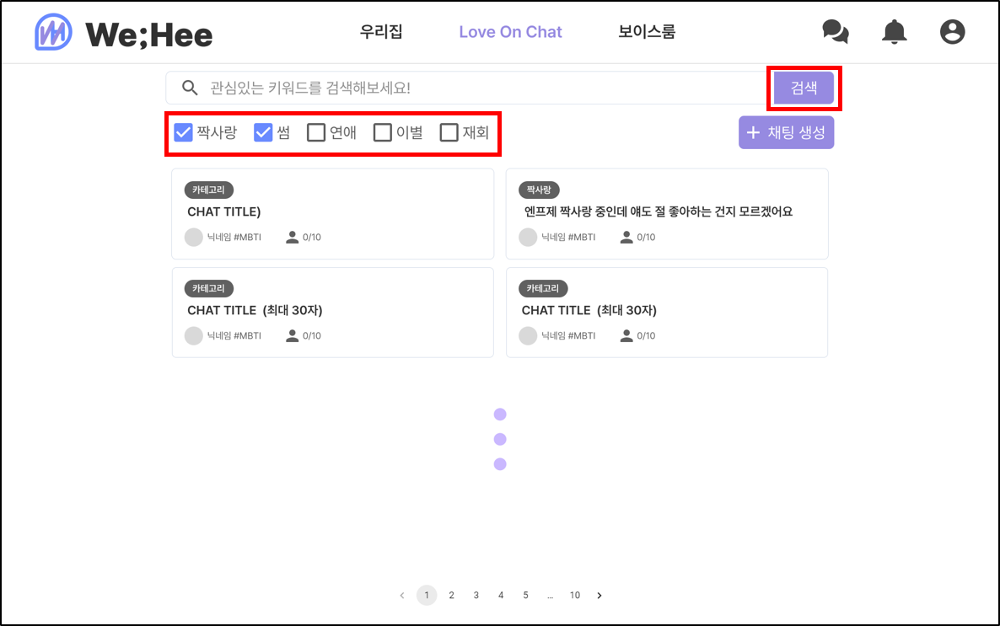
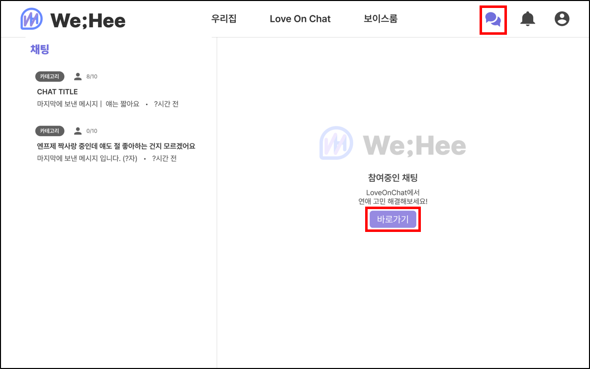
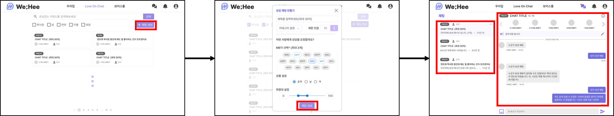
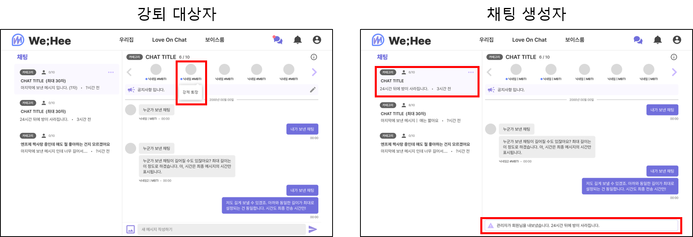
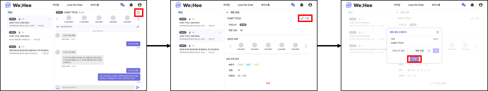
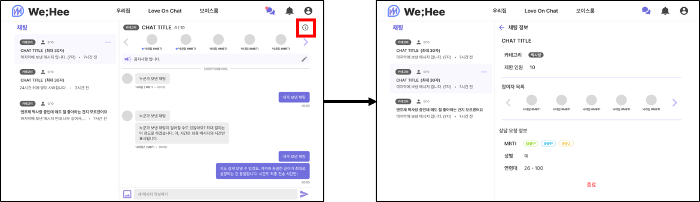
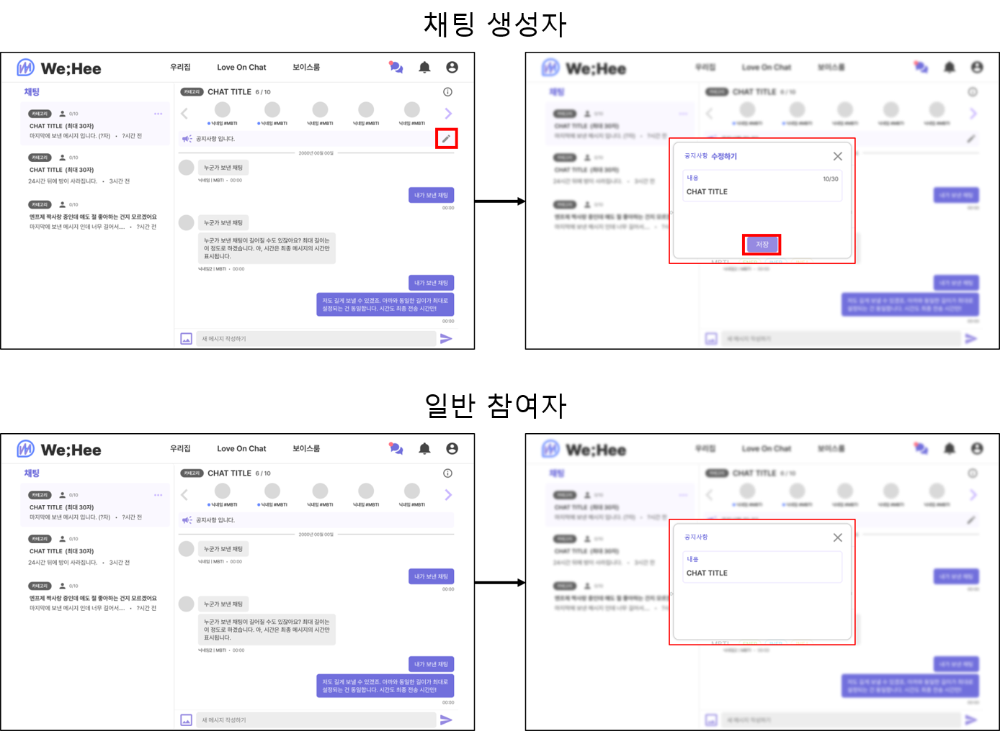
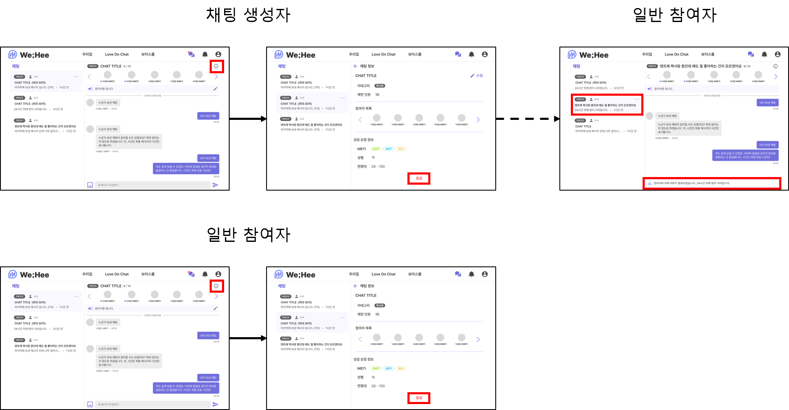

# 채팅 기능 구현하기

마지막 업데이트 날짜: 2023-08-09  
작성자: 김예진

> **목차**
>
> 1. [요구사항 파악](#1-요구사항-파악)
>    1. [채팅 메인](#채팅-메인)
>    2. [채팅 메인 (필터링 및 검색)](#채팅-메인-필터링-및-검색)
>    3. [채팅 참여 목록](#채팅-참여-목록)
>    4. [채팅 생성](#채팅-생성)
>    5. [채팅 강제 퇴장](#채팅-강제-퇴장)
>    6. [채팅 정보 수정 (채팅 생성자)](#채팅-정보-수정-채팅-생성자)
>    7. [채팅 정보 열람 (일반 참여자)](#채팅-정보-열람-일반-참여자)
>    8. [공지사항](#공지사항)
>    9. [채팅 종료](#채팅-종료)

# 1. 요구사항 파악

## 채팅 메인

## 채팅 메인 (필터링 및 검색)

## 채팅 참여 목록

## 채팅 생성

## 채팅 강제 퇴장

## 채팅 정보 수정 (채팅 생성자)

## 채팅 정보 열람 (일반 참여자)

## 공지사항

## 채팅 종료

