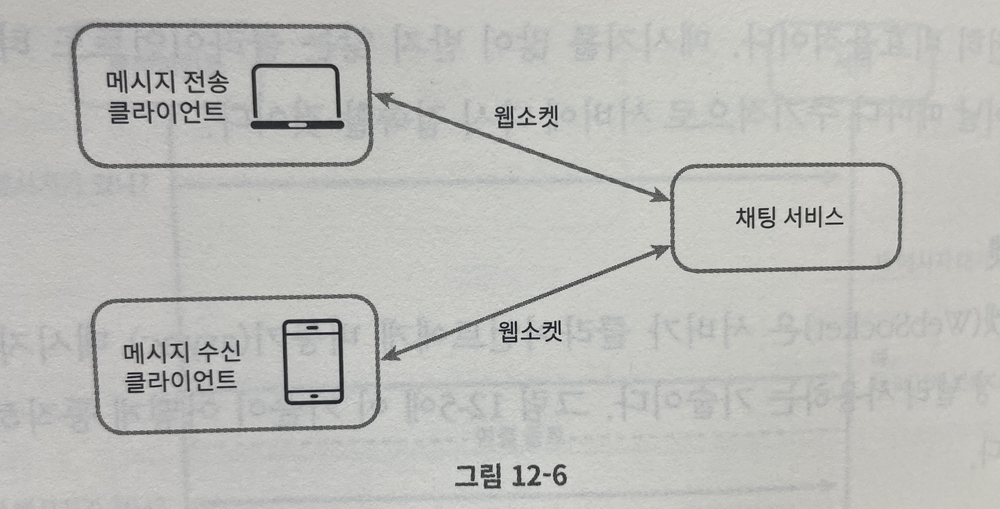
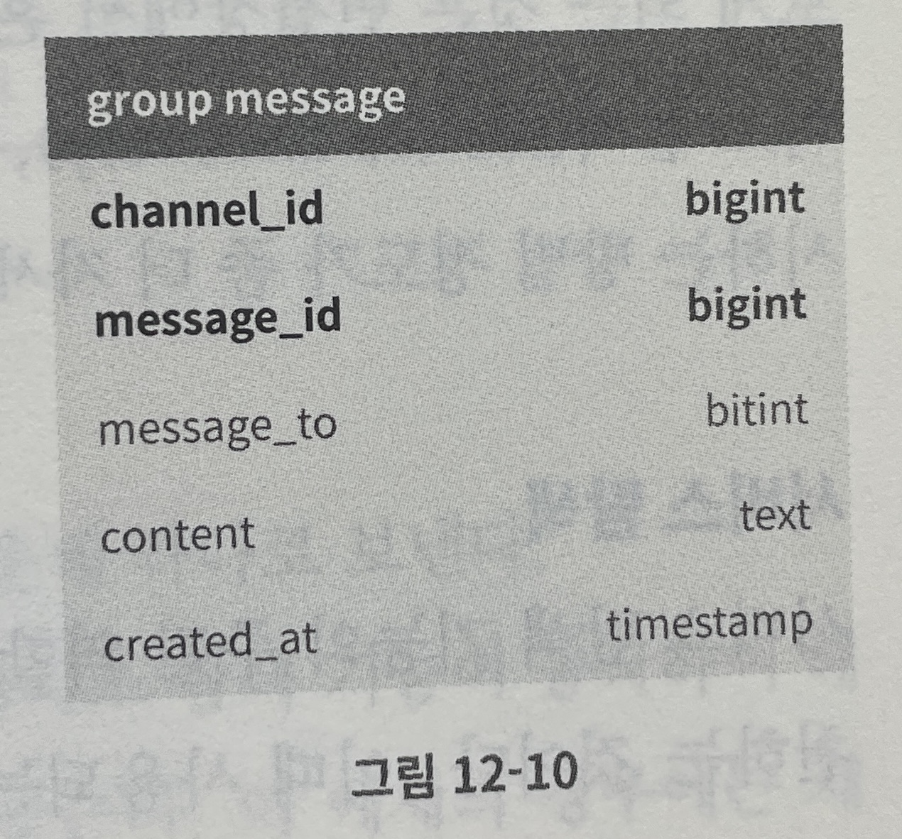
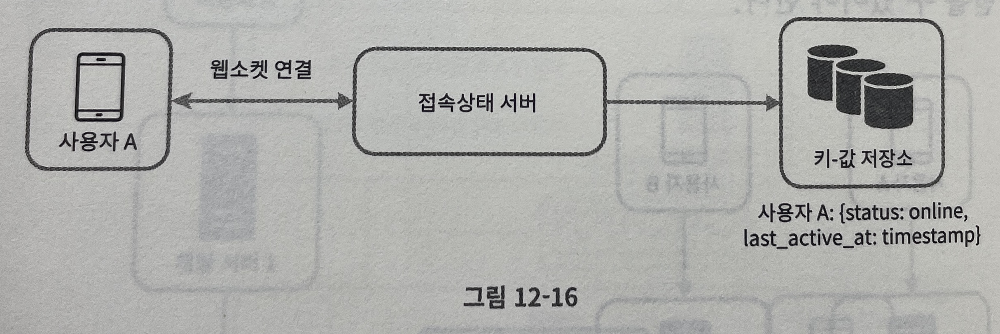
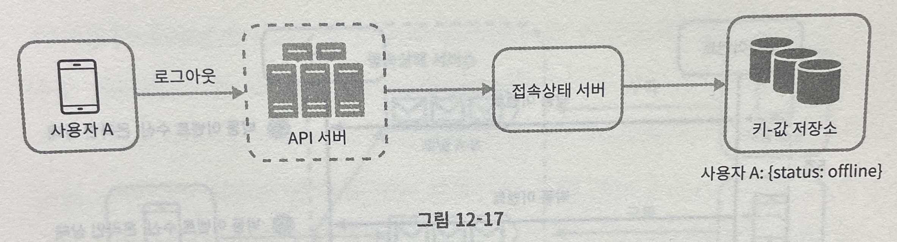
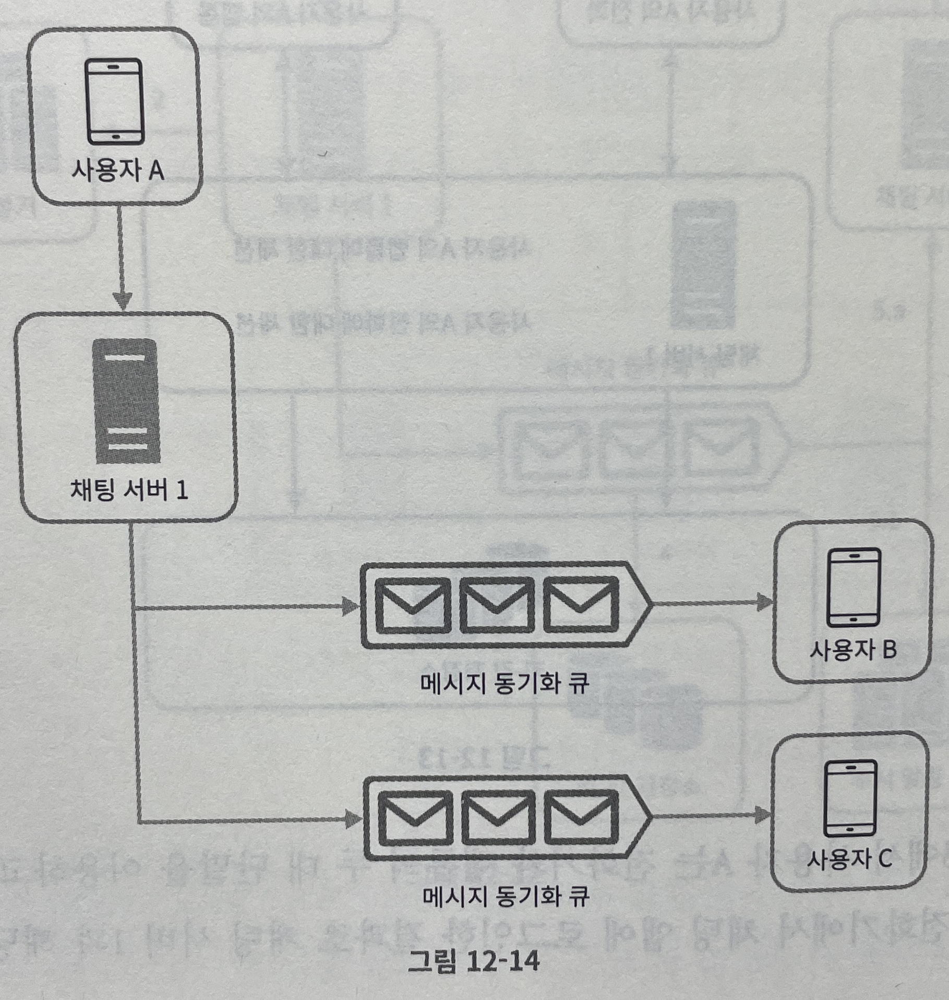
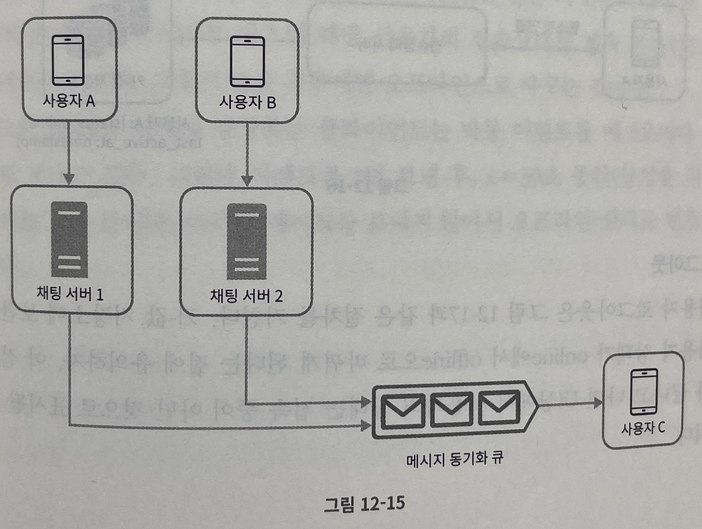

# 채팅 기술 스택 선정

마지막 업데이트 날짜: 2023-07- 21 
작성자: 김예진

> **목차**
>
> 1. [요구사항](#요구사항)
>    1. [기능적 요구사항](#기능적-요구사항)
>    2. [기술적 요구사항](#기술적-요구사항)
> 2. [기술 조사](#기술-조사)
>    1. [통신 프로토콜](#통신-프로토콜)
>       1. [HTTP 프로토콜](#http-프로토콜)
>       2. [웹소켓](#웹소켓)
>    2. [키-값 저장소](#키-값-저장소)
>       1. [그룹 채팅을 위한 메시지 테이블 설계](#그룹-채팅을-위한-메시지-테이블-설계)
>    3. [메시지 큐](#메시지-큐)
>       1. [송신자 입장](#송신자-입장)
>       2. [수신자 입장](#수신자-입장)
> 5. [사용할 기술 스택](#사용할-기술-스택)
> 6. [참고 링크](#참고-링크)

# 요구사항

## 기능적 요구사항

- 웹에서 지원하는 그룹 채팅
  - 웹 단말에서만 지원
  - 한 방에 최대 10명 입장 가능
  - 메시지 길이는 1000자로 제한
  - 채팅방 제목 글자 제한: 30자
- 알림
  - 사용자 접속 상태 표시 지원
  - 읽지 않은 채팅 상태 표시 지원
- 메시지 송수신
  - 클라이언트들로부터 메시지 수신, 메시지 수신 시 채널에 전달
  - 수신자가 접속 상태가 아닌 경우 접속할 때까지 해당 메시지 보관

## 기술적 요구사항

- 웹에서 지원하는 그룹 채팅
  - 일별 능동 사용자 수(DAU: Daily Active User): 00명
- 알림
  - 사용자 접속 상태 표시 지원
  - 읽지 않은 채팅 상태 표시 지원
- 메시지 송수신
  - 클라이언트들로부터 메시지 수신, 메시지 수신 시 채널에 전달
  - 수신자가 접속 상태가 아닌 경우 접속할 때까지 해당 메시지 보관 (Redis 이용)

# 기술 조사

[가상 면접 사례로 배우는 대규모 시스템 설계](../../research/books/system-design-interview.md)를 참조합니다.

## 통신 프로토콜

### ~~HTTP 프로토콜~~

- 이유
  - 메시지 송신 클라이언트 → 수신 클라이언트에게 전달할 메시지를 보냄
- keep-alive 헤더 사용
  - 클라이언트와 서버 사이의 연결을 끊지 않고 계속 유지
  - TCP 접속 과정에서 발생하는 핸드셰이크 횟수를 줄임
- 단점
  - HTTP는 클라이언트가 연결을 만드는 프로토콜이기 때문에 서버에서 클라이언트로 임의 시점에 메시지를 보내는 데는 쉽게 쓰일 수 없음
  - 서버가 연결을 만드는 것처럼 동작할 수 있게 하는 기법 필요(~~폴링, 롱 폴링~~, 웹소켓 등)

### 웹소켓

1. 서버가 클라이언트에게 비동기 메시지를 보낼 때 가장 널리 사용하는 기술
2. 방화벽이 있는 환경에서도 잘 동작
   - 80이나 443처럼 HTTP 혹은 HTTPS 프로토콜이 사용하는 기본 포트번호를 그대로 쓰기 때문
3. 웹소켓 연결은 클라이언트가 시작 - 항구적/양방향 연결
   - 처음 연결은 HTTP 연결이지만 특정 핸드셰이크 절차를 거쳐 웹소켓 연결로 업그레이드 됨
   - 항구적 연결이 만들어지면 서버는 클라이언트에게 비동기적으로 메시지를 전송할 수 있음
4. 유의점
   - 웹소켓 연결이 항구적으로 유지되어야 하기 때문에 서버 측에서 연결 관리를 효율적으로 해야 함

## 키-값 저장소

- 이점
  - 수평적 규모확장이 쉬움
  - 데이터 접근 지연시간이 낮음
  - 이미 많은 채팅 시스템이 키-값 저장소를 채택하고 있음
    - 페이스북 - HBase
    - 디스코드 - Cassandra

### 그룹 채팅을 위한 메시지 테이블 설계

- 기본키: `channel_id`와 `message_id`를 복합키로 사용
- `message_id`
  - 고유해야 함
  - 정렬 가능해야 하며 시간 순서와 일치해야 함
  - 스노플레이크 전략을 사용하거나 지역적 순서 번호 생성기(local sequence number generator)를 이용해 id 생성
- `cur_max_message_id`
  - 여러 단말 사이에서 메시지 동기화 할 때 사용 가능
  - 단말마다 cur_max_message_id 설정해 사용
- `status`, `last_active_at`
  - 사용자 접속상태 표시를 위해 사용
  - 사용자 로그인/로그아웃 등 소켓 연결에 변동이 생길 때 키-값 저장소에 업데이트

## 메시지 큐 사용

### 송신자 입장

사용자 A가 그룹 채팅방에서 메시지를 보내면 B와 C 메시지 동기화 큐에 복사

- 소규모 그룹 채팅에 적합한 이유
  - 새로운 메시지가 왔는지 확인하려면 자기 큐만 보면 되니까 메시지 동기화 플로가 단순함
  - 그룹이 크지 않으면 메시지를 수신자별로 복사해서 큐에 넣는 작업의 비용이 문제되지 않음
  - 실사례: 위챗(그룹 크기 500명으로 제한)

### 수신자 입장

한 수신자는 여러 사용자로부터 오는 메시지를 큐에 받기 때문에 여러 사용자로부터 오는 메시지를 수신할 수 있음

# 사용할 기술 스택

| MySQL | Cassandra | Redis | 메세지 브로커    |
| ----- | --------- | ----- | ---------------- |
| User  | Chatting  | Cache | RabbitMQ 고려 중 |

# 참고 링크

- Erlang at Facebook
  [EugeneLetuchy-ErlangatFacebook.pdf (erlang-factory.com)](https://www.erlang-factory.com/upload/presentations/31/EugeneLetuchy-ErlangatFacebook.pdf)
- Messenger and WhatsApp process 60 billion messaged a day
  https://www.theverge.com/2016/4/12/11415198/facebook-messanger-whatsapp-number-messages-vs-sms-f8-2016
- Long tail
  https://en.wikipedia.org/wiki/Long_tail
- The Underlying Technology of Messages
  https://www.facebook.com/notes/facebook-engineering/the-underlying-technology-of-messages/454991608919/
- How Discord Stores Billions of Messages
  https://discord.com/blog/how-discord-stores-billions-of-messages
- Announcing Snowflake
  https://blog.twitter.com/engineering/en_us/a/2010/announcing-snowflake.html
- Apache Zookeeper
  https://zookeeper.apache.org/
- From noting: the evolution of WeChat background system (Article in Chinese)
  https://www.infoq.cn/article/the-road-of-the-growth-weixin-background