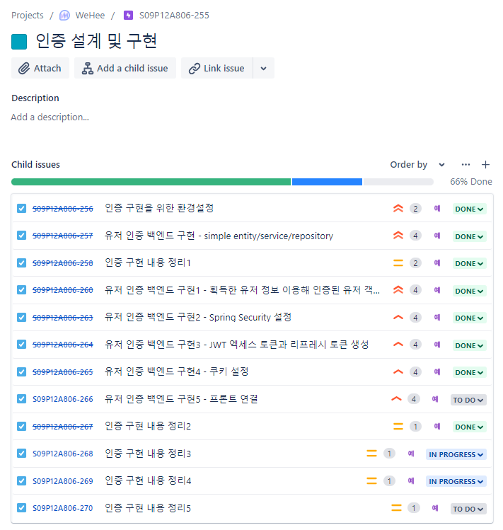
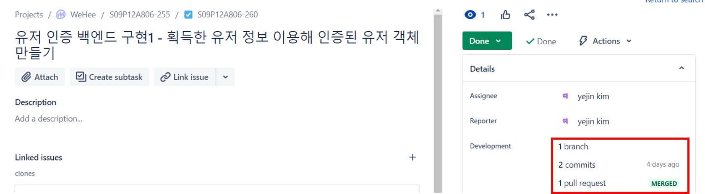
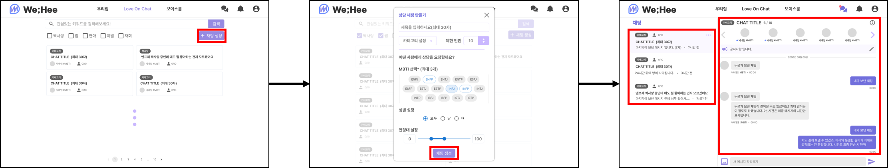

# 백엔드 개발자의 API 만들기

마지막 업데이트 날짜: 2023-08-08 <br>
작성자: 김예진

> **목차**
>
> 1. [이 문서의 목적은?](#1-이-문서의-목적은)
>    1. [무슨 내용을 다룰까?](#무슨-내용을-다룰까)
> 2. [왜 이렇게 개발해야 할까?](#2-왜-이렇게-개발해야-할까)
>    1. [프로젝트 관리 관점](#2-1-프로젝트-관리-관점)
>    2. [개발 속도 관점](#2-2-개발-속도-관점)
>    3. [코드 품질 관점](#2-3-코드-품질-관점)
> 3. [Jira와 GitLab을 이용해 프로젝트 관리하기](#3-jira와-gitlab을-이용해-프로젝트-관리하기)
>    1. [Jira로 프로젝트 계획 세우기](#3-1-jira로-프로젝트-계획-세우기)
>    2. [GitLab 브랜치로 Jira 계획 실천하기](#3-2-gitlab-브랜치로-jira-계획-실천하기)
> 4. [프론트엔드 개발자와 소통하기](#4-프론트엔드-개발자와-소통하기)
>    1. [요구사항 파악하기](#4-1-요구사항-파악하기)
>    2. [프론트엔드와 연동할 때 어떤 정보가 오가는지 파악하기](#4-2-프론트엔드와-연동할-때-어떤-정보가-오가는지-파악하기)
>    3. [대략적인 API 설계하기](#4-3-대략적인-api-설계하기)
> 5. [API 개발](#5-api-개발)
>    1. [API 명명 규칙](#5-1-api-명명-규칙)
>    2. [Controller 설계](#5-2-controller-설계)
>       1. [API 출력 정보 규칙](#api-출력-정보-규칙)
>    3. [Service 구현](#5-3-service-구현)
>    4. [Repository 구현](#5-4-repository-구현)

### 들어가기 전에

이 문서에서 설명하는 방법은 모든 프로젝트에서 사용되는 방법은 아닙니다. 프로젝트의 목적과 코드 구조에 따라 언제든지 달라질 수 있음을 기억해두되, WeHee의 개발 속도와 품질을 높이기 위해 이 방법을 따르면 좋겠습니다. 물론 저도 경력이 10년이 된 개발자라거나 엄청난 역량을 가진 개발자가 아니기 때문에 이 방법 외에도 좋은 방법들이 분명히 있겠다만, 경험상으로는 이 방법들이 효과가 가장 좋았습니다.

### 이 문서에서 다루는 내용

단순히 `Spring Boot에서 어떻게 API 설정을 하느냐`만을 다루지 않고, 프로젝트 관리 관점과 개발 속도 향상/품질 향상 관점에서 어떻게 API를 만드는지 그 순서와 절차들을 다룹니다.

# 1. 이 문서의 목적은?

백엔드 개발자-프론트엔드 개발자가 효율적으로 개발하고, 백엔드 개발자-기획자가 효과적으로 소통하면서 개발하는 방법을 배우는 것이 이 문서가 지향하는 지점입니다.

## 무슨 내용을 다룰까?

1. 프론트엔드 개발자와 소통하는 방법
2. 다른 개발자, 기획자와 소통하는 방법
3. API를 만드는 방법

# 2. 왜 이렇게 개발해야 할까?

## 프로젝트 관리 관점

하나의 웹 개발 프로젝트는 여러 파트로 나누어져 관리됩니다. 크게는 백엔드와 프론트엔드로 나뉘어지고, 우리팀의 경우 백엔드는 운영/게시팥/채팅/보이스룸/인프라로 나뉘게 됩니다. 시간이 여유롭다면 구현에 대한 공부도 하고 여유롭게 프론트엔드와 코드를 맞춰볼 수도 있겠지만, 마감 기한이 타이트하게 정해진 시점에서는 여러 개발자가 공부와 클린 코드를 병행하며 프로젝트를 완성해가기 힘들어집니다. <br>

프로젝트에서 가장 중요한 것은 결국 `시간 내에 얼만큼의 완성도로 기능을 구현하느냐`입니다. 여기서의 '완성도'는 게시판이나 보이스룸, 채팅 등 각 기능별 완성도만을 의미할 뿐만 아니라 모든 도메인들의 평균적인 기능 구현 완성도도 포함합니다. 그래서 각 도메인별로 여러분들이 개발을 잘 하고 계신다고 하더라도 계속해서 개발 진척도와 계획을 물어보게 되는 것입니다. 모든 도메인들의 개발 완성도가 어떻게 되는지, 그래서 프로젝트의 완성도가 어떻게 될 것인지 판단해야 하니까요.

## 개발 속도 관점

WeHee는 기획이 촘촘하게 된 편이기 때문에 개발하면서 프론트-백-기획이 계속해서 질문을 주고 받아야 하는 상황은 아닙니다. 이렇게 될 경우 각자 자기가 맡은 역할에만 충실하면 되기 때문에 개발 속도가 빨라지게 되는데요, 그럼에도 주의할 점이 생깁니다. 프론트는 프론트만, 백엔드는 백만 만들다보면 나중에 연동이 안되는 문제가 발생하거든요. 여기에서 최악은 서비스 정책을 잊어버렸거나 착각해 백엔드/프론트엔드 로직을 전반적으로 갈아 엎어야 하는 상황이 발생하는 경우가 발생할 수도 있다는 것입니다. 그렇게 되면 기획이 아무리 탄탄하다 한들 개발 속도는 무제한으로 늘어나게 됩니다. <br>

이런 상황을 방지하기 위해서는 모든 개발 시점마다 프론트엔드/기획자와 소통해야 합니다. 기획자와의 소통은 꽤나 쉬운 편에 속하는데 미리 정해지지 않은 정책이면 기획자에게 물어보면 되고, 정해진 정책이라면 기획자의 문서를 보는 것만으로도 충분한 소통이라고 할 수 있겠습니다. <br>

프론트엔드와 소통은 보다 복잡합니다. 실질적으로 개발하면서 여러가지 정보가 오고가게 되니까요. 이 부분은 뒤에서 더 자세하게 다루도록 하겠습니다.

## 코드 품질 관점

WeHee의 경우 Spring Security와 JWT를 이용해 인증과 인가 절차를 처리합니다. 이 인증/인가 절차로 인해 코드상의 규약도 많아지는데요, 만약 이 규약을 따르지 않는다면 코드가 동작하지 않는 불상사가 발생할 수도 있습니다. 열심히 코딩을 했는데 작동하지 않는다면 속도 상하지만, 코드의 품질도 그만큼 높다고 할 수 없겠죠...? 심지어 여러분의 잘못도 아닌 것 같은데 말입니다. <br>

이 문제를 해결하기 위해서는 브랜치 주기를 짧게 가져가고 devleop 브랜치와 자주 병합을 해 코드가 정상적으로 작동하는지 확인해야 합니다. 그렇게 하면 코드가 정상적으로 작동하는지 가장 빠르게 알 수 있고, 각기 다른 개발자가 개발했다고 하더라도 전반적으로 코드의 통일성을 크게 유지할 수 있게 됩니다. 좋은 코드 리뷰가 가능해지는 것은 물론이고요.

# 3. Jira와 GitLab을 이용해 프로젝트 관리하기

프로젝트를 가장 효율적으로 관리하는 방법은 Jira와 GitHub을 잘 이용하는 것입니다. 각 개발자마다 구체적으로 어떤 개발을 앞두고 있는지, 어떤 개발을 할 것인지 파악하는 것만으로도 프로젝트가 어떻게 흘러가는지 알 수 있거든요.

## 3-1. Jira로 프로젝트 계획 세우기

Jira는 다음과 같이 작성하시는 것이 가장 이상적입니다.

 

위의 사진에 따르면 `인증 설계 및 구현`이라는 큰 Epic 밑에는 어떻게 인증을 구현할 것인지 세부적인 계획들이 다음과 같은 tasks로 나뉘어져 있습니다.

1. 인증 구현을 위한 환경설정
2. 유저 인증 백엔드 구현 - simple entity/service/repository
3. 유저 인증 백엔드 구현1 - 획득한 유저 정보 이용해 인증된 유저 객체 만들기
4. 유저 인증 백엔드 구현2 - Spring Security 설정
5. 유저 인증 백엔드 구현3 - JWT 엑세스 토큰과 리프레시 토큰 생성
6. 유저 인증 백엔드 구현4 - 쿠키 설정
7. 유저 인증 백엔드 구현5 - 프론트 연결
8. 인증 구현 내용 정리 1~5

`인증 설계 및 구현`을 구체적으로 어떻게 하는지는 몰라도, 대강 어떤 순서와 어떤 규모로 일이 진행되는지 쉽게 알 수 있습니다. 이렇게 각 도메인별로 계획이 세분화되어 있다면 프로젝트가 어떻게 진행되는지 파악하기 쉬워집니다.

## 3-2. GitLab 브랜치로 Jira 계획 실천하기

Jira에서 각 task는 최대한 짧은 주기로 가져가고, 각 task를 한 개의 브랜치로 일대일 대응시키는 것이 가장 좋습니다.



사진을 보면 `유저 인증 백엔드 구현1 - 획득한 유저 정보 이용해 인증된 유저 객체 만들기` task는 1개의 브랜치를 가지고 있고, 이 브랜치에서는 2개의 커밋을 했습니다. 그리고 develop 브랜치와 연동이 완료된 상태인 것도 확인 가능합니다. Jira에서 짠 계획이 그대로 개발로 이어지니 참 좋죠? 

# 4. 프론트엔드 개발자와 소통하기

프론트엔드 개발자와 소통하기 위해서 여러 단계를 거치는데, 이때는 마지막 단계에서만 프론트엔드 개발자와 대화를 나누고 주로 혼자 작업을 하게 됩니다. 결국 프론트엔드 개발자와 소통하기 위한 준비를 엄청나게 하는 것인데요, 어떤 작업들이 있는지 보겠습니다. 

## 4-1. 요구사항 파악하기

어떤 기능을 개발한다고 한다면, 예컨대 채팅 서비스를 만들겠다고 한다면 기본적으로 무엇을 구현해야 하는지 다들 머릿속에 아이디어가 떠오를 것입니다. 하지만 **절대로 머릿속에 떠오른 아이디어대로 개발해서는 안됩니다!!!** 기억과 느낌에 기반해 구현을 하게 되면 정책들을 놓치기 쉽고, 기획과는 다른 것을 개발할 수도 있거든요. 그래서 개발 전에는 항상 `내가 무엇을 개발하려고 했는가`를 점검해야 합니다. 여기에서는 채팅 서비스를 예시로 설명하겠습니다. <br>

가장 좋은 방법은 기획자가 만든 `채팅 요구사항`을 읽어보는 것입니다. 채팅방을 만들 때는 어떤 조건이 있었는지, 채팅방에서 공지사항은 누가 얼마나 올릴 수 있는지, 방은 어떻게 입장하고 나가는지 등등...을 파악해봅니다.

## 4-2. 프론트엔드와 연동할 때 어떤 정보가 오가는지 파악하기

보통 웹개발에서 정보가 오갈 때는 버튼을 이용해 어떤 기능을 수행할 때, 페이지를 바꿀 때가 되겠습니다. 버튼과 페이지를 누르는 것은 서비스 이용자가 시각적으로 웹페이지를 보면서 하는 것이므로 우리도 이 기능들을 잘 제공하기 위해서는 웹페이지가 어떻게 생겼는지 다시 한 번 확인해야 합니다.



채팅 생성을 대략적으로 보자면 사용자가 `채팅 생성`버튼을 누르면 채팅 생성 모달창이 뜨게 됩니다. 여러가지 정보를 입력하고 `채팅 생성` 버튼을 누르면 채팅창으로 넘어가게 됩니다. 여기에서 백엔드가 해야 하는 작업들에는 어떤 것이 있을까요? 함께 보겠습니다.

1.  채팅 생성 모달에서 설정한 정보를 기반으로 채팅방 만들기
   - 카테고리 설정 여부/제한 인원 설정 여부/MBTI 최대 3개까지 선택했는지 등등은 백엔드/프론트엔드 중 누가 처리하지?
2. 채팅방 내부 정보 보여주기
   - 참여 중인 참여자 정보, 메시지(보낸 사람 정보/내용/시간) 정보, 공지사항, 타이틀 등의 정보를 넘겨줘야 함
3. 다른 채팅방 정보 보여주기
   - 다른 채팅방 이름, 몇 명이 참여 중인지, 마지막 메시지 정보 등을 보여줘야 함

여기에서 `누가 처리하지?`와 같은 부분을 프론트엔드 개발자와 합의하면 됩니다.  

## 4-3. 대략적인 API 설계하기

자, 채팅방을 생성하는 `api/v1/chat/create` API를 만든다고 가정해 봅시다. 프론트엔드 개발자는 다음과 같은 정보를 보낼 것입니다.

1. 채팅방 이름
2. 카테고리
3. 제한 인원
4. 선택한 MBTI들
5. 성별
6. 연령대

이 정보들은 `ChatCreateRequestDto` 객체로 만들어서 요청을 받을 계획을 세워봅니다. 채팅방을 만들고 나면(API가 그 기능을 충실하게 수행했다면 )프론트엔드에게는 어떤 정보들을 넘겨줘야 할까요? 이때는 `ChatCreateResponseDto` 객체를 만들어 전달하면 됩니다. ResponseDto의 내용은 생략하겠습니다. <br>

이렇게 1. 어떤 API를 만들어야 하는지 결정 2. 요청/응답 시 주고 받을 정보 결정 작업이 완료되면 해당 내용을 정리해 프론트엔드 개발자와 연동 계획을 나눕니다.

# 5. API 개발

개발은 지금부터가 시작입니다. 가장 먼저 기획과 화면을 기반으로 API를 설계하고, 그 API를 구현하기 위한 controller-service-repository 순서로 개발합니다.

## 5-1. API 명명 규칙

api는 `/api/<버전>/domain`을 기본으로 하고, 그 뒤에 필요한 정보들을 덧붙여 개발합니다. 이는 프로젝트 전반적으로 작성되는 API를 한번에 개발하기 위함입니다. 구현은 다음과 같이 합니다.
```java
@RestController
@RequestMapping("/api/v1/chat")
@RequiredArgsConstructor
public class ChatController {
}
```


## 5-2. Controller 설계

위에서의 채팅을 예시로 든다면 지금까지 ChatController에서 개발될 API는 `/api/v1/chat/create`-`createChatRoom()`입니다. 

```java
@RestController
@RequestMapping("/api/v1/chat")
@RequiredArgsConstructor
public class ChatController {

    private final ChatService chatService;

    @GetMapping("/create")
    public ApiResponse<ChatCreateResponseDto> createChatRoom(@AuthenticationPrincipal String providerId,
        @Valid @RequestBody ChatCreateRequestDto requestDto) {
        ChatCreateResponseDto room = chatService.createChatRoom(providerId, requestDto);
        return ApiResponse.success("room", room);
    }
}
```

### API 출력 정보 규칙

API에서 동작을 수행한 후에는 ApiResponse 객체를 반환합니다. 꺽쇠<> 내부에는 반환할 정보 객체 타입을 넣으면 됩니다. return할 때는 `ApiResponse.success()` 내부에 String 형태의 객체 이름과 객체를 함께 넣어 반환하면 됩니다. 

## 5-3. Service 구현

비즈니스 로직을 service class에서 구현하시면 됩니다.

## 5-4. Repository 구현

DB와 트랜잭션 하는 부분을 repository class에서 구현하시면 됩니다.
