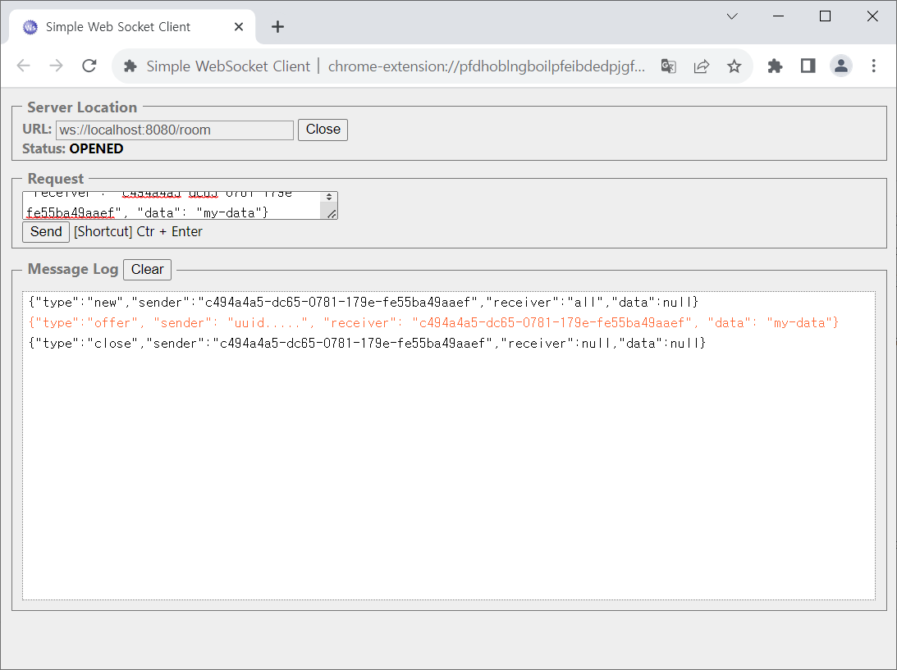
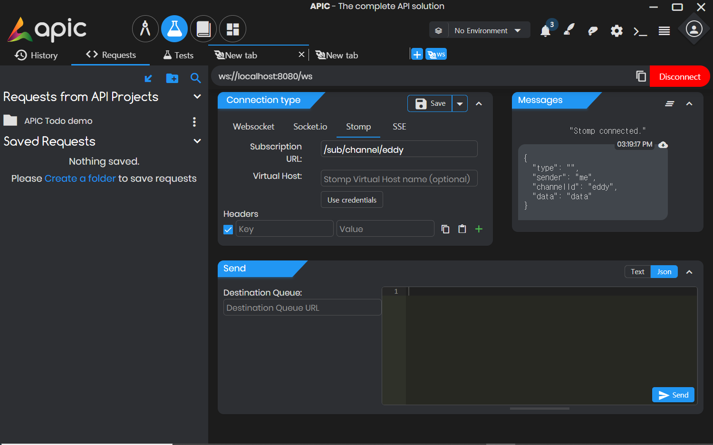
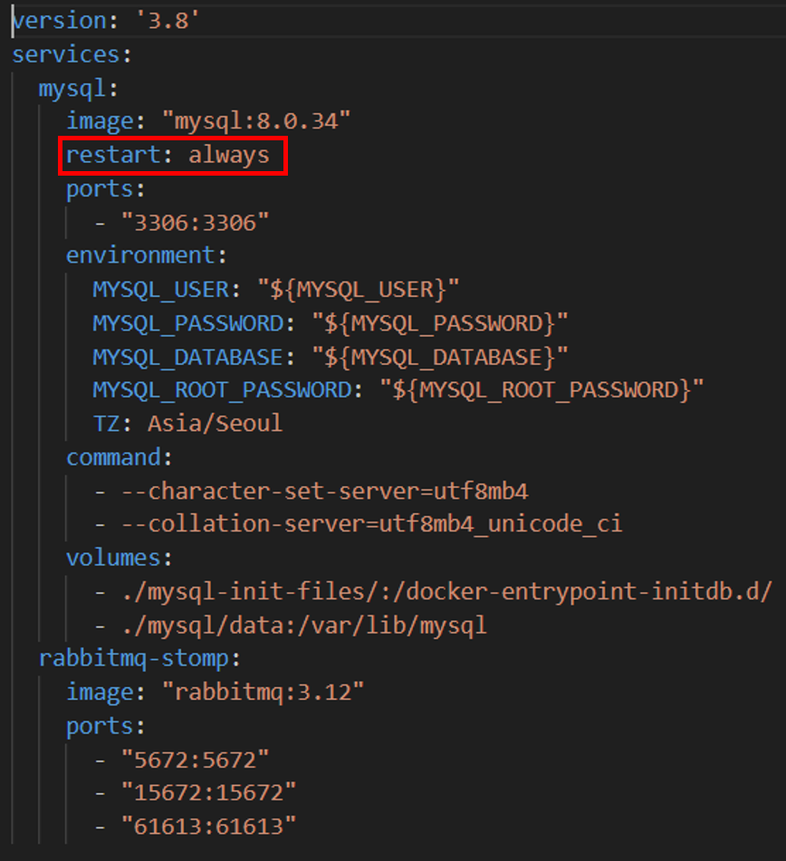
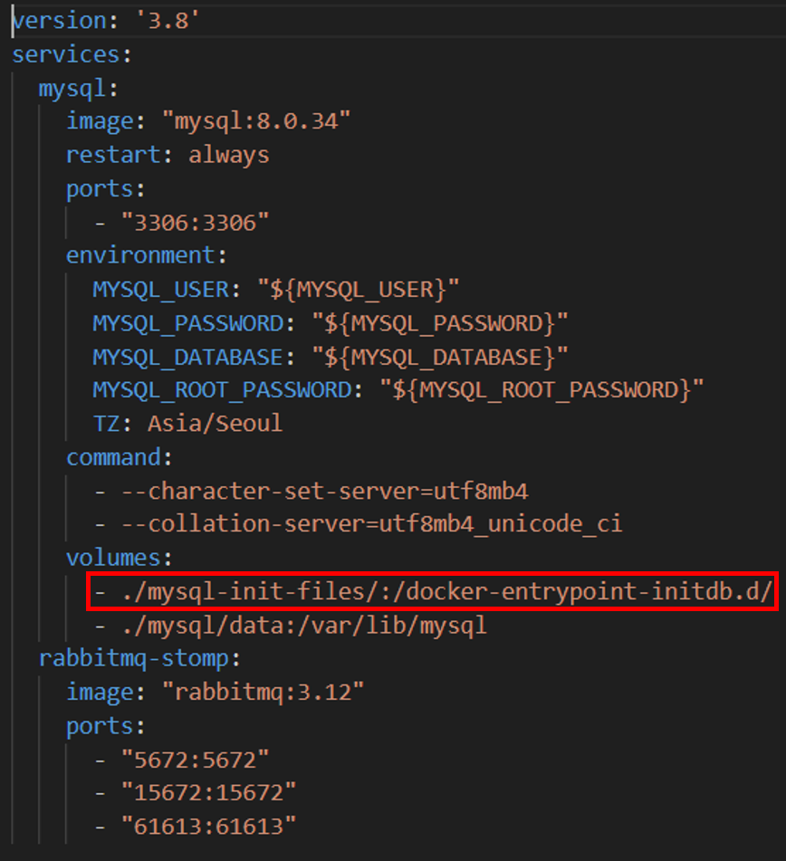
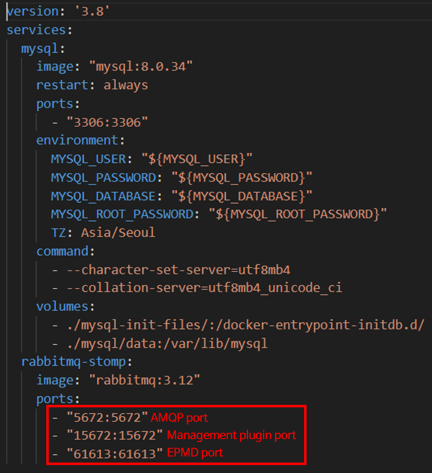

# Spring WebSocket

마지막 업데이트 날짜: 2023-08-01  
작성자: 김예진

> **목차**
>
> 1. 배워야 할 개념들
>    1. STOMP
>    2. SockJS
>    3. RabbitMQ
>    4. Message Brocker
>    5. WebSockek
>    6. amqp
>    7. docker compose file
>       [여기](https://github.com/skylove308/playground) 참고함
>    8. yml
>       1. [yml 프로퍼티 관리](https://tecoble.techcourse.co.kr/post/2022-10-04-active_profiles/)
>       2. [Spring boot 외부 환경변수 주입](https://velog.io/@crow/Spring-boot-%EC%99%B8%EB%B6%80-%ED%99%98%EA%B2%BD%EB%B3%80%EC%88%98-%EC%A3%BC%EC%9E%85)
> 2. 의존성 추가

# 1. 의존성 추가

dependency에 해당 내용 추가

`implementation 'org.springframework.boot:spring-boot-starter-websocket'`

# 2. 도커

$ docker-compose -f docker-compose/dependencies.yml up

mysql 실행: docker exec -it <mysql container name> bash

mysql -u root -p

rabbitmq 접근: docker exec <rabbitmq container name> rabbitmq-plugins enable rabbitmq_management

# 3. 단순 WebSocket Test

---

## Docker-compose 관련 - MySQL

### 1. `restart: always` 뜻

Docker Compose에서 `restart: always`는 컨테이너의 재시작을 명시하는 옵션이다. 이 옵션을 사용하면 시스템 재부트이든 컨테이너가 장애에 의해 꺼졌든 무슨 이유로든 컨테이너가 종료된 상태에서 도커가 실행되면 자동으로 컨테이너를 생성하는 것을 의미한다. `restart`에 대한 다른 옵션들은 다음과 같다.

> - `no`: The container will not be automatically restarted, regardless of the exit status or the cause of the stop.
> - `on-failure`: The container will be restarted automatically only if it exits with a non-zero exit status, indicating an error or failure.
> - `unless-stopped`: The container will be restarted automatically unless it is explicitly stopped by the user or a `docker-compose down` command is issued.

### 2. docker-entrypoint-initdb.d를 마운트하는 이유?

도커 컨테이너 내부에 docker-entrypoint-initdb.d에 SQL 스크립트 파일을 저장하면 컨테이너 실행 시 최초 한 번에 대해 스크립트 파일에 내용이 반영된다. 따라서 데이터베이스 초기화에 대한 sql 파일이 있다면 `./mysql-init-files` 내부에 sql 파일들을 위치시키면 된다. 이떄 sql 파일들의 이름은 어떻든 상관 없다. 

---

## Docker-compose 관련 - RabbitMQ, 3개의 포트를 지정하는 이유?

> 1. AMQP Port (5672): The default port used by RabbitMQ for AMQP (Advanced Message Queuing Protocol) connections. AMQP is the main protocol used for communication between RabbitMQ clients and the server. This port is used for sending and receiving messages from producers and consumers.
> 2. Management Plugin Port (15672): RabbitMQ comes with a web-based management plugin that provides a user interface for managing and monitoring the RabbitMQ server. This port is used to access the management plugin's web interface. It allows you to view queues, exchanges, connections, and other useful information about the RabbitMQ server.
> 3. Erlang Port Mapper Daemon (EPMD) Port (4369): RabbitMQ uses the EPMD for communication between nodes in a RabbitMQ cluster. The EPMD port is essential for cluster formation and coordination among RabbitMQ nodes.

------

### 참고 링크

- [Spring Websocket & STOMP](https://brunch.co.kr/@springboot/695#:~:text=STOMP%EB%8A%94%20Simple%20Text%20Oriented,%ED%95%98%EA%B2%8C%20%EC%A0%95%EC%9D%98%ED%95%A0%20%EC%88%98%20%EC%9E%88%EB%8B%A4.)
  - [Spring AMQP, RabbitMQ](https://brunch.co.kr/@springboot/298)
  - [스프링 클라우드, MQ 도입 사례 시리즈](https://brunch.co.kr/@springboot/2)
    - 도입 배경 및 아키텍처 결정
    - 관련 연구 1 - 기본 개념
    - 관련 연구 2 - RabbitMQ
    - 관련 연구 3 - Spring Cloud Stream, RabbitMQ 연동
- [Spring Official Docs - Flow of Messages](https://docs.spring.io/spring-framework/reference/web/websocket/stomp/message-flow.html)
- [[Spring Boot] WebSocket과 채팅 (1)](https://dev-gorany.tistory.com/212)
- [[Spring Boot] WebSocket과 채팅 (2) - SockJS](https://dev-gorany.tistory.com/224)
- [[Spring Boot] WebSocket과 채팅 (3) - STOMP](https://dev-gorany.tistory.com/235)
- [[Spring Boot] WebSocket과 채팅 (4) - RabbitMQ](https://dev-gorany.tistory.com/325)
- [Spring +STOMP+SOCKJS 채팅 구현(STOMP 작동방식)](https://nobase2dev.tistory.com/25)
- [[Spring][WebSocket] 스프링 STOMP와 웹 소켓 개념 및 사용법 (Web Socket with STOMP) (1)](https://growth-coder.tistory.com/157)
- [Spring Boot WebSocket (2) - 웹소켓 이해하기 _ STOMP로 채팅 고도화 하기](https://ws-pace.tistory.com/106)
- [[Stomp] Spring Boot with React 채팅 서버 : 3-1. Stomp 정리 및 설명](https://develop123.tistory.com/76)
