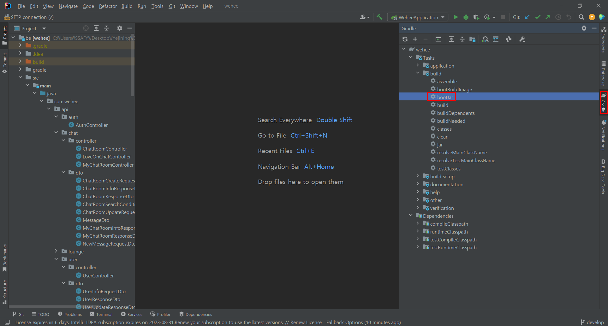
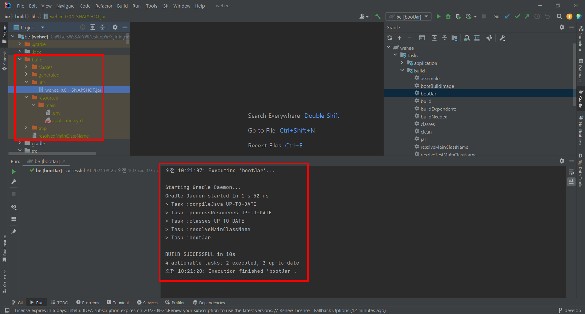

# 백엔드 빌드하기

마지막 업데이트 날짜: 2023-08-25 <br>
작성자: 김예진

> **목차**
>
> 1. [터미널에서 빌드하기](#1-터미널에서-빌드하기)
> 2. [IntelliJ에서 빌드하기](#2-intellij에서-빌드하기)

# 1. 터미널에서 빌드하기

1. 빌드 명령

   ``` bash
   ./gradlew bootJar
   ```

2. 빌드된 파일 확인

   `build` 폴더 하단

# 2. IntelliJ에서 빌드하기

1. `gradle`에서 `bootJar` 클릭
    
2. 빌드된 파일 확인

    


