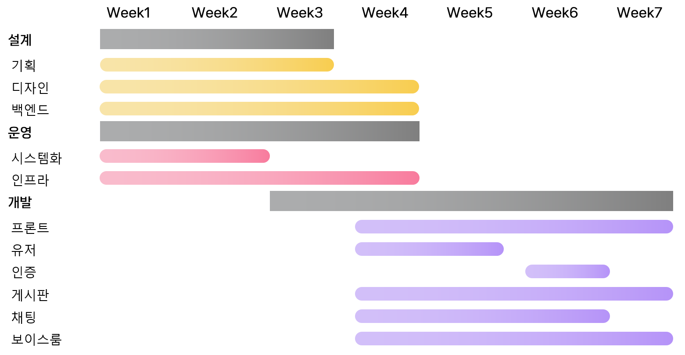

# 운영

## 링크 바로 가기

> 1. [기술 스택](tech_stack.md)
> 2. [일정](plan.md)
> 3. [역할 분담](roles.md)

# 운영 미리보기

## 기술 스택

## 일정

## 역할 분담

|                      [김예진](#김예진)                       |                      [류나연](#류나연)                       |                      [박우현](#박우현)                       |                      [유연정](#유연정)                       |                      [윤석준](#윤석준)                       |                      [조명익](#조명익)                       |
| :----------------------------------------------------------: | :----------------------------------------------------------: | :----------------------------------------------------------: | :----------------------------------------------------------: | :----------------------------------------------------------: | :----------------------------------------------------------: |
|  |  |  |  |  |  |
|                            백엔드                            |                             기획                             |                            백엔드                            |                          프론트엔드                          |                            백엔드                            |                            컨설팅                            |

