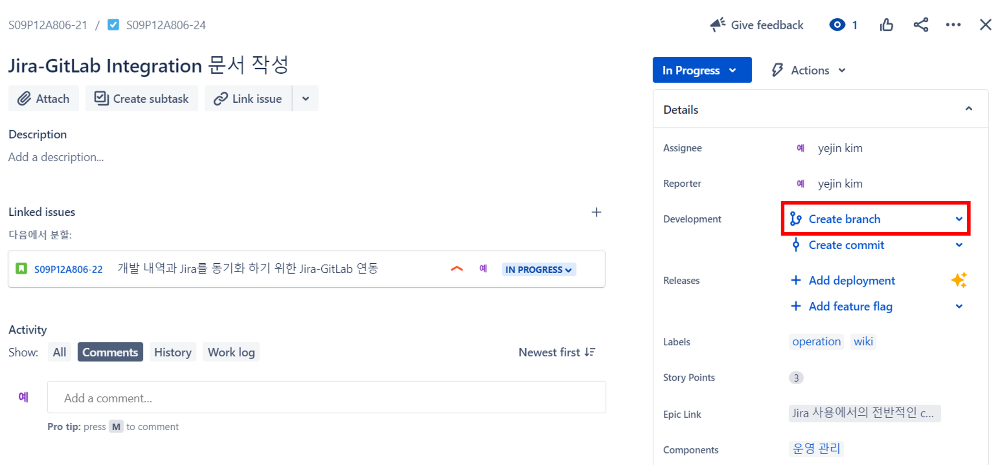
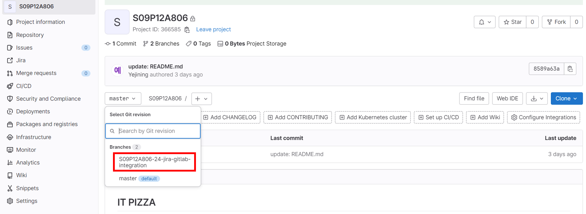
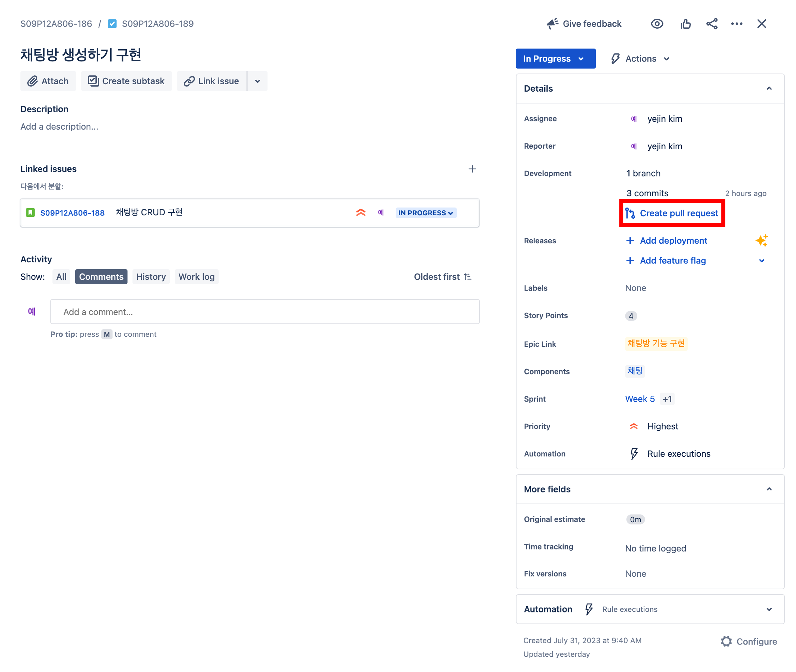
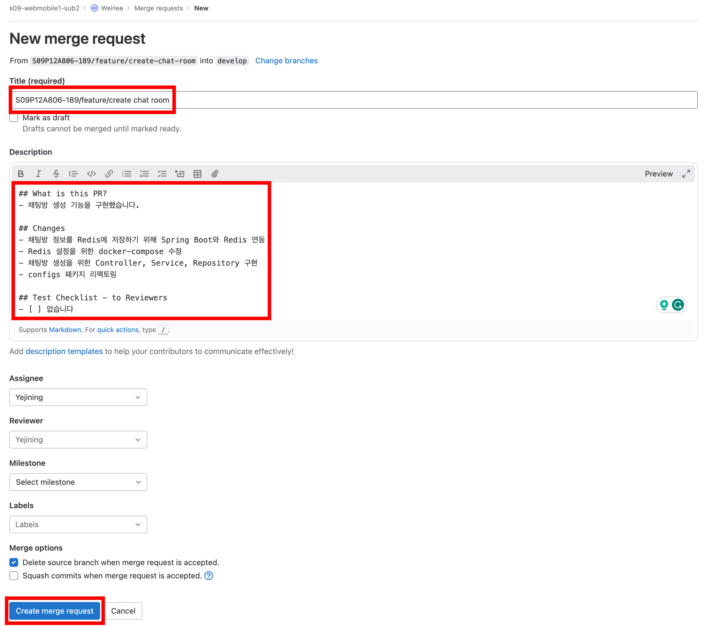

# Git Conventions

마지막 업데이트 날짜: 2023-08-21 <br>
작성자: 김예진

> **목차**
>
> 1. [Branch Conventions](#1-branch-conventions)
>    1. [Branch Naming Convention](#branch-naming-convention)
>    2. [Jira를 활용한 브랜치 생성](#jira를-활용한-브랜치-생성)
> 2. [Commit Conventions](#2-commit-conventions)
>    1. [Commit Example](#commit-example)
>    2. [Commit Template](#commit-template)
>    3. [Commit Type](#commit-type)
> 3. [PR Conventions](#pr-conventions)
>    1. [PR Naming Convention](#pr-naming-convention)
>    2. [Jira를 활용한 PR](#jira를-활용한-pr)

# 1. Branch Conventions

## Branch Naming Convention

| 이름        | 규칙                         | 설명                                                   | 분기점  | 병합점          |
| ----------- | ---------------------------- | ------------------------------------------------------ | ------- | --------------- |
| Master      | `main`                       | 배포 가능한 최종 상태의 브랜치                         | -       | Develop         |
| Develop     | `develop`                    | 기능 개발을 위한 분기 및 병합 지점으로 사용하는 브랜치 | Master  | Release         |
| Release     | `release/v<release-version>` | 배포를 위한 마무리 작업 브랜치                         | Develop | Master          |
| Hotfix      | `hotfix/v<hotfix-version>`   | 배포 버전에서 발생한 버그 긴급 수정 작업 브랜치        | Master  | Master, Develop |
| Feature     | `feature/<feature-name>`     | 기능 개발 브랜치                                       | Develop | Develop         |
| Refactoring | `refactor/<feature-name>`    | 리팩토링 브랜치                                        | Develop | Develop         |

## Jira를 활용한 브랜치 생성

> **목차**
>
> 1. `Create branch` 버튼 클릭
> 2. `Create branch in GitLab` 클릭
> 3. 브랜치 정보 입력 후 브랜치 생성
>    1. `Jira Project` 설정
>    2. `Source branch` 설정
>    3. `Branch name` 설정

1. `Create branch` 버튼 클릭

   
   각 이슈로 들어가면 다음과 같은 `Create branch` 버튼을 보실 수 있습니다.

2. `Create branch in GitLab` 클릭

   3번의 사진을 참조하세요.

3. 브랜치 정보 입력 후 브랜치 생성

   

   1. Project는 Jira 프로젝트로 설정하시면 됩니다. 

   2. 분기하고자 하는 브랜치를 정해 Source branch로 지정해주세요.

   3. **Branch name 정하기**

      Branch name은 Jira에서 연동해 사용하기 위해 `<Jira Project Key>-<Issue 번호> <원하는 브랜치 이름>` 형식으로 작성해주시면 좋습니다(참고: [Jira Issue Regex](#jira-issue-regex). [Jira Issue Prefix](#jira-issue-prefix)).

### 생성된 브랜치 확인



# 2. Commit Conventions

## Commit Example

```bash
git commit -m "S09P12A806-105/feat: 로그인 기능 구현"
```

## Commit Template

`<Jira project code>-<issue#>/<commit type>: <commit message>`


## Commit Type

| 이름     | 규칙                   | 설명                                     |
| -------- | ---------------------- | ---------------------------------------- |
| feat     | `feat: <contents>`     | 새로운 기능에 대한 커밋                  |
| fix      | `fix: <contents>`      | build 빌드 관련 파일 수정에 대한 커밋    |
| docs     | `docs: <contents>`     | 문서 수정에 대한 커밋                    |
| style    | `style: <contents>`    | 코드 스타일 혹은 포맷 등에 관한 커밋     |
| refactor | `refactor: <contents>` | 코드 리팩토링에 대한 커밋                |
| test     | `test: <contents>`     | 테스트 코드 수정에 대한 커밋             |
| chore    | `chore: <contents>`    | 그 외 자잘한 수정에 대한 커밋(기타 변경) |
| setting  | `ci: <contents>`       | 환경 설정 관련 커밋                      |

# 3. PR Conventions

## PR Naming Convention

`<Jira project code>-<issue#>/<branch name>`

## Jira를 활용한 PR

1. `Create pull request` 버튼 클릭

   

2. Pull Request 내용 작성

   

   1. `Title`에 브랜치명 입력
   2. [Pull Request Template](./templates/pull-request-template.md)에 따라 브랜치에서 수정한 내역 입력
   3. `Create merge request` 클릭