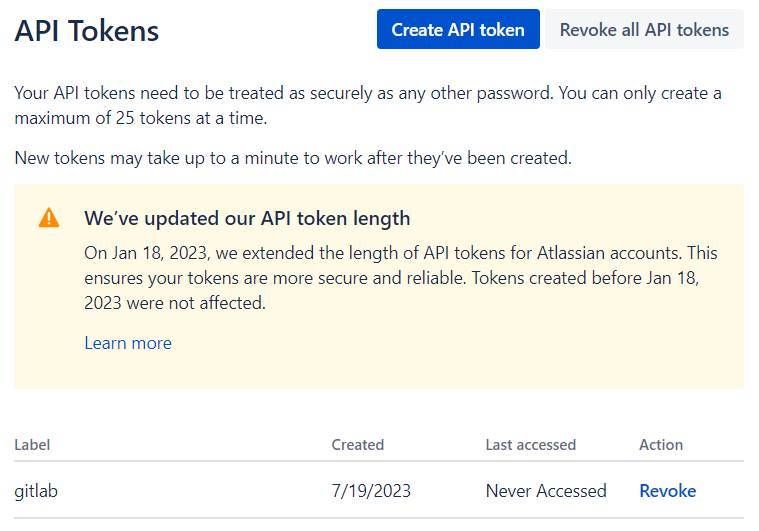
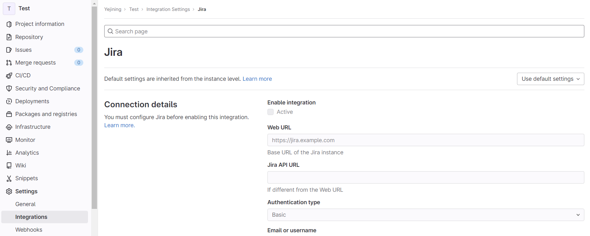
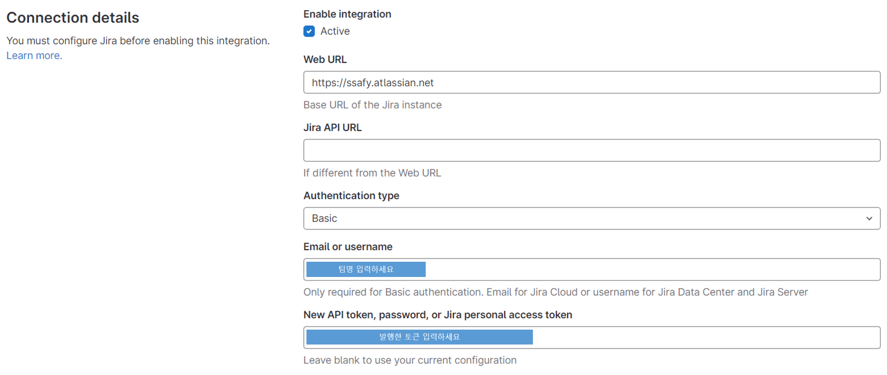
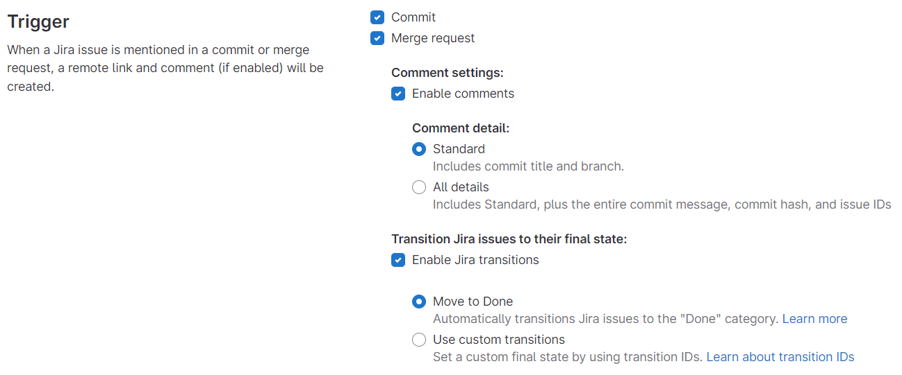
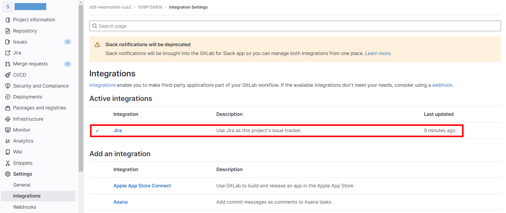
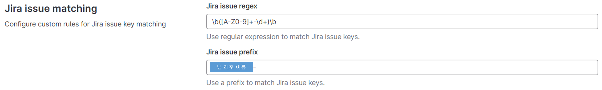
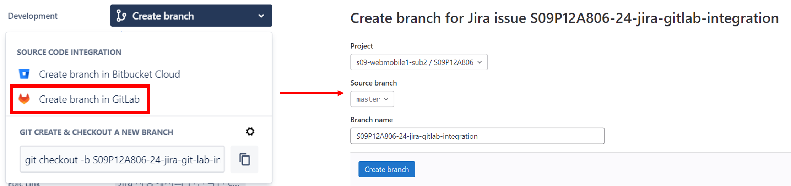
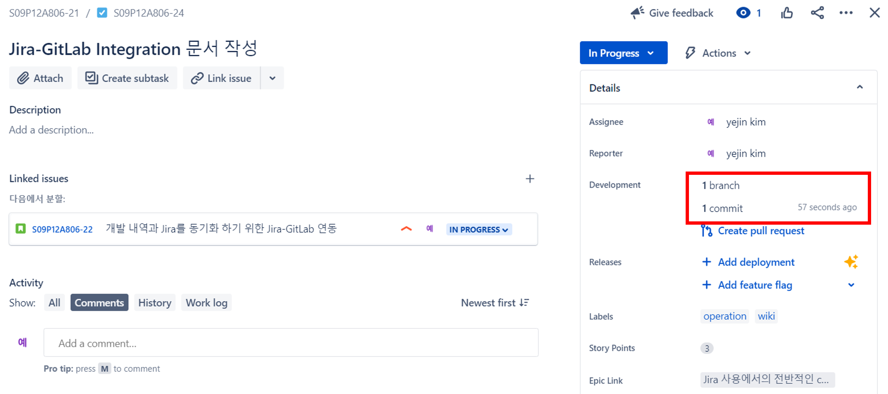
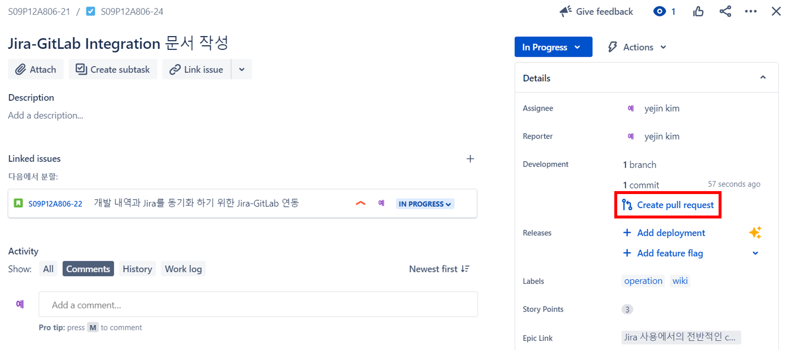

# Jira-GitLab Integration

작성일: 2023-07-21 
작성자: 김예진

> **목차**
>
> 1. [Jira-GitLab 연동하기](#Jira-GitLab-연동하기)
>    1. [Jira에서의 토큰 발행](#1-jira에서의-토큰-발행)
>    1. [GitLab에서의 Jira Integration Setting](#2-gitlab에서의-jira-integration-setting)
> 2. [Jira-GitLab Issue 연동하기](#jira-gitlab-issue-연동하기)
>    1. [Jira Issue Regex](#jira-issue-regex)
>    2. [Jira Issue Prefix](#jira-issue-prefix)
>    3. [간단하게 처리하고 싶은 SSAFY인들을 위해](#간단하게-처리하고-싶은-ssafy인들을-위해)
> 3. [Jira project - GitLab branch, commit 연동 결과 확인](#jira-project---gitlab-branch-commit-연동-결과-확인)
>    1. [Jira에서 GitLab 브랜치 생성](#1-jira에서-gitlab-브랜치-생성)
>    2. [커밋명 규칙에 맞춰 커밋해보기](#2-커밋명-규칙에-맞춰-커밋해보기)
>    3. [Jira에서 브랜치와 커밋 내역 확인](#3-jira에서-브랜치와-커밋-내역-확인)
> 4. [제안](#제안)

이 문서는 Jira를 처음 사용해보는 사람들이 쉽게 따라할만한 요소들을 담고 있습니다. Jira와 코드를 연동하기 위한 [Jira-GitLab 연동하기](#Jira-GitLab-연동하기)과 [Jira-GitLab Issue 연동하기](#jira-gitlab-issue-연동하기) 섹션이 있고, Jira에서 이슈 관리를 하는 몇 가지 방법들에 대해서도 언급하고 있습니다.

현재 Jira 프로젝트와 GitLab 레포지토리를 연결해서 Jira Issue-GitLab Branch 간 연동까지는 확인했으나, SSAFY에서 하고 있는 Jira 프로젝트의 경우 다른 해보고 싶은 기능들(커밋/PR/merge 등 이벤트 발생 시 Jira Issue 페이지에서 자동으로 comment 작성)은 권한이 막혀있네요. 나중에 해결되면 업데이트 하겠습니다.

블로그 글을 찾아보니 [Gitlab에 JIRA와 Mattermost 연동시키기](https://pythontoomuchinformation.tistory.com/453)와 같은 내용도 있네요. 시도해보실 분들은 해보셔도 좋겠습니다.

# Jira-GitLab 연동하기

내부적으로 어떤 방식으로 Jira와 GitLab이 연동되어 있는지 모르겠지만 ssafy측에서 제공하는 '버튼 누르기'를 이용해 Jira 프로젝트와 GitLab 레포지토리를 생성하면 그 둘은 일단 연결된 상태로 있다고 보면 된다. 여기서 몇 가지 세팅만 하면 다음과 같은 기능들을 편하게 연동할 수 있다.

> 1. 이슈 발행
> 2. 브랜치 분기
> 3. 브랜치 요청 및 합병
> 4. 커밋
> 5. 릴리즈
> 6. 기타

Jira와 GitLab이 연동되어 있다고 해도 GitLab 측에서 설정해야 하는 몇 가지 사항들이 있다. 다음은 진정한 연동을 위해 해야하는 일 목록이다.

> 1. Jira에서의 토큰 발행
> 2. GitLab에서의 Jira Integretion Setting

본격적인 튜토리얼에 들어가기 앞서, GitLab측에서 제공하는 [Jira issue integration documentation](https://docs.gitlab.com/ee/integration/jira/configure.html)을 참고하면 큰 도움을 받을 수 있다. 참고로, 이 장에서는 기본적인 연동만 다루기 떄문에, Jira의 Issue나 Branch까지 연동하고 싶다면 [Jira-GitLab Issue 연동하기](#jira-gitlab-issue-연동하기) 등의 섹션을 참고하면 된다.

## 1. Jira에서의 토큰 발행

이 토큰은 GitLab이 Jira의 데이터센터나 서버에 접근할 때 필요하므로 먼저 발행해두고 시작하면 좋다.

> **목차**
>
> 1. https://id.atlassian.com/manage/api-tokens에 접속한다.
> 2. `Create API token` 버튼을 클릭한다.
> 3. `Label`에는 식별 가능한 이름을 넣으면 되는데, 나는 쉽게 기억하기 위해 'gitlab'으로 입력했다.
> 4. 토큰 생성을 완료한다.

토큰 생성을 완료하면 해당 토큰을 미리 복사하라고 안내하는데, 복사한 후 개인이 알아서 보관하면 된다. 해당 모달을 닫고 나면 다시는 토큰을 볼 수 없기 때문에 일단 복사해서 다른 곳에 두는 것이 좋다. 만약 복사하기 전 모달창을 닫아버렸다면 재발급 받으면 되니 큰 걱정은 안해도 된다.

토큰 발행을 완료한 모습은 다음과 같다.

## 2. GitLab에서의 Jira Integration Setting

세팅을 완료하기 위한 대략적인 순서는 다음과 같다. 따라하는게 가능하다면 아래의 리스트를 보고 따라하고, 만약 어려운 부분이 있다면 하단의 상세 설명을 참고하면 된다. 상세하게 설정하고 싶은 부분은 분량이 길기 때문에 따로 다룬다.

> **목차**
> 
> 1. GitLab Setting 창으로 이동
> 2. Use custom settings 설정
> 3. Connection details 설정
>    1. Web URL에 Jira URL 입력
>    2. Authentication type은 `Basic`으로 설정
>    3. Email or Username 입력
>    4. Password or API token 입력 - [Jira에서의 토큰 발행](#1-jira에서의-토큰-발행)에서 발행받은 토큰 입력
> 4. Trigger 설정
>    1. Commit 체크
>    2. Merge Request 체크
> 5. 연동 확인

### 1. GitLab Setting 창으로 이동

이제는 Jira가 아니라 GitLab으로 넘어갈 차례다. Jira와 연동하고자 하는 레포지토리 세팅으로 들어가 Integration까지 간다(**`Repository Setting`** → **`Integrations`**). 일반적으로 레포지토리를 생성하면 여러 연동 가능한 리스트가 나오는데, 그 중에서는 지라를 선택하면 된다. 만약 SSAFY를 통해 연동한다면 자동으로 Jira 연동으로 나올 것이다.

### 2. Use custom settings 설정

세팅창까지 들어갔다면 다음과 같은 화면이 나온다. 여기에서 수정하려고 해보면 모든 항목이 수정 불가능하다. 저 위의 'Use default settings'를 **`Use custom settings`**로 변경한다.

### 3. Connection details 설정

   1. Web URL에 Jira URL 입력
      SSAFY 중인 사람들은 간단하게 `https://ssafy.atlassian.net`를 입력하면 된다.
   2. Authentication type은 `Basic`으로 설정
      Jira Cloud에 접근하려면 기본으로 설정해야 한다.
   3. Email or Username 입력
   4. Password or API token 입력 - [Jira에서의 토큰 발행](#1-jira에서의-토큰-발행)에서 발행받은 토큰 입력
   
​	여기까지만 입력하고 저장하면 기본적으로 Jira와 GitLab의 연동이 완료된다.

### 4. Trigger 설정

   

### 5. 연동 확인

   

# Jira-GitLab Issue 연동하기

[GitLab에서의 Jira Integration Setting](#2-gitlab에서의-jira-integration-setting)을 하다보면 Jira ssue matching을 설정하는 부분이 나온다. 이 섹션을 잘 활용하면 `자동적으로 GitLab의 커밋, 브랜치, PR과 Jira의 이슈 발행을 연동`할 수 있다. 연동을 위해 설정할 내용은 Jira issue regex와 Jira issue prefix 둘 뿐이다. 하지만 이 기능을 활용하고 싶다면 Jira에서 Issue를 만들 때 어떤식으로 네이밍을 할 것인지에 대한 규칙이 정해져 있어야 한다.

하단에서 설정하는 부분은 사용 목적이나 연동 방법에 따라 달라지니 이 점에 유의해야 한다. 야무진 활용을 하고싶다면 공식 문서 등을 참고하는 것을 추천한다.

## Jira Issue Regex

Jira Issue 정규식은 Jira Issue 키를 만들 때 사용되는 포맷이나 구조를 정의하는 정규식 패턴이다. 이 정규식을 설정하면 커밋 메시지, 브랜치 이름, 또는 PR 제목을 Jira Issue와 연동하는 것을 도와준다.

- Default Jira Issue Key Pattern: Jira에서 사용되는 기본적인 정규식 패턴은 `\b([A-Z]+-\d+)\b`이다. `ABC-123`가 이 정규식에 해당되는 예시인데, 대문자로 이루어진 키 숫자 키와 하이픈으로 이은 형태로 보면 된다. 
- Extended Jira Issue Key Pattern: 만약 기본 형태가 아니라 조금 더 유한 Jira Issue 명명규칙을 적용하고 싶다면, 정규식을 해당 규칙에 맞게 설정하면 된다. `Abc-123`을 허용하는 형태라면 `\b([A-Za-z]+-\d+)\b`로 설정하면 된다.
- Customized Jira Issue Key Pattern: 완전히 커스텀된 Issue 명명규칙을 적용하고 싶다면, 해당 규칙을 정규식으로 만들어서 작성하면 된다.
- SSAFY default Jira Issue Key Pattern: `\b([A-Z0-9]+-\d+)\b`로 설정하면 된다. 해석하자면 '<Repository 이름>-<이슈 번호>'가 된다.

## Jira Issue Prefix

Jira Issue Prefix는 GitLab에서 Jira Issue를 참조할 때 사용된다. 이 기능은 GitLab에서 Jira 프로젝트 내부에서 다른 접두사를 사용할 때 활용하기에 용이하다. 이 기능은 예시를 보는 것이 이해하는데 더 도움이 되는데, 예를 들어 Jira 프로젝트에서 이슈를 발급할 때 `PROJ-XXX`로 한다고 하고(
xxx에는 숫자가 들어간다), GitLab에서는 'PROJ-'를 제외한 숫자로만 이슈를 관리한다고 해보자. 이 경우 Jira Issue Prefix를 `PROJ-`으로 설정해두면 GitLab에서 Jira Issue를 연동할 때 단순히 '123'으로 표기되는 것이 아니라 'PROJ-123'으로 표기된다.

## 간단하게 처리하고 싶은 SSAFY인들을 위해

다음과 같이 설정하면 된다.

- Jira issue regex: \b([A-Z0-9]+-\d+)\b
- Jira issue prefix: '<팀 레포지토리 이름>-'

# Jira project - GitLab branch, commit 연동 결과 확인

## 1. Jira에서 GitLab 브랜치 생성

> **목차**
>
> 1. `Create branch` 버튼 클릭
> 2. `Create branch in GitLab` 클릭
> 3. 브랜치 정보 입력 후 브랜치 생성
>    1. `Jira Project` 설정
>    2. `Source branch` 설정
>    3. `Branch name` 설정

### 1. `Create branch` 버튼 클릭

   
   각 이슈로 들어가면 다음과 같은 `Create branch` 버튼을 보실 수 있습니다.

### 2. `Create branch in GitLab` 클릭

   3번의 사진을 참조하세요.

### 3. 브랜치 정보 입력 후 브랜치 생성

   

   1. Project는 Jira 프로젝트로 설정하시면 됩니다. 
   2. 분기하고자 하는 브랜치를 정해 Source branch로 지정해주세요.
   3. **Branch name 정하기**
      Branch name은 Jira에서 연동해 사용하기 위해 `<Jira Project Key>-<Issue 번호> <원하는 브랜치 이름>` 형식으로 작성해주시면 좋습니다(참고: [Jira Issue Regex](#jira-issue-regex). [Jira Issue Prefix](#jira-issue-prefix)).

### 생성된 브랜치 확인

## 2. 커밋명 규칙에 맞춰 커밋해보기

커밋하실 떄는 꼭 `<Jira Project Key>-<Issue 번호> <커밋 메시지>` 규칙을 맞춰주셔야 합니다(참고: [Jira Issue Regex](#jira-issue-regex). [Jira Issue Prefix](#jira-issue-prefix))!! 생성한 브랜치로 체크아웃 하시고 커밋 시 커밋명 규칙을 지키면 미션 완료입니다. 커밋을 할 때마다 일일이 issue key를 써주시는 것이 귀찮을 수도 있으나, issue key를 생략하고 커밋하실 경우 Jira에서는 해당 커밋 내역을 확인할 수 없습니다.

## 3. Jira에서 브랜치와 커밋 내역 확인

지금까지 Jira에서 GitLab 브랜치를 만들고 커밋까지 해보았습니다. 다시 Jira의 이슈로 돌아가 화면을 확인해보면 다음과 같이 뜹니다. 1개의 브랜치와 1개의 커밋이 GItLab 레포지토리에서 일어난 것을 확인할 수 있습니다.

# 제안

여기까지 따라오신 분이라면, pull request도 Jira에서 해보고 싶으실겁니다! 저 버튼을 눌러서 각자만의 학습을 진행해보시는건 어떨까요~?