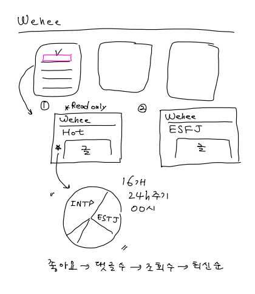

# 우리집 요구사항

작성자: 류나연

> **목차**
>
> 1. [게시판 이용](#1-게시판-이용)
>    1. [이용 정책](#이용-정책)
>    2. [게시판 조회](#게시판-조회)
>    3. [게시판 알림](#게시판-알림)
>    4. [댓글](#댓글)
>    5. [좋아요](#좋아요)
>    6. [스크랩](#스크랩)
>    7. [신고](#신고)
> 2. [인기 게시판](#2-인기-게시판)
>    1. [게시 기준](#게시-기준)
>    2. [인기 게시글 조회](#인기-게시글-조회)
> 3. [투표](#3-투표)
>    1. [투표 생성](#투표-생성)
>    2. [투표 조회](#투표-조회)
>    3. [투표 참여](#투표-참여)
>    4. [투표 삭제](#투표-삭제)

# 1. 게시판 이용

## 이용 정책

1. 사용자는 게시판에 게시글을 작성할 수 있다.
2. 게시글 작성 시 사용자가 원하는 경우 투표 기능을 사용할 수 있다.
3. 게시글을 작성하는 경우 제목과 내용이 필수적으로 요구된다.
4. 사용자는 본인이 작성한 글을 수정하고 삭제할 수 있다.
5. 사용자가 글을 삭제하더라도 삭제된 글은 정책 상 데이터베이스 상에 남는다.
6. 사용자는 게시판 내에서 게시글을 검색할 수 있다. (검색 키워드가 제목 또는 내용에 포함되는 경우 검색 목록에 다 뜨게 된다.)

## 게시판 조회

1. 로그인한 사용자만이 게시판을 조회할 수 있다.

2. 사용자는 사용자에게 해당하는 MBTI 게시판만 입장이 가능하다.

   1. MBTI가 변경되면 이전에 썼던 글을 조회할 수 없다.

3. 메인 화면에서 전체 MBTI 게시판의 인기글 16개를 조회할 수 있다.

   1. 인기글은 0시 기준으로 24시간 동안의 좋아요 수를 기준으로 집계된다.
   2. 좋아요 수가 같은 경우, 댓글 수, 조회 수, 최신순 순으로 인기글을 집계한다.
   3. 인기 게시글에는 댓글을 남기거나 좋아요를 누를 수 없다.
   4. 인기 게시글을 조회할 수 있는 페이지가 존재한다.

4. 게시판의 글은 **최신순**으로 조회할 수 있다.

5. 사용자는 본인이 작성한 게시글, 댓글을 단 게시글, 스크랩한 게시글을 조회할 수 있다. (MBTI 게시판 내 **페이지 별도 존재**)

   

## 게시판 알림

1. 사용자가 작성한 글에 댓글이 달리는 경우 사용자에게 알림이 뜬다.
2. 사용자가 작성한 댓글에 대댓글이 달리는 경우 사용자에게 알림이 뜬다.
3. 알림창 항목을 누르면 해당 글로 바로 이동한다.
4. 알림센터에서 알림을 해제할 수 있다.

## 댓글

1. 사용자는 게시판에 생성된 모든 글에 댓글을 작성할 수 있다.
2. 사용자는 댓글에 대한 대댓글을 작성할 수 있다.
3. 사용자는 본인이 작성한 댓글과 대댓글을 수정, 삭제할 수 있다.
4. 댓글이 삭제되는 경우 ‘삭제된 댓글입니다’ 라는 문구로 대체되고, 그에 대한 대댓글은 남아 있다.
5. 사용자가 댓글을 삭제하더라도 삭제된 댓글은 정책 상 데이터베이스 상에 남는다.

## 좋아요

1. 사용자는 게시판 내 모든 글에 대해 좋아요를 누를 수 있다.
2. 사용자는 좋아요를 취소할 수 있다.
3. 좋아요 수를 기준으로 인기글이 선정된다.

## 스크랩

1. 사용자는 게시판 내 모든 글에 대해 스크랩할 수 있다.
2. 사용자가 스크랩한 게시글을 조회할 수 있는 페이지가 별도 존재한다.

## 신고

1. 사용자는 게시판 내 모든 게시글에 대해 신고할 수 있다.
2. 누적 신고 수가 30개 초과인 경우, 사용자들은 게시글을 조회할 수 없다.

# 2. 인기 게시판

## 게시 기준

1. 24시간 동안의 좋아요 수를 기준으로 16개의 글을 선정하여 게시한다.
2. 12시간마다 새로 인기글을 집계한다. (오전 12시, 오후 12시)
3. 인기글로 선정된 글이 삭제된 경우, 글을 클릭했을 때 ‘삭제된 게시글입니다.’ 라는 경고창이 뜨도록 한다.
4. 각 MBTI 게시판에서 갱신되는 좋아요, 댓글은 실시간으로 반영된다.
5. 글의 좋아요 수 순위가 변하더라도 인기 게시판 내에서 순서가 변동하지 않는다.

## 인기 게시글 조회

1. 로그인한 사용자들은 인기 게시판 및 게시글을 조회할 수 있다.
2. 인기 게시판에 게시된 글 중 나의 MBTI에 해당하지 않는 글은 *좋아요, 댓글, 스크랩*이 **불가**하다.

# 3. 투표

## 투표 생성

1. 게시판 사용자는 투표를 생성할 수 있다.
2. 투표 생성 시 투표 제목 및 항목(2가지)을 기입해야 한다.

## 투표 조회

1. 게시판 사용자는 투표를 조회할 수 있다.
2. 투표는 등록된 순으로 게시판 상단에 노출된다.

## 투표 참여

1. 게시판 사용자는 투표에 참여할 수 있다.
2. 투표에 참여하면 바로 결과를 확인할 수 있다. (1순위: % 숫자, 2순위: 바)
3. 투표에 참여한 사용자가 누구인지 확인할 수 없다.
4. 투표에 참여하면 수정이 불가능하다.

## 투표 삭제

1. 투표는 등록 후 24시간이 지나면 자동으로 삭제된다.
2. 투표를 생성한 사용자는  투표를 삭제할 수 있다.