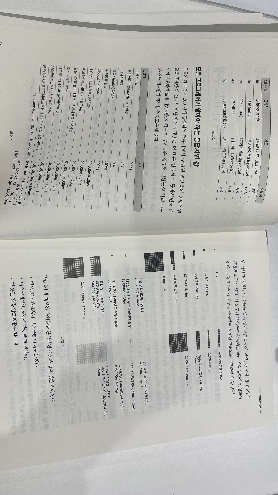

# 가상 면접 사례로 배우는 대규모 시스템 설계 기초

> **목차**
>
> 1. [대규모 시스템 설계가 필수이지 않았던 옛 시절](#대규모-시스템-설계가-필수이지-않았던-옛-시절)
> 2. [그래서 읽고 무엇을 배웠는가?](#그래서-읽고-무엇을-배웠는가?)
> 3. [어떻게 적용할 수 있을 것인가?](#어떻게-적용할-수-있을-것인가?)

## 대규모 시스템 설계가 필수이지 않았던 옛 시절

이 책에 대한 후기를 남기기 전, 책을 읽기 전 나의 상태가 어떠했는지를 먼저 논하는 것이 좋겠다. 과연 나는 대규모 시스템은 차치하고, 시스템에 대한 것을 고민한 적이 있던가? 없다. 나와 내 팀이 요하는 요구사항에 따르면, 그동안에는 시스템을 고민할 필요가 없었다.

그렇다고 시스템을 만들어 본 적이 없는가? 라는 질문을 던진다면, 그 대답 또한 '아니'다. 앱을 시스템이라고 한다면 이미 3개의 안드로이드 앱을 만들어 봤고, 연구실에서는 시각화 시스템을 만들었다. 여러 가지 레포를 합해도 시스템이라고 인정해 준다면, 나는 분명 데이터를 가져와서 전처리를 수행하고, 모델을 돌리고 결과까지 비교하는 하나의 시스템을 직접 설계하고 개발한 경험이 있다.

> 그렇다면, 시스템에 대한 큰 고민 없이 시스템을 만들어도 괜찮은 경우와 그렇지 않은 경우는 어떻게 다른가?

개인적인 경험에 따르면, 답은 `실제 사용자가 있는가`로 나뉜다. 안드로이드 앱도, 시각화 시스템도, 모델 파이프라인도 모두 배포 단계가 필요하지 않았다. 목적 자체가 사용자에게 있지 않았던 것이다. 2023년도 기준으로 생각해보자면 앱을 개발한다고 했을 때 배포가 기본으로 들어가지만 2018년도만 해도 클라우드 서비스가 초기 단계였기 때문에(내 기억으로는 이때 구글의 Firebase와 AWS가 유행하기 시작하는 초기 단계였던 것 같다), 당시에는 '배포'라는 단어에 대해서는 들어본 적도 이야기를 한 적도 없다. 나머지 시스템은 목적 자체가 '연구'에 있었기 때문에 목적만 달성하면 코드 자체를 폐기하는 정도였고.

책을 읽기 전 '옛날'이라고 부르던 때에는 시스템 설계 없는 시스템 구현이 나쁘지 않은 전략이었지만(오히려 현대판 시스템 설계를 했다면 굉장한 오버스택이기 때문에 오히려 마이너스였을지도 모른다), 책을 읽고 난 지금은 시스템 설계가 필수가 아닌가 싶다. 시대적으로도 그렇고, 우리가 만드려는 웹 서비스를 개발하려는 목적성에서도 그렇고.

## 그래서 읽고 무엇을 배웠는가?

### 수와 성능 감 잡기

**감 잡기의 어려움**

가끔 개발자 컨퍼런스나 (so called) 합격 포트폴리오를 보면 유행처럼 나오는 말은 다음과 같다.

> '저는(혹은 우리는) 이 기능의 무엇을(주로 호출 횟수라든가, 시간과 관련된 지표) 어떤 기술을 활용해 효율을 x% 정도 향상시켰습니다.'

성능 향상에 대한 필요성을 느껴본 적이 없고, 일단 개발 자체가 전무한 나로서는 저 말이 도대체 얼마나 대단한 말인지 전혀 공감할 수 없었다. 일단 저 대사에 나오는 수치에 대한 감이 잡혀있지 않았고, 내가 개발할 때는 성능을 고려한다는 것이 그렇게 고급 개발처럼 보이지 않았기 때문이다.

성능을 향상시키는 것은 분명 멋진 일이지만, 이런 점들을 등한시했던 것은 실질적인 유저를 만나본 적이 없던 경험 탓이 가장 크지 않나 싶다(성능 향상에 대한 실질적인 요구사항이 없었기 때문). 경험이 없다는 것은 현업에서 사용하게 될 '성능'에 대한 감 잡기가 그렇게 쉽지 않을 것을 뜻하기도 하는데, 2장인 `대략적인 규모 추정`에서 전반적인 수에 대한 개념과 추정 과정을 소개해 어느 정도 감을 잡을 수 있게 되었다.

**대략적인 규모 추정**

책에서는 2^k에 대한 대략적인 값부터 메모리 참조, 뮤텍스 락/언락, 네트워크에서 2KB 정도의 데이터를 전송할 때, 1M 데이터를 메모리에서 읽어오는 속도 등을 알기 쉽게 표와 그림으로 설명한다. 1ns, 1ms 시간 단위가 의미하는 것부터 메모리에서는 1KB, 1M가 어떤 의미를 가지는지 대략적인 감을 잡는 것 만으로도 시스템 성능 측정에 있어 기본적인 감을 잡는 첫 단추를 끼운다는 느낌이 들었다.

앞으로 위에 언급된 대사를 다시 보게 된다면, 이번에는 대략적으로 성능을 머릿속에서 수치화 해보고 시스템 규모에 맞게 잘 설계된 것인지, 성능 향상이 시스템 전체에 어떤 기여를 하게 되는지 분석하는 것에 도움이 많이 되지 않을까 싶다. 실제 설계 단계에서 응용하는 것은 물론이고.

### 시스템 설계에 대한 필요성

이 책은 면접 형식을 빌려 면접관이 시스템 설계와 관련된 질문을 던지면 지원자가 면접관과 대화를 이어나가는 형식으로 시스템 설계의 기반을 다진다. 면접관이 '이러이러한 무엇을 설계하시오'라는 첫 질문을 던지면 지원자는 질문과 대화를 이용해 해당 시스템의 요구사항을 명확히(clarifying) 하고, 각 요구사항에 맞춰 시스템의 요소들을 로고처럼 조립하고 구체화한다. 요구사항에 따라 시스템의 설계 요소가 달라지기 때문에 이 과정을 이해하면 직관적으로 시스템 설계가 왜 필요한지 이해할 수 있게 된다.

### 시스템 설계에 접근하는 방법

잘 짜여진 시스템을 본 적이 없고 '시스템 설계'라는 것이 무엇인지 모르는 사람에게 '설계하시오'란 질문을 던진다고 가정해보자. 질문을 받는 대상이 나라고 생각한다면 나는 막연함과 막막함을 거뜬히 뛰어 넘어 공포감까지 느낄 것 같다. '설계'라는 것이 뉴비들에게 거부감을 일으키는 이유에 대해 간략하게 나열해보자면 다음과 같다.

- 무엇인지는 모르겠으나 '설계'라는 단어 자체가 거창해 보인다
- 인터넷에서 찾아본다고 한들 어느 설계 기법이 표준인지 알기 힘들다(대부분의 경우 표준조차도 없을 거라고 생각한다)
- 시스템의 목적에 따라 설계가 달라지기 때문에 내가 필요로 하는 요구사항에 맞춰 적용하기 어렵다

책에서는 어떤 시스템이 필요하다고 대략적으로 가정했을 때 가장 기초가 되는 설계 구조부터 제안한다. 예를 들면 어떤 웹 애플리케이션을 제작한다고 한다면 가장 먼저 사용자가 DNS를 거쳐 웹 서버에 오는 시스템을 가장 먼저 제안하는 것이다. 이 단계까지 오면 새로운 문제를 발견한다. 만약 사용자가 늘어서 웹 서버로부터 데이터베이스를 분리해야 한다면? 그러면 이 단계에서는 웹 서버로부터 DB 서버를 분리해낸다. 그 다음엔 다음 문제를 정의하고, 문제와 요구사항에 따라 새롭게 설계를 이어나간다.

이 과정을 따라나가다 보면 결국 어떤 복잡한 시스템을 만들더라도 핵심으로부터 출발하다보면 언젠가는 그 지점에 도달하게 된다는 것을 알게 된다. 책에서 소개하는 설계는 종류가 매우 다양한데,  처리율 제한 장치 설계, 안정 해시 설계와 같은 다소 지협적인 설계부터 알림 시스템 설계, 채팅 서비스 설계와 같은 서비스 단위의 설계, 나중에는 유튜브 설계, 구글 드라이브 설계와 같은 대대대규모 서비스 설계까지를 소개하고 있다. 다양한 종류의 설계 과정을 따라가다 보면 자연스레 도달 과정에 대한 사고력도 함께 함양하게 되는데, 이런 사고 방식을 몇 번이고 간접적으로 경험하다 보면 어느샌가 설계에 대한 공포감이 사라진 것을 발견할 수 있게 된다.

### 기획과 설계, 면접에서의 의사소통 방식

개발 분야를 아우르는 책을 보다보면, 생각보다 면접 상황을 가정해두고 내용을 풀어가는 책들이 많다. 이 책이 그렇고, Cracking the PM Interview 책도 마찬가지이다. 이런 종류의 책을 읽다보면 사실상 면접은 중요한 것이 아니고, 면접이라는 롤플레잉을 하면서 오고가는 논리가 중요하다는 것을 쉽게 알 수 있다.

'면접'이라는 특수한 상황은 상대방에게 내가 어떤 직무에서 기술적인 역량이 있음을 어필함과 동시에 의사소통에 탁월한 사람이라는 것을 보이는 좋은 예시가 된다. 기술적으로 설득하는 논리 방식도 배울 수 있고, 대화 시에 지켜야 하는 매너도 자연스럽게 익히게 된다.

## 어떻게 적용할 수 있을 것인가?

- DB 샤딩 설계에 활용
- 채팅 서버 설계에 활용
- 웹 서비스 규모에 따른 요구사항 도출, 그에 따른 설계에 활용
