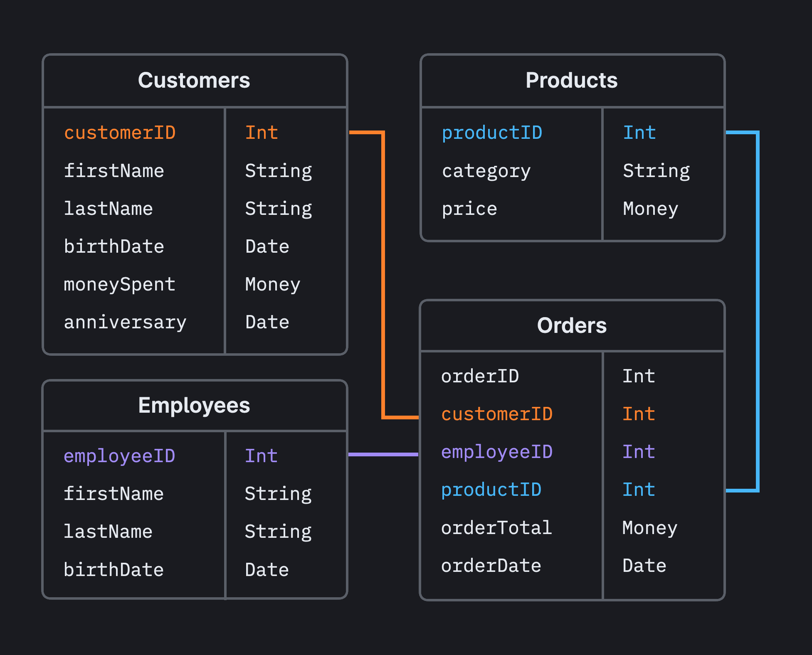
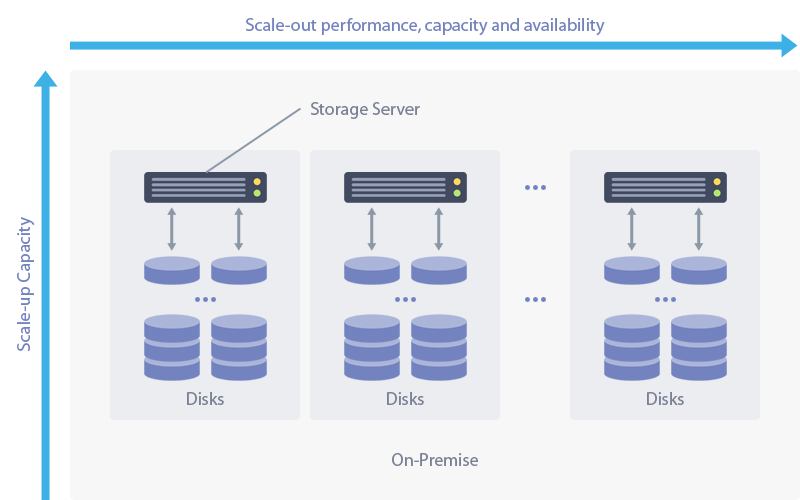
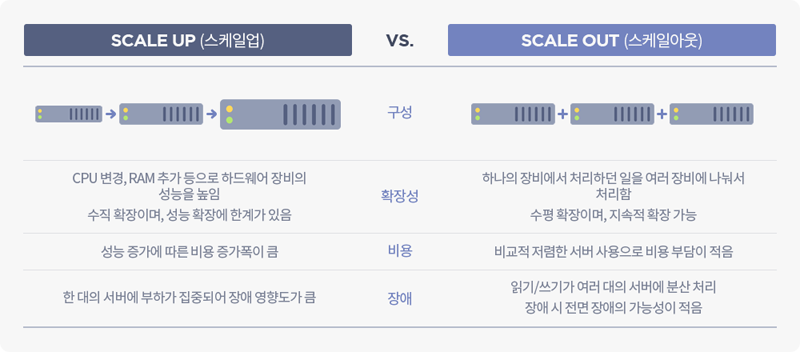

# RDBMS와 NoSQL DB의 차이

마지막 업데이트 날짜: 2023-07-31  
작성자: 김예진

> **목차**
>
> 1. [Schema](#schema)
>    1. [Schema 정의](#schema-정의)
>    2. [RDBMS의 Schema](#rdmbs의-schema)
>    3. [NoSQL DB의 Schema](#nosql-db의-schema)
> 2. [ACID 충족 여부](#acid-충족-여부)
>    1. [ACID](#acid)
>    2. [ACID - RDBMS](#acid---rdbms)
>    3. [ACID - NoSQL DB](#acid---nosql-db)
> 3. [Scalability](#scalability)
>    1. [Scale Up과 Scale Out 정의](#scale-up과-scale-out-정의)
>    2. [Scale Up과 Scale Out 장단점 비교](#scale-up과-scale-out-장단점-비교)
>    3. [NoSQL에서의 Horizontal Scalability](#nosql에서의-horizontal-scalability)
> 4. [대규모 배포를 고려한 DB 선택](#대규모-배포를-고려한-db-선택)
>    1. [NoSQL이 분산 시스템에 적용하기 위해 고안되었지만 대규모 배포 시 사용하기에 적절하지 않은 이유는?](#nosql이-분산-시스템에-적용하기-위해-고안되었지만-대규모-배포-시-사용하기에-적절하지-않은-이유는)
>    2. [대규모 배포 시 RDMBS vs NoSQL DB](#대규모-배포-시-rdmbs-vs-nosql-db)

# Schema

스키마에 대한 전반적인 정의는 [여기(외부 링크)](https://jwprogramming.tistory.com/47)를 참조하시면 됩니다.

## Schema 정의

- 데이터베이스의 구조와 제약조건에 관한 전반적인 명세를 기술한 것
  - Attribure : 개체의 특징을 나타냄(속성)
  - Entity: 속성들의 집합으로 이루어짐(개체)
  - Relationship: 개체 간 존재하는 관계
- 관점에 따른 스키마
  - 개념 스키마: 데이터베이스의 전체적인 논리적 구조
  - 내부 스키마: 데이터베이스의 물리적 저장 구조
  - 외부 스키마: 사용자에게 보여지는 스키마 (서브 스키마)

## RDMBS의 Schema

## NoSQL DB의 Schema

NoSQL 형식의 DB에서는 Document에 데이터가 저장된다. JSON 혹은 객체 형태인 key-value로 데이터가 저장되며, Documents가 모여 Collection이 되고 Collection이 모여 Database가 된다. 이때 중요한 점은 RDBMS와 달리 NoSQL DB는 `스키마를 정의하지 않아도 된다`는 점이다. (출처: [SQL vs NoSQL](https://velog.io/@thms200/SQL-vs-NoSQL))

# ACID 충족 여부

## ACID

ACID는 DB의 트랜잭션이 안전하게 수행되는 것을 보장하기 위한 특징이다.

### Atomicity (원자성)

트랜잭션과 관련된 작업들이 부분적으로 실행되다가 중단되지 않는 것을 보장하는 능력. 예를 들어 자금 이체는 성공할 수도 있고 실패할 수도 있지만 보내는 쪽에서 돈을 빼오는 작업만 성공하고 받는 쪽에 돈을 넣는 작업이 실패해서는 안된다. 원자성은 트랜잭션이 중간 단계까지만 실행되고 실패하는 일이 없도록 한다.

### Consistency (일관성)

트랜잭션이 실행을 성공적으로 완료하면 언제나 일관성 있는 데이터베이스 상태로 유지하는 것.

### Isolation (고립성)

트랜잭션 수행 시 다른 트랜잭션 연산 작업이 끼어들지 못하도록 보장하는 것을 의미한다. 공식적으로 고립성은 트랜잭션 실행 내역은 연속적이어야 함을 의미한다.

### Durability (지속성)

성공적으로 수행된 트랜잭션은 영원히 반영되어야 함을 의미함. 시스템 문제, DB 일관성 체크 등을 하더라도 유지해되어야 한다. 트랜잭션은 로그에 모든 것이 저장된 후에만 commit 상태로 간주될 수 있다.

## ACID - RDBMS

ACID를 충족해야 하는 경우에는 RDBMS를 채택하는 것이 적절하다. 주로 ACID를 충족하는 관계형 데이터베이스의 경우 선형적으로 데이터베이스를 확장하는 것이 용이하지 않고, 만약 확장했다 하더라도 확장 과정에서 병목 현상이 발생할 수 있기 때문에 데이터의 선형 증대가 필요한 경우에는 RDBMS를 채택하는 것은 좋지 않다.

## ACID - NoSQL DB

NoSQL DB는 ACID를 충족하지 않고 CAP 이론을 따른다. 분산 시스템에서 CAP 이론을 적용할 때는 3가지 속성을 모두 만족시킬 수 없으며, 2가지만 만족하는 것으로 본다.

### Consistencey (일관성)

모든 요청은 최신 데이터 또는 에러를 응답받는다. 예를 들어 DB가 3개로 분산되었다고 가정할 때, 하나의 특정 DB 데이터가 수집되면 나머지 2개의 DB에서도 수정된 데이터를 응답받아야 한다.

### Availability (가용성) 

모든 요청은 특정 DB에 장애가 나더라도 항상 정상 응답을 받는다.

### Partitions Tolerance (분리 내구성)

DB간 통신이 실패하는 경우라도 시스템은 정상적으로 동작한다.

# Scalability

## Scale Up과 Scale Out 정의

### Scale Up

- 기존의 하드웨어를 보다 높은 사양으로 업그레이드 하는 것을 의미
- 성능이나 용량 증강을 목적으로 디스크를 추가하거나 CPU 혹은 메모리를 업그레이드함
- 수직 스케일링(vertical scaling)으로도 불림

### Scale Out

- 장비를 추가해 확장하는 방식 의미
- 비슷한 사양의 서버를 연결해 용량을 증가시킬 뿐만 아니라 워크로드를 분담해 성능을 높이는 식으로 구현됨
- 분산 파일 시스템이나 글로벌 네임스페이스를 통해 스토리지 커버 클러스터를 하나의 시스템으로 인지하며, 서버를 추가로 확장하기 때문에 수평 스케일링(horizontal scailing)이라고 불림

## Scale Up과 Scale Out 장단점 비교

### Scale Up

- 장점
  - 추가적인 네트워크 연결 없이 용량을 증강할 수 있음
  - 추가되는 메모리나 CPU의 비용만 부담하면 되기 때문에 Scale Out 방식에 비해 비용이 저렴함
  - 비교적 업그레이드가 쉽고, 듀얼 컨트롤러로 고가용성 구성이 가능해 다운타임을 줄일 수 있음
- 단점
  - 스케일업을 할수록 기존 하드웨어의 냉각/공간/전력공급 등의 문제가 발생할 수 있음
  - 하드웨어 허용 범위 내에서만 확장 가능함
  - 새 장비로 교체 시 데이터 전체를 마이그레이션해야 하기 때문에 다운타임이 불가피해짐
- 활용
  - 온라인 금융 거래와 같이 워크플로우 기반에 빠르고 정확하면서 단순 처리가 필요한 OLTP(Online Transaction Processing) 환경에 적용
  - 단순하거나 빠른 작업(DB 갱신이 자주 일어나야 하는 경우)에 적합

### Scale Out

- 장점
  - 서버를 필요한 만큼만 도입하고 장기적인 용량 증가 추이를 예측할 필요 없이 때마다 필요한 만큼 서버를 추가해 용량과 성능을 확장할 수 있음(pay as you grow)
  - 하나의 시스템을 전반적으로 모니터링할 수 있어 이슈 탐지에 용이, SLA 등 관리 정책을 일관적으로 정할 수 있음
- 단점
  - 여러 노드를 연결해 병렬 컴퓨팅 환경을 구성하고 유지하려면 아키텍처에 대한 높은 이해도가 요구됨
    - 여러 노드에 워크로드를 균등하게 분산시키기 위해 로드 밸련싱 필요
    - 노드를 확장할수록 문제 발생의 잠재 원인이 늘어남
  - 소프트웨어 가격이 스케일업에 비해 비쌈 
- 활용
  - 빅데이터 데이터 마이닝이나 검색엔진 데이터 분석 처리 등을 디표하는 OLAP(Online Analytical Processing) 애플리케이션 환경에서 대량의 데터와 복잡한 쿼리를 처리하기 위해 스케일 아웃 구성 활용

## NoSQL에서의 Horizontal Scalability

대부분의 NoSQL DB의 분산 시스템을 기반으로 설계되었다. 간단하게 말하자면 NoSQL DB는 특정 문제를 해결하기 위해 네트워크로 연결된 노드 집합인 클러스터로 작동하기 위해 설계되었다. 이에 따른 NoSQL DB는 네 가지의 카테고리로 분류된다.

1. Key-value
2. Document
3. Column family
4. Graph

# 대규모 배포를 고려한 DB 선택

이번 장은 Chatting 구현 책을 읽으면서 의아했던 부분을 정리한 내용을 다룬다. ChatGPT에게 질문한 내용과 답변을 그대로 옮기며, 번역은 따로 하지 않았다.

## NoSQL이 분산 시스템에 적용하기 위해 고안되었지만 대규모 배포 시 사용하기에 적절하지 않은 이유는?

책에서는 NoSQL 기반 DB가 대규모 배포에 사용하기 적절치 않다고 했는데 분산 시스템에 적용하기 위해 고안된 NoSQL DB가 왜 대규모 배포에 적절하지 않은지 이해가 되지 않았다. ChatGPT에게 묻고 답을 들은 결과는 다음과 같다.

> NoSQL databases are designed to handle large amounts of data and high scalability, but they can be challenging to configure for large deployments due to several reasons:
>
> 1. Lack of schema: NoSQL databases are typically schema-less or have flexible schemas, which means they do not enforce a fixed structure for data. While this flexibility allows for easier data modeling and evolution, it also means that data integrity checks are left to the application layer. As the dataset grows and evolves, managing data consistency and ensuring proper configurations become more complicated.
> 2. Limited transaction support: Many NoSQL databases sacrifice full transaction support to achieve high scalability and performance. This means that ensuring data consistency and preventing race conditions across distributed systems often requires careful planning and custom application logic, which can be difficult to implement and manage in large deployments.
> 3. Distribution and sharding: NoSQL databases are often designed to be distributed across multiple nodes or clusters to handle large amounts of data and user requests. Configuring distribution and sharding effectively requires a deep understanding of the database's architecture and the application's specific requirements. Deciding how to shard data, distribute data evenly, and handle rebalancing can be complex tasks, especially as the dataset grows over time.
> 4. Replication and consistency: NoSQL databases often provide options for data replication to ensure high availability and fault tolerance. Configuring replication and maintaining data consistency across replicas can be intricate, especially in large, geographically distributed deployments. Choosing the right replication strategy and handling synchronization issues can be challenging.
> 5. Tuning for performance: Achieving optimal performance in a large-scale NoSQL deployment demands careful tuning of various configuration parameters. These parameters may be related to caching, indexing, memory usage, disk I/O, and other system settings. Finding the right balance to optimize performance can be time-consuming and require extensive knowledge of the database and hardware environment.
> 6. Monitoring and maintenance: As NoSQL databases scale to handle massive amounts of data and traffic, monitoring their performance and health becomes critical. Configuring monitoring tools, setting up alerts, and maintaining the database's health can be complex and resource-intensive tasks in large deployments.
> 7. Inadequate tooling and documentation: Some NoSQL databases, especially those developed by smaller open-source projects, may have limited tooling and documentation support. This can make it more difficult for administrators and developers to troubleshoot issues, optimize configurations, and perform routine maintenance tasks.
>
> In summary, NoSQL databases offer great scalability and flexibility, but configuring them for large deployments requires careful planning, deep understanding of the database's architecture, and expertise in distributed systems. Without proper knowledge and experience, handling the complexities of large-scale NoSQL deployments can become a daunting task.

## 대규모 배포 시 RDMBS vs NoSQL DB

NoSQL DB가 대규모 배포에 적절하지 않다고 한다면, 대규모 배포를 앞둔 서비스에서는 어떤 DB를 사용하는 것이 더 유리한가?

> 
> The choice between RDBMS (Relational Database Management System) and NoSQL databases for deploying a large-sized database depends on various factors and the specific requirements of your application. Both types of databases have their strengths and weaknesses, so it's essential to consider the following aspects before making a decision:
>
> 1. Data Model and Structure:
>    - RDBMS: If your data has a fixed and well-defined schema with clear relationships between entities, RDBMS may be a good choice. RDBMS enforces ACID (Atomicity, Consistency, Isolation, Durability) properties and supports complex joins, which can be advantageous for data that requires strict consistency and integrity.
>    - NoSQL: If your data is schema-less or has a flexible schema, or if you anticipate frequent changes in data structure, a NoSQL database might be more suitable. NoSQL databases offer greater flexibility in data modeling and are well-suited for handling unstructured or semi-structured data.
> 2. Scalability and Performance:
>    - RDBMS: While RDBMS systems can handle large datasets, they may face scaling challenges in highly distributed environments and very high-velocity data. Vertical scaling (adding more powerful hardware) is a common approach, but it has limitations.
>    - NoSQL: NoSQL databases, particularly distributed NoSQL systems like Apache Cassandra or MongoDB, are designed to scale horizontally across commodity hardware, making them a better choice for handling massive amounts of data and high throughput.
> 3. Read-Write Patterns:
>    - RDBMS: If your application primarily involves complex read-heavy operations, RDBMS systems can often perform well with proper indexing and query optimization.
>    - NoSQL: NoSQL databases excel in scenarios with high write-heavy operations and read-intensive workloads where horizontal scaling can distribute the load effectively.
> 4. Consistency and Transaction Support:
>    - RDBMS: RDBMS systems typically provide strong consistency and full transaction support, which ensures data integrity and reliability.
>    - NoSQL: Some NoSQL databases may sacrifice strong consistency for high availability and partition tolerance (CAP theorem). Depending on your application's requirements, this trade-off might be acceptable or not.
> 5. Development and Operational Overhead:
>    - RDBMS: Traditional RDBMS systems often require a more rigid data model and may involve complex schema migrations as the application evolves.
>    - NoSQL: NoSQL databases, especially document-based or key-value stores, can be more developer-friendly in terms of schema evolution, as they allow flexible and dynamic data models.
>
> In summary, if your application demands high scalability, handling large amounts of data, and flexible data modeling, NoSQL databases are often a better fit. On the other hand, if your data has a well-defined schema, strict consistency requirements, and the need for complex joins, an RDBMS might be more suitable.
>
> It's essential to evaluate your specific use case, consider the nature of your data, and weigh the trade-offs between the two types of databases before making a decision. In some cases, a hybrid approach using both RDBMS and NoSQL databases can also provide an effective solution by leveraging the strengths of each database type.

------

### 참고 링크

- 책 - Building Real-Time Apps with Spring, Cassandra, Redis, WebSocket and RabbitMQ
- [SQL vs NoSQL](https://velog.io/@thms200/SQL-vs-NoSQL)
- [스케일업(Scale-up)과 스케일아웃(Scale-out)](https://bruno-jang.tistory.com/34)
- [스토리지 기초 지식 3편: 스케일 업과 스케일 아웃](https://tech.gluesys.com/blog/2020/02/17/storage_3_intro.html)
- [Relational database - wikipedia](https://en.wikipedia.org/wiki/Relational_database#See_also)
- [NoSQL - wikipedia](https://en.wikipedia.org/wiki/NoSQL)
