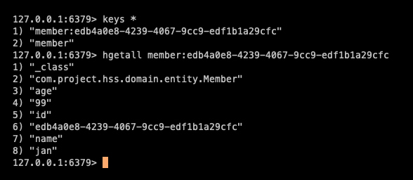

# Redis

마지막 업데이트 날짜: 2023-08-09 <br>
작성자: 김예진

> **목차**
>
> 1. [Redis](#1-redis)
>    1. [기본 특징](#기본-특징)
>    2. [주의사항](#주의사항)
> 2. [Spring Boot 환경 설정](#2-spring--boot-환경-설정)
>    1. [`build.gradle` 설정](#buildgradle-설정)
>    2. [`application.yml` 설정](#applicationyml-설정)
>
> 3. [Lettus](#lettuce)
>    1. [Lettuce 적용 - RedisConfig.java](#lettuce-적용---redisconfigjava)
>
> 4. [Spring Data Redis 접근 방식](#4-spring-data-redis-접근-방식)
>    1. [RedisTemplate](#1-redistemplate)
>    2. [RedisRepository](#2-redisrepository)
>       1.  [실행 화면](#실행-화면)
>
> 5. [Docker 설정](#5-docker-설정)
>    1. [`docker-compose`설정](#docker-compose-설정)
>    2. [Docker container 내부 Redis로 접근하는 방법](#docker-container-내부-redis로-접근하는-방법)
>
> 6. [Redis cli 명령어](#6-redis-cli-명령어)
>    1. [localhost:6379 접속](#localhost6379-접속)
>    2. [원격 접속](#원격-접속)
>    3. [현재 키 값 확인](#현재-키-값-확인)
>    4. [key/value 형태로 저장](#keyvalue-형태로-저장)
>    5. [여러 개의 key/value 형태로 저장](#여러-개의-keyvalue-형태로-저장)
>
>

# 1. Redis

## 기본 특징

- Key, Value 구조이기 때문에 쿼리 사용 필요 없음
- 데이터를 디스크에 쓰는 구조가 아니라 메모리에서 데이터를 처리하기 때문에 속도가 빠름
- String, Lists, Sets, Sorted Sets, Hashes 자료 구조 지원
  - **String** : 가장 일반적인 key - value 구조
  - **Sets** : String집합으로 여러 개의 값을 하나의 value에 넣을 수 있음. 포스트의 태깅 같은 곳에 사용.
  - **Sorted Sets** : 중복된 데이터를 담지 않는 Set 구조에 정렬 Sort를 적용한 구조로 랭킹 보드 서버 같은 구현에 사용
  - **Lists** : Array 형식의 데이터 구조. List를 사용하면 처음과 끝에 데이터를 넣고 빼는 건 빠르지만 중간에 데이터를 삽입하거나 삭제하는 것은 어려움
- Single threded 방식
  - 한 번에 하나의 명령만 처리
  - 중간에 처리 시간이 긴 명령어가 들어오면 그 뒤에 들어오는 명령어들은 모두 앞에 있는 명령어가 처리될 때까지 기다려야 함

## 주의사항

- 서버에 장애가 발생할 경우에 대한 운영 플랜 필요
  - 인메모리 데이터 저장소 특성상 서버에 장애가 발생할 경우 데이터 유실이 가능성이 있기 때문
- 메모리 관리에 유의해야 함
- Single thread 특성 상 한 번에 하나의 명령만 처리할 수 있기 때문에 처리하는데 시간이 오래 걸리는 요청이나 명령은 피해야 함

# 2. Spring Boot 환경 설정

## `build.gradle` 설정

```groovy
# 의존성 추가
dependencies {
    implementation 'org.springframework.boot:spring-boot-starter-data-redis:3.1.2'
}
```

## `application.yml` 설정

```yaml
spring:
  data:
    redis:
      host: ${REDIS_HOST}
      port: 6379
```

# 3. Lettuce

Lettuce는 Netty(비동기 이벤트 기반 고성능 네트워크 프레임워크) 기반의 Redis 클라이언트로, 비동기로 요청을 처리하기 때문에 고성능을 자랑한다.

## Lettuce 적용 - RedisConfig.java

`redisConnectionFactory()는`새로운 Connection이나 이미 존재하는 Connection을 리턴한다.

```java
@Configuration
public class RedisConfig {

    @Value("${spring.data.redis.host")
    private String host;

    @Value("${spring.data.redis.port")
    private int port;

    @Bean
    public RedisConnectionFactory redisConnectionFactory() {
        return new LettuceConnectionFactory(host, port);
    }
}
```

# 4. Spring Data Redis의 접근 방식

RedisTemplate은 간단한 자료구조를(String, Set 등), RedisRepository는 객체 Redis에 저장할 수 있게 해주는 것으로 보인다. 

## 1. RedisTemplate

Token과 같은 string을 저장하기에 적합해 보인다.

```java
// RedisConfig.java
@Bean
public RedisTemplate<?, ?> redisTemplate() {
    RedisTemplate<?, ?> redisTemplate = new RedisTemplate<>();
    redisTemplate.setConnectionFactory(redisConnectionFactory());
    redisTemplate.setEnableTransactionSupport(true);
    return redisTemplate;
}
```

## 2. RedisRepository

```java
// Member.java
@Getter
@Setter
@RedisHash("member") // 설정한 값을 Redis의 key 값 prefix로 사용
public class Member {

    @Id // "member:{id}" 위치에 자동으로 generated 된 값이 들어감
    private String id;
    private String name;
    private int age;

    public Member(String name, int age) {
        this.name = name;
        this.age = age;
    }
}
```

```java
// MemberService.java
@RequiredArgsConstructor
@Service
public class MemberService {

    private final MemberRedisRepository memberRedisRepository;

    public void addMember() {
        Member member = new Member("jan", 99);
        memberRedisRepository.save(member);
    }
}
```

```java
// MemgerRedisRepository.java
public interface MemberRedisRepository extends CrudRepository<Member, String> {
}
```

### 실행 화면



출처: [Spring Boot Redis 두 가지 사용 방법 RedisTemplate, RedisRepository](https://wildeveloperetrain.tistory.com/32)

# 5. Docker 설정

## `docker-compose` 설정

```yaml
version: '3.8'
services:
  redis:
    image: "redis:7.0"
    ports:
      - "6379:6379"
```

## Docker container 내부 Redis로 접근하는 방법

```bash
docker exec -it <redis-container-name/id> redis-cli
```

# 6. Redis cli 명령어

## localhost:6379 접속

```bash
redis-cli
```

## 원격 접속

```bash
redis-cli -h <host> -p <port> 
```

## 현재 키 값 확인

데이터가 많은 경우 부하가 심하기 때문에 운영 중인 서비스에서는 주의 요망

```bash
keys *
```

## key/value 형태로 저장

```bash
set <key> <value>
```

## 여러 개의 key/value 형태로 저장

```bash
mset <key1> <val1> <key2> <val2>
```


---

## 참고 자료

- [Jedis보다 Lettuce를 쓰자](https://jojoldu.tistory.com/418)
- 블로그 - 여기 저번에 왔던 것 같은데?
  - [Redis란? 레디스의 기본적인 개념 (인메모리 데이터 구조 저장소)](https://wildeveloperetrain.tistory.com/21)
  - [Spring Boot Redis 두 가지 사용 방법 RedisTemplate, RedisRepository](https://wildeveloperetrain.tistory.com/32)
- [redis-cli 명령어 정리](https://freeblogger.tistory.com/10)
