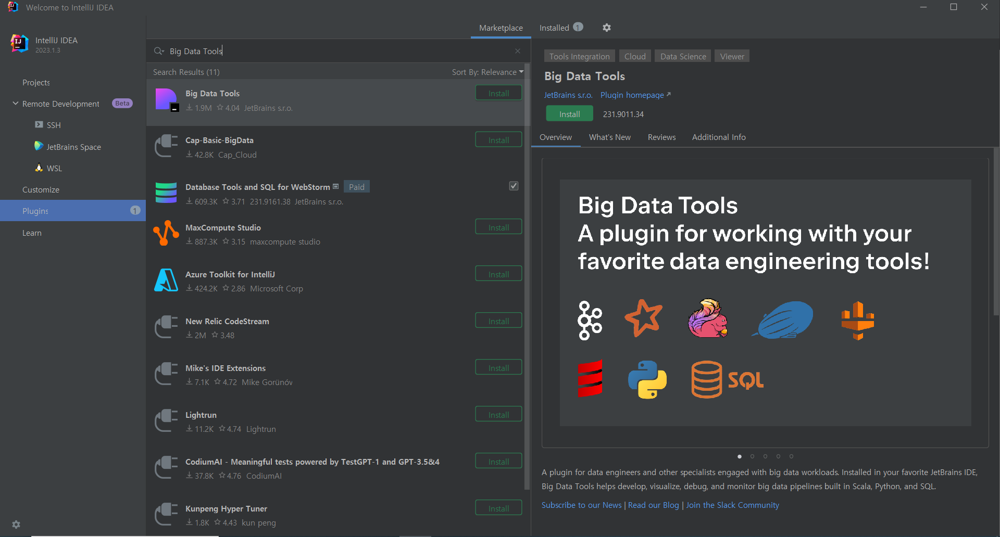
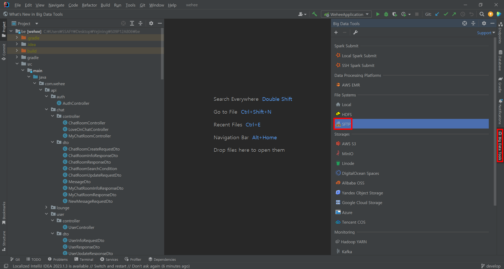
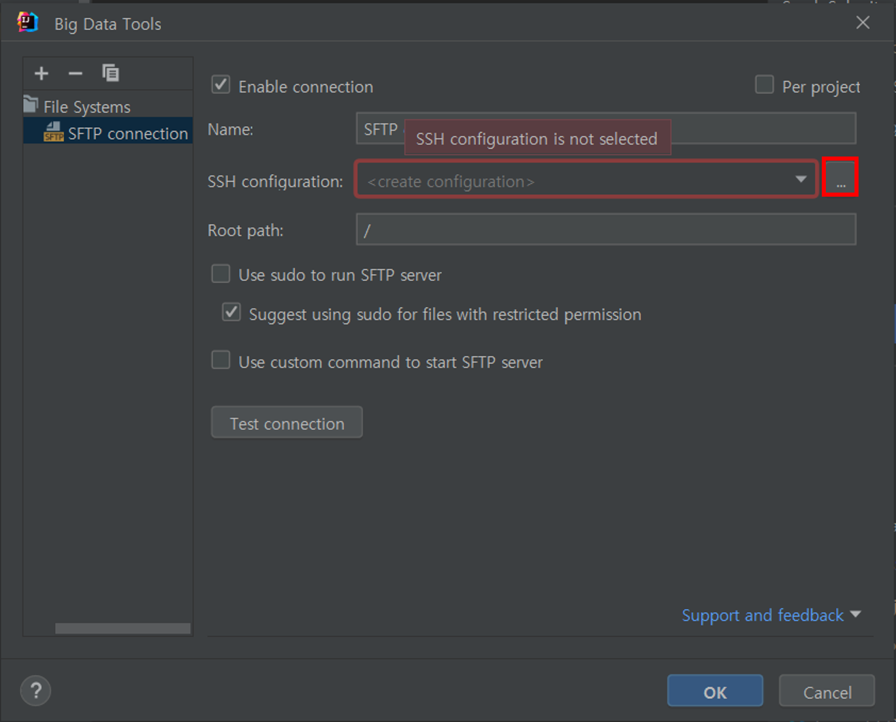
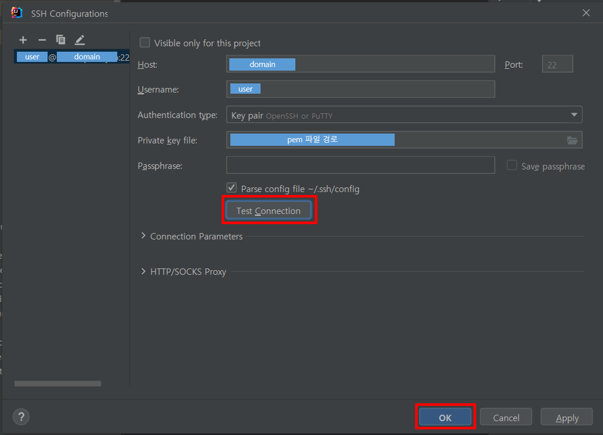
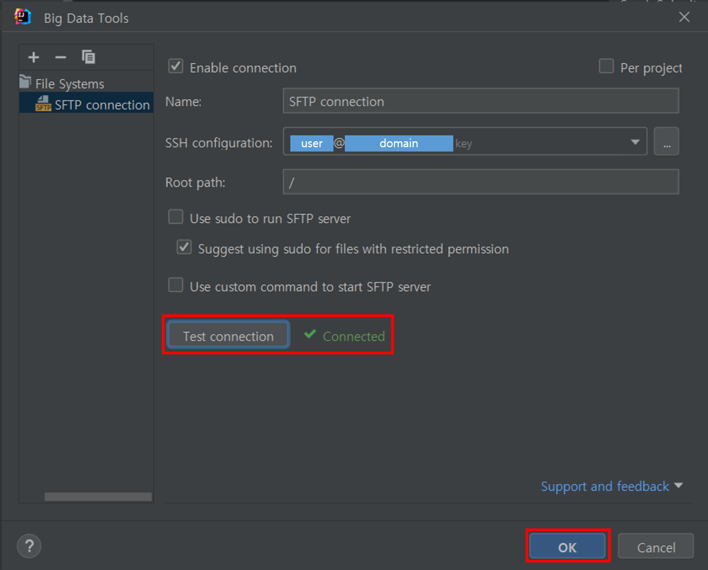
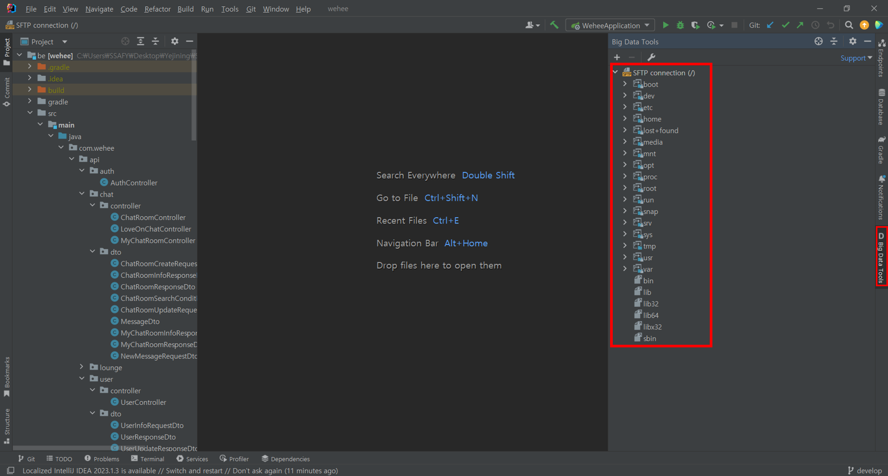

# IntelliJ Big Data Tools로 EC2 접속하기

마지막 접속 날짜: 2023-08-25  
작성자: 김예진

> **목차**
>
> 1. [IntelliJ에 Big Data Tools 설치](#1-intellij에-big-data-tools-설치)
> 2. [SFTP를 이용해 EC2와 연결](#2-sftp를-이용해-ec2와-연결)
>    1. [Big Data Tools에서 SFTP 버튼 클릭](#1-big-data-tools에서-sftp-버튼-클릭)
>    2. [SSH configuration 설정](#2-ssh-configuration-설정)

# 1. IntelliJ에 Big Data Tools 설치

# 2. SFTP를 이용해 EC2와 연결

## 1. Big Data Tools에서 SFTP 버튼 클릭

## 2. SSH configuration 설정

1. `SSH configuration 설정 버튼` 클릭
    
2. EC2 정보 입력
    
    - user 이름 입력: `ubuntu`
    - domain 입력: SSAFY에서 부여한 도메인
3. 테스트 커넥션 확인 후 적용
    
4. 연결 완료
    
