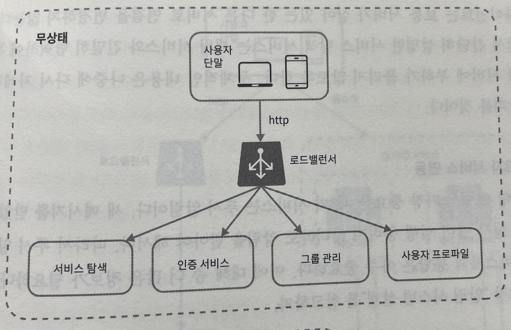
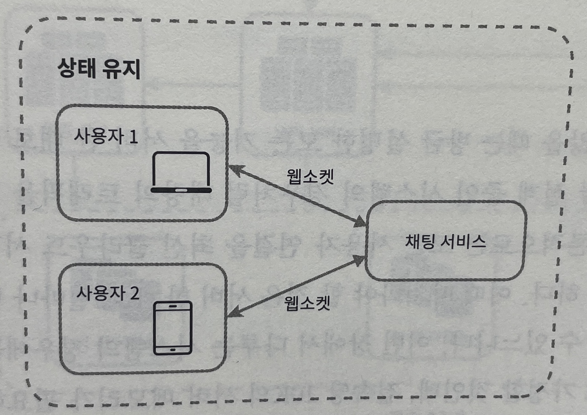

# 상태 서비스와 무상태 서비스

## 1. 무상태 서비스

- 기능
  - 유저(로그인, 회원가입, 사용자 프로파일 표시)
  - 라운지
- 무상태 서비스는 로드밸런서 뒤에 위치
  - 로드밸런서: 요청을 그 경로에 맞는 서비스로 이동시킴

## 2. 상태유지(stateful) 서비스

- 기능
  - 채팅
  - 보이스룸
- 각 클라이언트가 채팅 서버와 독립적인 네트워크 연결 유지