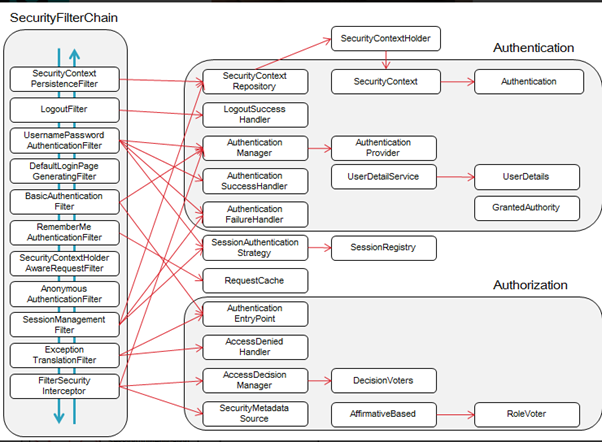
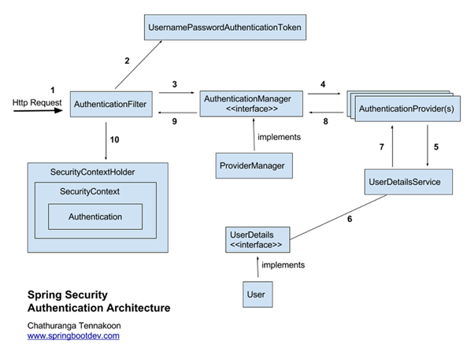

# Spring Security

마지막 업데이트 날짜: 2023-08-04  
작성자: 김예진

> **목차**
>
> 1. [Spring Security](#1-spring-security)
> 2. [Spring Security Filter](#2-spring-security-filter)
>    1. [Spring Filter Chain](#spring-filter-chain)
> 3. [Spring Security 인증 관련 아키텍처](#spring-security-인증-관련-아키텍처)

이 정리는 [참고 자료](#참고-자료)의 내용을 정리한 글입니다.

### 단어 정리

- **인증(Authentication)**: '증명하다'라는 의미. 유저 아이디와 비밀번호를 이용해 로그인 하는 과정을 의미
- **인가(Authorization)**: '권한부여', '허가'의 의미. 어떤 대상이 특정 목적을 실현하도록 허용(Access) 하는 것
- **권한**: 인증된 주체가 애플리케이션의 동작을 수행할 수 있도록 허락되었는지를 결정할 때 사용

# 1. Spring Security

스프링 시큐리티는 스프링 기반 애플리케이션의 보안(인증과 권한)을 담당하는 프레임워크를 의미한다. 스프링 시큐리티는 보안과 관련된 옵션을 지원해주며, 필터 기반으로 동작하기 때문에 스프링 MVC와 분리되어 관리 및 동작한다. 스프링 시큐리티 3.2부터는 XML로 설정하지 않고 자바 config 설정으로 간단하게 설정 가능하다.

# 2. Spring Security Filter

클라이언트(보통 브라우저)가 요청을 보내면 그 요청을 JSP나 Servlet 등이 처리한다. 스프링 MVC에서는 요청을 가장 받는 것이 Dispatcher Servlet인데, Dispatcher Servlet이 요청 받기 전 다양한 필터를 거치게 된다. 필터는 클라이언트와 자원 사이에서 요청과 응답 정보를 이용해 다양한 처리를 하는 역할을 수행한다.  

스프링 시큐리티는 다양한 기능을 가진 필터를 기본적으로 10개 이상 지원하는데, 이 필터들을 Security Filter Chain이라고 한다.

## Spring Filter Chain

- SecurityContextPersistenceFilter : SecurityContextRepository에서 SecurityContext를 가져오거나 저장하는 역할을 한다.
- LogoutFilter : 설정된 로그아웃 URL로 오는 요청을 감시하며, 해당 유저를 로그아웃 처리
- (UsernamePassword) AuthenticationFilter : (아이디와 비밀번호를 사용하는 form 기반 인증) 설정된 로그인 URL로 오는 요청을 감시하며, 유저 인증 처리
  1. AuthenticationManager를 통한 인증 실행
  2. 인증 성공 시, 얻은 Authentication 객체를 SecurityContext에 저장 후 AuthenticationSuccessHandler 실행
  3. 인증 실패 시, AuthenticationFailureHandler 실행
- DefaultLoginPageGeneratingFilter : 인증을 위한 로그인폼 URL을 감시한다.
- BasicAuthenticationFilter : HTTP 기본 인증 헤더를 감시하여 처리한다.
- RequestCacheAwareFilter : 로그인 성공 후, 원래 요청 정보를 재구성하기 위해 사용된다.
- SecurityContextHolderAwareRequestFilter : HttpServletRequestWrapper를 상속한 SecurityContextHolderAwareRequestWapper 클래스로 HttpServletRequest 정보를 감싼다. SecurityContextHolderAwareRequestWrapper 클래스는 필터 체인상의 다음 필터들에게 부가정보를 제공한다.
- AnonymousAuthenticationFilter : 이 필터가 호출되는 시점까지 사용자 정보가 인증되지 않았다면 인증토큰에 사용자가 익명 사용자로 나타난다.
- SessionManagementFilter : 이 필터는 인증된 사용자와 관련된 모든 세션을 추적한다.
-  ExceptionTranslationFilter : 이 필터는 보호된 요청을 처리하는 중에 발생할 수 있는 예외를 위임하거나 전달하는 역할을 한다.
-   FilterSecurityInterceptor : 이 필터는 AccessDecisionManager 로 권한부여 처리를 위임함으로써 접근 제어 결정을 쉽게 해준다.

# 3. Spring Security 인증 관련 아키텍처

1. 클라이언트(유저)가 로그인을 시도합니다.
2. AuthenticationFilter는 AuthenticationManager, AuthenticationProvider(s), UserDetailsService를 통해 DB에서 사용자 정보를 읽어옵니다. 여기서 중요한 것은 UserDetailsService가 인터페이스라는 것입니다. 해당 인터페이스를 구현한 빈(Bean)을 생성하면 스프링 시큐리티는 해당 빈을 사용하게 됩니다. 즉, 어떤 데이터베이스로 부터 읽어들일지 스프링 시큐리티를 이용하는 개발자가 결정할 수 있게 됩니다.
3. UserDetailsService는 로그인한 ID에 해당하는 정보를 DB에서 읽어들여 UserDetails를 구현한 객체로 반환합니다. 프로그래머는 UserDetails를 구현한 객체를 만들어야 할 필요가 있을 수 있습니다. UserDetails정보를 세션에 저장하게 됩니다.
4. 스프링 시큐리티는 인메모리 세션저장소인 SecurityContextHolder 에 UserDetails정보를 저장하게 됩니다.
5. 클라이언트(유저)에게 session ID(JSESSION ID)와 함께 응답을 하게 됩니다.
6. 이후 요청에서는 요청 쿠키에서 JSESSION ID정보를 통해 이미 로그인 정보가 저장되어 있는 지 확인합니다. 이미 저장되어 있고 유효하면 인증 처리를 해주게 됩니다.

---

### 참고 자료

- [boostcourse Spring Security](https://www.boostcourse.org/web326/lecture/58997#:~:text=%EC%8A%A4%ED%94%84%EB%A7%81%20%EC%8B%9C%ED%81%90%EB%A6%AC%ED%8B%B0%EB%8A%94%20%EC%8A%A4%ED%94%84%EB%A7%81%20%EA%B8%B0%EB%B0%98,%EB%A7%8E%EC%9D%80%20%EC%98%B5%EC%85%98%EB%93%A4%EC%9D%84%20%EC%A7%80%EC%9B%90%ED%95%B4%EC%A4%8D%EB%8B%88%EB%8B%A4.)