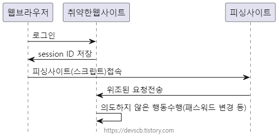
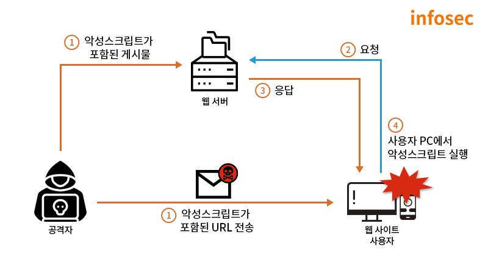

# CSRF

마지막 업데이트 날짜: 2023-08-06  
작성자: 김예진

> **목록**
>
> 1. [CSRF(Cross Site Request Forgery)](#csrfcross-site-request-forgery)
> 2. [동작 조건](#동작-조건)
> 3. [CSRF 공격 순서](#csrf-공격-순서)
> 4. [번외: XSS(Cross-Site Scripting)](#번외-xss-cross-site-scripting)

# CSRF(Cross Site Request Forgery)

- 사이트간 요청 위조
- 웹 보안 취약점의 일종이며, 사용자가 자신의 의지와는 무관하게 의도한 행위(데이터 수정, 삭제, 등록 등)을 특정 웹사이트에 요청하게 하는 공격
- 특성에 따라 공격자가 사용자의 계정에 대한 완전한 권한을 얻을 수도 있음
- 예시
  - 피해자의 전자 메일 주소 변경, 암호 변경, 자금이체 등의 동작 수행 요청

# 동작 조건

CSRF가 성공하려면 아래 3가지 조건을 만족해야 함.

1. 사용자는 보안이 취약한 서버로부터 이미 **로그인이 되어있는 상태**여야 함
2. **쿠키 기반의 서버 세션 정보**를 획득할 수 있어야 함
3. 공격자는 서버를 공격하기 위한 요청 방법에 대해 미리 파악하고 있어야 하고, 예상하지 못한 요청 매개변수가 없어야 함

# CSRF 공격 순서

1. 사용자가 보안이 취약한 서버에 로그인
2. 서버에 저장된 세션 정보를 사용할 수 있는 sessionID가 사용자의 브라우저 쿠키에 저장됨
3. 공격자가 사용자로 하여금 악성 스크립트 페이지를 누르도록 유도
   - 게시판이 있는 웹사이트에 악성 스크립트를 게시글로 작성해 사용자들이 게시글을 클릭하도록 유도
   - 메일 등으로 악성 스크립트를 직접 전달하거나 악성 스크립트가 적힌 페이지 링크를 전달
4. 사용자가 악성 스크립트가 작성된 페이지에 접근 시 웹 브라우저에 의해 쿠키에 저장된 Session ID가 서버로 전송됨
5. 서버는 쿠키에 담긴 session ID를 통해 해당 요청이 인증된 사용자로부터 온 것이라고 판단하고 처리

# 번외: XSS (Cross-Site Scripting)

- 공격자가 입력한 악성 스크립트가 사용자 측에서 응답되는 취약점
- 사용자 입력값에 대한 검증이 미흡하거나 출력시 필터링되지 않을 경우 발생
- 쿠키 값 또는 세션 등 사용자의 정보를 탈취하거나 피싱 사이트로 접근을 유도하는 등 사용자에게 직접적인 피해를 줄 수 있음

---

### 참고 자료

- [CSRF(Cross-Site Request Forgery) 공격과 방어](https://junhyunny.github.io/information/security/spring-boot/spring-security/cross-site-reqeust-forgery/)