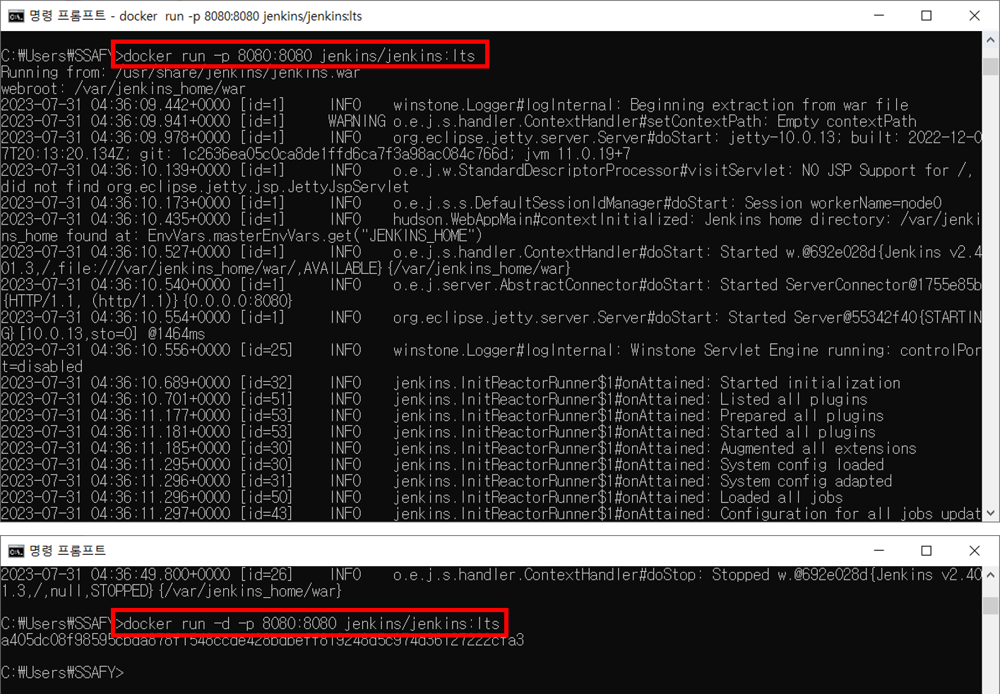
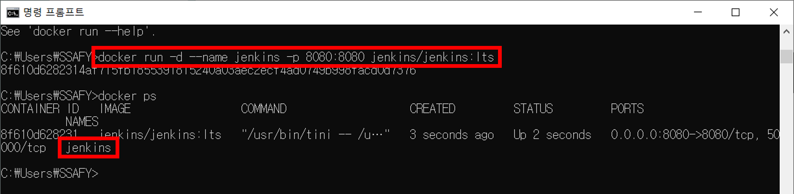
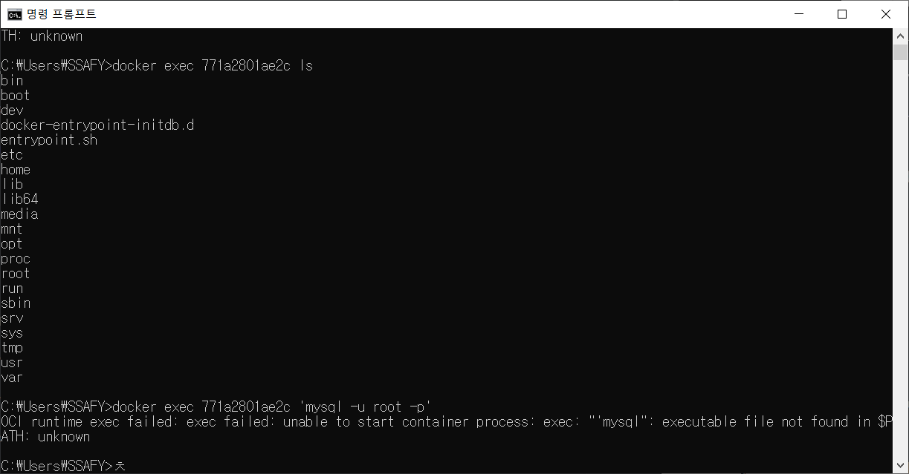
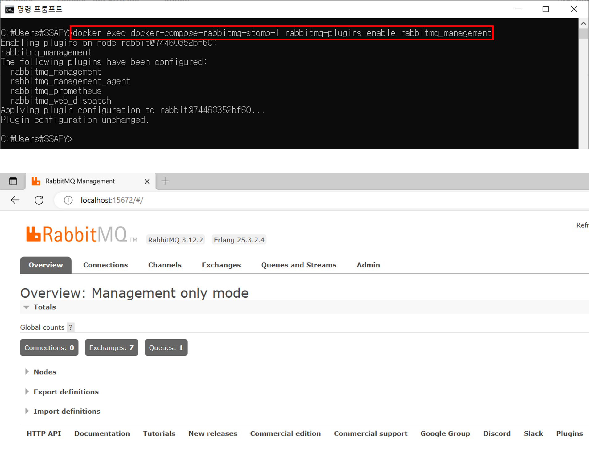
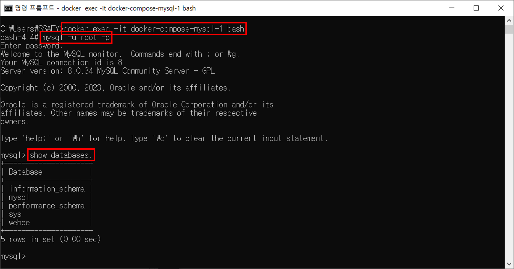

# Docker 학습 내용

마지막 업데이트 날짜: 2023-08-02 <br>
작성자: 김예진

> **목차**
>
> 1. [도커를 사용하는 이유](#도커를-사용하는-이유)
>    1. [WeHee에서 도커를 사용하는 것이 적절한가?](#wehee에서-도커를-사용하는-것이-적절한가)
> 2. [도커](#도커)
>    1. [Docker Hub](#docker-huib)
>    2. [도커 이미지와 컨테이너의 차이](#도커-이미지와-컨테이너의-차이)
> 3. [도커 명령어](#도커-명령어)
>    1. [실행](#실행)
>    2. [도커 이미지 다운받기](#도커-이미지-다운받기)
>    3. [도커 이미지 실행](#도커-이미지-다운받기)
>    4. [실행중인 도커 컨테이너 리스트로 띄우기](#실행중인-도커-컨테이너-리스트로-띄우기)
>    5. [모든 도커 컨테이너 리스트로 띄우기](#모든-도커-컨테이너-리스트로-띄우기)
>    6. [해당 PC에 설치된 모든 이미지 리스트로 띄우기](#해당-pc에-설치된-모든-이미지-리스트로-띄우기)
>    7. [실행중인 컨테이너 삭제하기](#실행중인-컨테이너-삭제하기)
>    8. [해당 PC에서 도커 이미지 삭제하기](#해당-pc에서-도커-이미지-삭제하기)
>    9. [컨테이너 내부에 있는 명령어 실행하기](#컨테이너-내부에-있는-명령어-실행하기)
>    10. [Dockerfile에서 제시하는대로 이미지 만들기](#dockerfile에서-제시하는대로-이미지-만들기)
> 4. [도커 실행 명령어](#도커-실행-명령어)
>    1. [백그라운드에서 도커 실행 → -d](#백그라운드에서-도커-실행---d)
>    2. [컨테이너에 이름 지정 → `--name`](#컨테이너에-이름-지정----name)
>    3. [컨테이너 포트 지정 → `-p`](#컨테이너-포트-지정---p)
>    4. [환경변수 설정 → `-e`](#환경변수-설정---e)
>    5. [볼륨 설정 → `-v`](#볼륨-설정---v)
>    6. [Docker Compose](#docker-compose)
>       1. [`-f` 옵션](#-f-옵션)
> 5. [실행 중인 도커 컨테이너에 명령어 전달하기 `exec`](#실행-중인-도커-컨테이너에-명령어-전다하기-exec)
>    1. [가동 중인 도커 컨테이너에 명령어 전달하기](#1-가동-중인-도커-컨테이너에-명령어-전달하기)
>    2. [`-it` 옵션을 사용해 컨테이너 기능 사용하기](#2--it-옵션을-사용해-컨테이너-기능-사용하기)
> 6. [도커 플러그인](#도커-플러그인)
> 7. [Docker with AWS](#docker-with-aws)
>    1. [How Docker mounts data to EBS?](#how-docker-mounts-data-to-ebs)
>    2. [EC2 EBS에 볼륨을 추가 + 마운트 + 부팅시 자동 마운트 하는 방법](#ec2-ebs에-볼륨을-추가--마운트--부팅시-자동-마운트-하는-방법)

이 문서에서는 [Building Real-Time Apps with Spring, Cassandra, Redis, WebSocket and RabbitMQ](building-real-time-apps.md)와 프로젝트 진행 중 알게 된 docker에 대한 정보를 다룹니다. Docker에 대한 사전적 정의 및 기타 내용은 생략합니다.

# 도커를 사용하는 이유

도커는 어떤 운영 체제이든 라이브러리든 상관 없이 항상 똑같은 상태로 서비스가 실행되는 것을 보장한다는 특징을 가진다. 때문에 서비스 운영 시 달라지는 라이브러리 버전, 환경 등을 일관되게 유지하는 데에 사용된다.

## WeHee에서 도커를 사용하는 것이 적절한가?

### 1. 컨님의 의견

도커는 서비스의 운영을 원활하게 하기 위해 사용하는 것이므로 WeHee 사용에는 적합하지 않다. 

### 2. 나의 생각

개발자가 5명이라고 하더라도 모두 설치하는 (예를 들어) MySQL의 버전이 다를 수 있다. 게다가 Cassandra와 Redis와 같이 일부 도메인에서만 활용할 서비스들도 사용하지 않는 개발자들이 로컬에 설치하면서 개발을 진행하기에는 시간적으로 낭비가 너무 크다. 운영 목적으로만 개발의 효율을 위해서라도 docker-compose 문서를 설치하면 개발 시 서비스 설치와 버전 맞추는 비용을 획기적으로 줄일 수 있다. <br>

DB의 경우 도커 컨테이너를 사용하면 컨테이너가 종료되는 경우 DB에 저장된 내용이 휘발될 수도 있다는 점이 있지만, 이것도 도커 실행 시 volume mount 옵션을 사용하면 EC2에 호스트에 DB를 따로 설치하지 않고도 파일로 DB 내용을 저장할 수 있다.

### 3. 우리 팀에서는 도커를 사용하는가?

업데이트 예정

# 도커

## Docker Hub

[Docker Hub](https://hub.docker.com)은 공식 도커 저장소로, 미리 생성된 도커 이미지를 다운받을 수 있다. Docker Hub에는 MySQl처럼 공식적으로 관리되는 이미지도 있고, 개발자들이 개별적으로 올리는 커스텀 이미지도 있다. <br>

공식적으로 제공되는 도커 이미지의 경우 username을 언급할 필요가 없지만 커스텀 이미지를 실행시키는 경우 다음과 같은 명령어를 사용하면 된다. <br>

```bash
docker run username/image_name:tag
```

## 도커 이미지와 컨테이너의 차이

- 도커 이미지
  - 특정 서비스를 실행시키기 위해 필요한 모든 것을 담은 바이너리 파일
- 도커 컨테이너
  - 도커 이미지를 실행하면 도커 컨테이너가 생성됨
- 도커 이미지와 컨테이너의 관계
  - 자바로 비유하자면 이미지는 클래스, 컨테이너는 객체를 의미함

# 도커 명령어

이 장에서의 도커 명령어는 실행과 관련 없는 명령어들만 표기한다. 실행과 관련된 명령어는 [여기](#도커-실행-명령어)에서 다룬다.

## 실행

```bash
docker run <username>/<image_name>:<tag>
```

공식적으로 서비스되는 이미지인 경우 `username`을 생략한다.

## 도커 이미지 다운받기

```bash
docker pull <image>
```

## 도커 이미지 실행

```bash
docker run <image>
```

## 실행중인 도커 컨테이너 리스트로 띄우기

```bash
docker ps
```

## 모든 도커 컨테이너 리스트로 띄우기

```bash
docker pas -a
```

## 해당 PC에 설치된 모든 이미지 리스트로 띄우기

```bash
docker images
```

## 실행중인 컨테이너 삭제하기

```bash
docker rm <container>
```

## 해당 PC에서 도커 이미지 삭제하기

```bash
docker rmi <image>
```

## 컨테이너 내부에 있는 명령어 실행하기

```bash
docker exec <container>
```

## Dockerfile에서 제시하는대로 이미지 만들기

```bash
docker build
```

# 도커 실행 명령어

이 장에서는 `docker run` 명령어 옵션에 대해 다룬다. 실행 방법을 직관적으로 받아들이게 특정 서비스(jenkins, MySQL 등)를 실행하는 것으로 한다.

## 백그라운드에서 도커 실행 → `-d`

```bash
docker run -d -p 8080:8080 jenkins
```

일반적으로 `docker run jenkins`를 실행하면 도커 창이 jenkins를 실행시키느라고 그 작업에만 매달려 있게 되는데 -d 옵션을 사용하면 jenkins가 백그라운드에서 실행된다. 이때 'd'는 'detach' 혹은 'detached mode'를 의미한다. 도커가 foreground에서 실행될 때는 터미널과 붙어있는 관계지만 -d 옵션을 사용할 때 터미널이 백그라운드에서 돌아가는 도커와 분리되기 때문에 '-b' 옵션이 아니라 '-d' 옵션이 된다.



`-d` 옵션을 적용하기 전과 후의 차이는 그림과 같다.

## 컨테이너에 이름 지정 → `--name`

```bash
docker run -d --name jenkins -p 8080:8080 jenkins/jenkins:lts
```



## 컨테이너 포트 지정 → `-p`

```bash
docker run -d -p <host port>:<container port> jenkins
```

`-p` 태그는 호스트 운영체제와 컨테이너 환경 포트를 매핑하는 역할을 수행한다. 만약 젠킨스 실행을 `docker run -d -p 8080:5000 jenkins` 명령어를 통해 한다면, 호스트 운영체제의 8080 포트가 컨테이너 5000 포트로 포워딩된다.

## 환경변수 설정 → `-e`
```bash
docker run -d --name mysql -e MYSQL_ROOT_PASSWORD=root -p 3306:3306 mysql:5.7
```

암호가 있는 MySQL 컨테이너를 실행한다고 가정할 때, 각 개발자마다 다른 암호를 사용한다고 가정해보면 도커 이미지를 실행시킬 때도 각기 다른 암호를 입력할 필요가 생긴다. 이때 `-e` 옵션을 사용하면 된다. `-e` 태그가 적용하려면 공식 도커 이미지가 어떤 환경 변수를 지원하는지 Docker Hub에서 확인하면 된다.

## 볼륨 설정 → `-v`

```bash
docker run -d -p 80:80 -v <host path>:<mounting point path in container> nginx
```

```bash
docker run -d -p 80:80 -v /some/nginx.conf:etc/nginx/nginx.conf.ro nginx
```

컨테이너의 실행/종료 여부와 상관 없이 컨테이너의 내용을 보존하고 싶은 경우에 볼륨을 마운트하는 옵션을 사용하면 된다. 도커의 볼륨을 마운트하는 경우 디스크에 영구적으로 데이터를 저장하기 때문에 컨테이너가 종료되어도 영구적으로 데이터를 저장할 수 있다. <br>

AWS를 사용하는 경우 Elastic Block Store나 Elastic FIle System을 이용해 볼륨을 마운트할 수 있다. 해당 부분은 다음과 같은 목록을 참고하면 된다.

- https://docs.aws.amazon.com/ko_kr/AmazonECS/latest/bestpracticesguide/storage-dockervolumes.html
- https://yoyostudy.tistory.com/61

Volume을 활용한 Data 관리는 [여기](https://medium.com/dtevangelist/docker-%EA%B8%B0%EB%B3%B8-5-8-volume%EC%9D%84-%ED%99%9C%EC%9A%A9%ED%95%9C-data-%EA%B4%80%EB%A6%AC-9a9ac1db978c)를 참조하면 된다.

## Docker Compose
```bash
docker-compose -f <docker compose yaml file> up
```

여러 컨테이너 설정을 담은 docker compose 파일을 실행시키면 한 번에 여러 개의 컨테이너를 띄울 수 있다.

### `-f` 옵션

Docker Compose는 기본적으로 커맨드가 실행하는 디렉토리에 있는 `docker-compose.yml` 또는 `docker-compose.yaml`를 설정 파일로 사용한다. Docker Compose를 실행하는 위치가 파일이 저장된 위치와 다르거나 위에 있는 파일명과 다른 파일명을 가지고 있다면 `-f` 옵션을 사용해 해당 사실을 명시한다. <br>

```bash
docker-compose -f docker-compose.yml -f docker-compose-test.yml up
```

`-f` 옵션은 여러 개의 설정 파일을 사용할 때도 사용하고, 나중에 나오는 설정이 앞에 나오는 설정보다 우선순위가 높게 작용한다.

# 실행 중인 도커 컨테이너에 명령어 전달하기 `exec`

도커 컨테이너를 이용해 MySQL이나 RabbitMQ 등을 실행하다 보면 종종 데이터베이스나 대시보드에 접근하고 싶은 경우가 발생한다.

## 1. 가동 중인 도커 컨테이너에 명령어 전달하기

```bash 
docker exec <container-id> <명령어>
```



MySQL id를 넣고 뒤에 `ls`, `mysql -u root -p` 등의 명령어를 넣고 실험해본 결과, 일부는 작동하고 일부는 작동하지 않는 현상이 발생했다. 아무래도 컨테이너의 서비스에 명령어를 내리는 게 아니라 컨테이너 파일에 접근 가능한 명령어인 듯 싶다(컨테이너의 쉘에 접근).

### 실습: RabbitMQ

```bash
docker exec <RabbitMQ container name or id> rabbitmq-plugins enable rabbitmq_management
```



## 2. `-it` 옵션을 사용해 컨테이너 기능 사용하기

### `-i` 옵션

>  This stands for "interactive" mode. When you use the `-i` option, it allows you to interact with the command's input. It means that the standard input (STDIN) of the command is kept open, allowing you to provide input to the command if needed. For example, if you are running a shell command inside a container, with `-i`, you can type commands interactively.

`-i` 옵션을 사용하면 명령의 입력과 상호 작용할 수 있으며, 컨테이너 내부에서 쉘 명령을 실행하는 경우 -i를 사용하면 대화식으로 명령을 입력할 수 있다.

```bash
docker exec -i <container_name_or_id> /bin/bash
```

### `-t` 옵션

>  This stands for "tty" (teletype). The `-t` option allocates a pseudo-TTY (terminal) to the command, which enables the command to interact with the terminal-like environment within the container. This option is helpful when the command you are executing expects to be run in a terminal environment, as it simulates a real terminal.

컨테이너 내에서 터미널과 유사한 환경으로 명령을 상호 작용하게 한다.

```bash
docker exec -t <container_name_or_id> ls -l
```

### `-it` 옵션

컨테이너 내에서 인터랙티브한 셸 실행

### 실습: MySQL

```bash
docker exec -it <MySQL container name> bash
```




# 도커 플러그인

Docker 플러그인은 Docker 엔진에 기능을 추가하는 out-of-process 확장이다.

- 참조
  - [Docker Rex-ray 볼륨 드라이버 플러그인 소개](https://blog.ashon.me/194)

# Docker with AWS

## How Docker mounts data to EBS?

Chat-GPT의 답변은 다음과 같다.

> As of my last knowledge update in September 2021, Docker itself does not directly handle the mounting of data to Amazon Elastic Block Store (EBS) volumes. Instead, it relies on the underlying infrastructure and the host operating system to manage the EBS volumes and mount them as needed.
>
> When using Docker with Amazon Web Services (AWS), you can leverage the native AWS features to mount EBS volumes to your Docker containers. Here's an overview of the typical process:
>
> 1. **Create an EBS Volume**: First, you create an Amazon EBS volume using the AWS Management Console, AWS CLI, or SDKs. This EBS volume acts as a persistent block storage device.
>
> 2. **Attach the EBS Volume to EC2 Instance**: After creating the EBS volume, you attach it to an Amazon EC2 instance that is running Docker. This can be done using the AWS Management Console, AWS CLI, or SDKs.
>
> 3. **Mount the EBS Volume on the EC2 Instance**: Once the EBS volume is attached to the EC2 instance, you can mount it to a specific directory on the instance, just like you would mount any other block storage device on a typical Linux-based system. You can use the `mount` command to mount the EBS volume to a chosen directory.
>
> 4. **Run Docker Containers with Bind Mounts**: With the EBS volume mounted on the EC2 instance, you can use Docker's bind mount feature to mount directories from the EC2 instance to specific directories within the Docker containers. This allows data to be shared between the host instance and the containers.
>
> Here's an example of running a Docker container with a bind mount to an EBS volume:
>
> ```bash
> # Assuming the EBS volume is mounted at /data/ebs_volume
> docker run -d -v /data/ebs_volume:/app/data my_docker_image
> ```
>
> In this example, the `/data/ebs_volume` directory on the EC2 instance is mounted into the `/app/data` directory inside the Docker container. Any data written to `/app/data` within the container will be stored on the EBS volume on the EC2 instance, ensuring data persistence.
>
> It's essential to note that the steps and commands mentioned here are generalized, and the actual implementation may vary based on your specific AWS setup and Docker configuration. Always refer to the official AWS documentation and Docker documentation for the most up-to-date and accurate information. Additionally, newer versions of Docker or AWS services may introduce changes or new features related to data mounting, so it's good practice to stay updated with the latest developments.

## EC2 EBS에 볼륨을 추가 + 마운트 + 부팅시 자동 마운트 하는 방법

[여기](https://yoyostudy.tistory.com/61)를 참조하세요.

