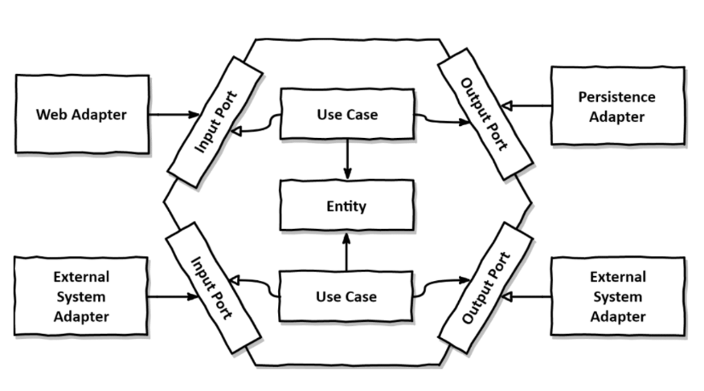
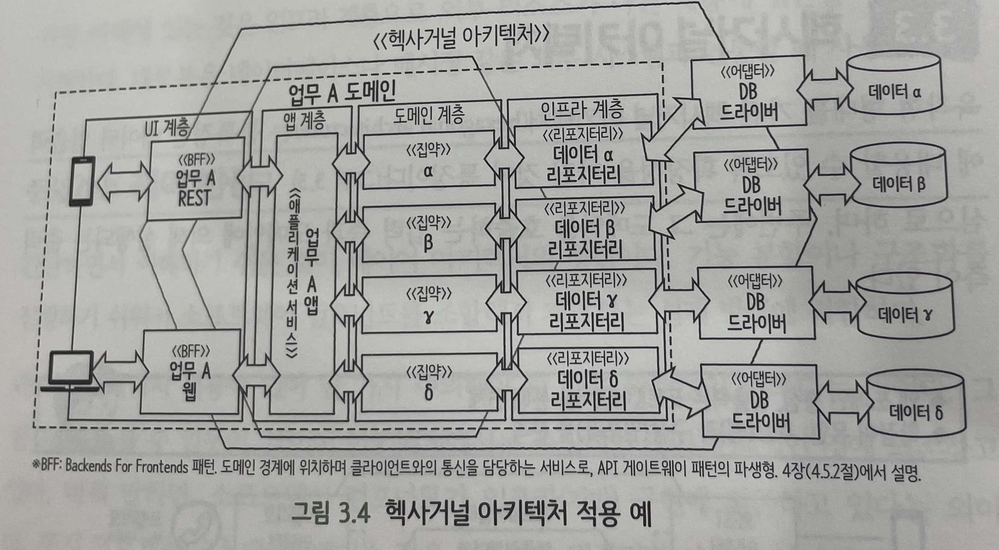

# Hexagonal Architecture

> **목차**
>
> 1. [Hexagonal Architecture](#1. Hexagonal Architecture)
>    1. [간단한 설명](#간단한 설명)
>    2. [구현 적용](#구현 적용)
> 2. [컨설팅 & 회의](#2. 컨설팅 & 회의)
>    1. [물어볼 내용](#물어볼 내용)
>    1. [컨설팅 결과](#컨설팅 결과)
>    1. [팀 내 결정사항](#팀 내 결정사항)

# 1. Hexagonal Architecture

## 간단한 설명

- Hexagonal Architecture(HA)는 불특정한 데이터 입출력에 대응할 수 있도록 확장성을 가진 것이 특징임. 도메인을 중심으로 하며, 주변에는 그 도메인을 호출하는 입력 측과 도메인에 의해 실행되는 출력측이 있음
- HA의 가능성의 근원은 외부 입출력과 도메인 사이에 위치하는 '포트&어댑터'에 있음
  - Port & Adapter 구조를 활용하면 외부 기능에 의존하지 않는 비즈니스 로직을 설계 및 구현할 수 있으며, 외부 기능을 쉽게 교체할 수 있어서 확장성을 챙기기에도 용이함
- Adapter
  - 외부 기능과 상호 작용하는 역할 수행, 외부 기능 단위로 교체할 수 있음
  - REST용 어댑터나 A사 데이터베이스용 어댑터 등을 개발적으로 구현 및 제공할 수 있음
- Port
  - 추상화된 프로그래밍 인터페이스를 도메인에 제공하는 역할 수행
  - 포트를 사용해 외부 기능에 접근하는 코드를 도메인 내에 구현하면 외부 기능을 변경해도 도메인은 영향을 받지 않음

## 구현 적용

- HA 구현한 GitHub 레포
  - https://github.com/thombergs/buckpal

- 각 도메인(인증, 게시판, 채팅)별로 도메인 계층/인프라 계층을 분리 설계/개발하는 방식으로 HA를 적용해보면 어떨지?
  - 예) 게시판에서는 RDB 사용, 채팅에서는 NoSQL 사용 등
  - 각 서비스 내부에서 통신이 필요한 경우 어떤 방식을 택할지(웹소켓/메시지 큐/gRPC 등) 정해야 함
- HA 도입 장점
  - 각 도메인별로 편하게 개발 가능, 기능 확장/축소에 용이
- HA 도입 리스크
  - 개발 경험 부족에 의한 여러 가지 문제 발생 가능성, BUT 내부에서 통신하는 방법, 배포 문제만 해결되면 괜찮을지도?

# 2. 컨설팅 & 회의

## 물어볼 내용

- MSA의 철학에 따라 각 기능별로 코드를 따로 짠다면 각 도메인별 통신은 주로 어떻게 하는지?
  - 메시지 큐/gRPC/웹소켓/REST API 등을 이용하는지?
  - 만약 의존관계가 생긴다면 DB 동기화 과정은 어떻게 신경써야 하는지?
  - 게시판은 RDB, 채팅은 NoSQL을 쓰는게 기술적으로 가능할지?

## 컨설팅 결과

공부를 먼저 하고 나중에 적용 여부를 결정하는 것은 낭비일 수 있다. 만약 공부를 하고 나서 도입을 하지 않게 된다고 하면, 시간이 부족해진다는 리스크가 있고 언제 플랜 B가 나온다는 보장이 없어 위험하다. 공부를 할 것이면 죽이 되든 밥이 되든 한다는 마음으로 하는 것이 좋은데, 새로운 기술에 도전하고 실패한다고 하더라도 이야기를 만들어냈다는 것 만으로도 시도해볼 가치가 있다. 하는 것은 권장하지만, 처음 들어보는 설계이기 때문에 도움을 많이 주지 못할 수도 있다.

## 팀 내 결정사항

Hexagonal Architecture에 대한 러닝 커브가 길고, 컨설턴트님이나 코치님한테 피드백을 받기도 불리해서 Layered Architecture로 가기로 했다. 이제 남게된 팀원들 중에서는 Layred Architecture에 대한 경험이 있는 사람이 아무도 없게 되어버렸으니, 이번 기회에 Layered Architecture를 쓰면서 이 구조 자체에 어떤 장단점이 있는지 알아봐야겠다고 생각했다. 다음 프로젝트에는 port와 adapter에 대한 개념을 더 확실히 하고, Hexagonal Architecture를 도입하거나 아니면 아예 이런 설계를 사용했다고 말하는 회사에 지원을 하거나.

