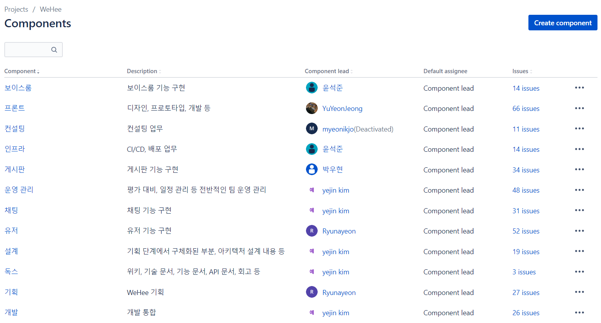
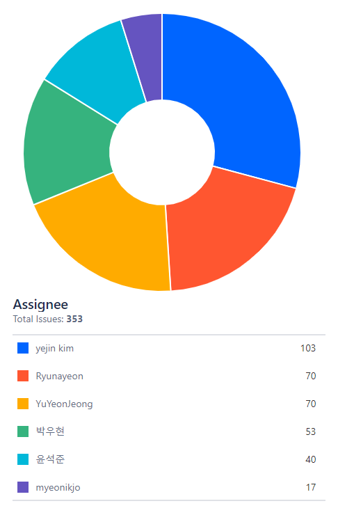

# 세미나

마지막 업데이트 날짜: 2023-08-23  
작성자: 김예진

> **목차**
>
> 1. [세미나를 하게 된 이유](#세미나를-하게-된-이유)
> 2. [Jira 세미나 설명 및 후기](#jira-세미나-설명-및-후기)
>    1. [Jira 세미나 진행 배경](#jira-세미나-진행-배경)
>    1. [세미나 진행 방식](#세미나-진행-방식)
>    1. [Jira 세미나 결과](#jira-세미나-결과)
> 3. [How to Run 세미나 배경](#how-to-run-세미나-배경)
> 4. [백엔드 개발자의 API 만들기 세미나 설명 및 후기](#백엔드-개발자의-api-만들기-세미나-설명-및-후기)
>    1. [세미나 진행 배경](#세미나-진행-배경)
>    2. [API 만들기 세미나 이후](#api-만들기-세미나-이후)

## 링크 바로 가기

> 1. [Jira 컨벤션 및 세미나](../conventions/jira/jira-conventions-seminar.md)
> 2. [How to Run](how-to-run.md)
> 3. [백엔드 개발자의 API 만들기](how-to-make-api-in-spring-boot.md)
> 4. [컨설팅](consulting/README.md)
>    1. [2주차 컨설팅 보고](consulting/week2-consulting.md)
>    2. [3주차 컨설팅 보고](consulting/week3-consulting.md)

# 세미나를 하게 된 이유

프로젝트를 진행하다 보면 팀원 전체가 새로운 것을 도입하거나, 설정을 통일하거나, 혹은 모두가 합의해야 할 사항이 생기는 경우가 발생하고는 합니다. WeHee 팀에서는 Jira를 팀프로젝트 내에서 처음 도입할 때, 개발 중 모두가 환경을 맞출 때, 프론트엔드와 백엔드가 서로의 기능을 연결하려고 할 때 위와 같은 상황이 발생했습니다. 모두가 쉽고 빠르게 공통의 합의를 도출해내기 위해 저희 팀에서는 세미나를 열어 정책을 통일했습니다.

# Jira 세미나 설명 및 후기

## Jira 세미나 진행 배경

프로젝트를 진행하는 초기 단계에서 WeHee 팀은 Jira를 프로젝트 운영에 도입하기로 했습니다. Jira 이슈를 이용해 프로젝트를 관리하기 위해 당시에 필요한 작업은 다음과 같았습니다.

1. 이슈 관리에 대한 정책 확립
2. Jira 기능 파악
3. Jira 기능에 익숙해지기

기획부터 개발을 위한 공부, 계획 수립까지 동시에 진행해야 했던 프로젝트 초기 특성 상, Jira를 담당하게 될 사람이 정책을 만들고 앞으로 사용할 Jira의 기능들을 한 번에 알리는 시간을 가지기로 했습니다.

## 세미나 진행 방식

Jira 세미나는 Google Meet를 이용해 [세미나 문서](../conventions/jira/jira-conventions-seminar.md) 화면을 공유하고, 앞으로 사용할 기능들과 정책들을 소개하는 시간을 가장 먼저 가졌습니다. 이후 Jira에서 이슈를 직접 생성하고, 이슈를 GitLab 브랜치와 연결해보는 실습 시간을 가지면서 팀원 모두가 Jira에 익숙해지는 시간을 가졌습니다.

## Jira 세미나 결과

WeHee 팀에서는 업무 단위별로 components를 만들어 프로젝트를 관리했습니다. 팀원 6명 모두 적어도 한 개의 component를 담당하게 업무를 배치했고, 이슈 생성 시 업무 특성에 맞는 component를 배정해 업무를 관리했습니다.

팀을 관리하면서 취업으로 팀을 나가신 분을 제외하면 WeHee 팀에서는 1인당 평균 약 67개의 이슈를 발행하고 관리했습니다.

# How to Run 세미나 배경

How to Run 세미나는 프로젝트 6주차인 2023년 8월 8일에 진행했습니다. 당시 프론트엔드 개발자 1명, 백엔드 개발자 3명, 기획자 1명이 각자의 환경에서 작업하는 중이었고, 코드를 병합하면서 여러가지 환경 변수, 세팅 등을 통합해야 하는 상황이 발생했습니다.

How to Run 세미나에서는 프론트 환경, 백엔드 환경을 통일하고, 외부 개발 툴(DB, 메시지 브로커) 개발을 위한 도커 실행을 어떻게 하는지 알려주는 형태로 진행되었습니다. 이후 이 문서는 WeHee 프로젝트가 마무리된 후 포팅 매뉴얼 문서를 작성하는 데에도 활용되었습니다.

# 백엔드 개발자의 API 만들기 세미나 설명 및 후기

## 세미나 진행 배경

API 개발 세미나는 How to Run 세미나와 같은 날에 진행되었습니다. 당시 상황을 정리해보면 다음과 같습니다.

1. 팀 내에 개발 경험이 있는 개발자가 거의 없음
2. 전체 개발자 4명 중 프론트엔드 개발자가 1명이어서 프론트엔드 개발자의 부담이 큰 상황
3. 프로젝트 마감이 1주 남은 상황에서 백엔드-프론트 간 연동을 위한 시간이 충분히 마련되어 있지 않음
4. 개발 진척에 대한 공유가 원활하게 되지 않아 프로젝트 전체 스케줄링이 어려움

위와 같은 문제로 단순히 `어떻게 백엔드에서 API를 만들까`를 고민하는 대신, `개발자 간 소통과 프로젝트 관리 기법을 활용한 개발 방법론`을 큰 주제로 잡고 API를 어떻게 만들어갈지에 대한 세미나를 주최하게 되었습니다.

## API 만들기 세미나 이후

API 개발 세미나에서는 크게 3가지 내용을 다루었습니다.

1. 프론트엔드 개발자와 소통하는 방법
2. 다른 개발자, 기획자와 소통하는 방법
3. API를 만드는 방법

다른 개발자와 업무 일정을 조율하고, 소통하고, 어떤 정보가 오갈지에 대한 세미나의 내용을 바탕으로, 전보다 훨씬 더 빠른 속도로 프론트-백엔드 간 기능 연결을 수행할 수 있었습니다.
