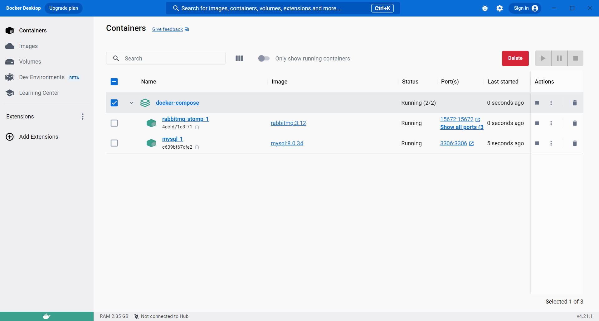
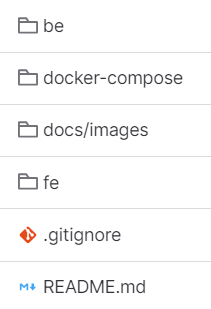
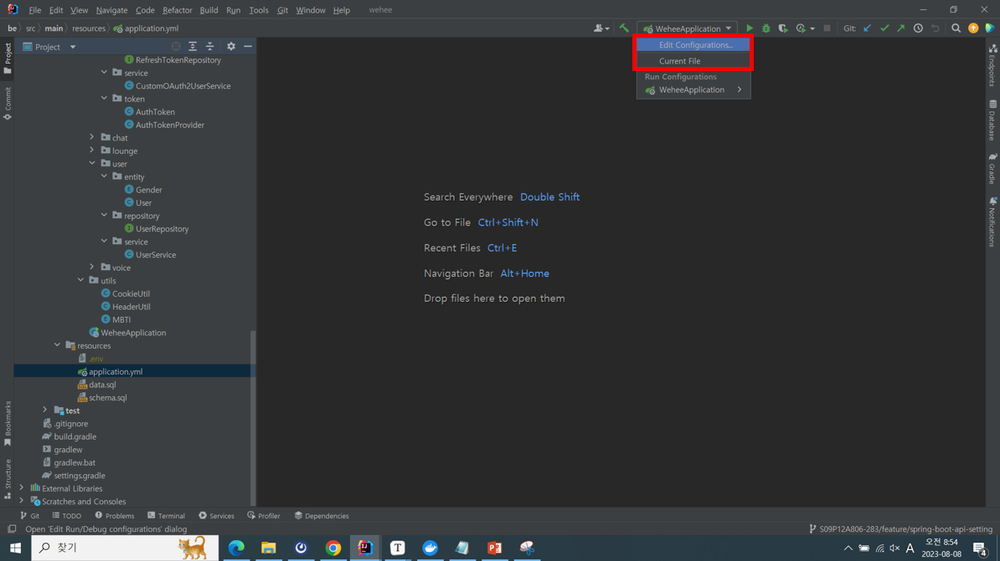
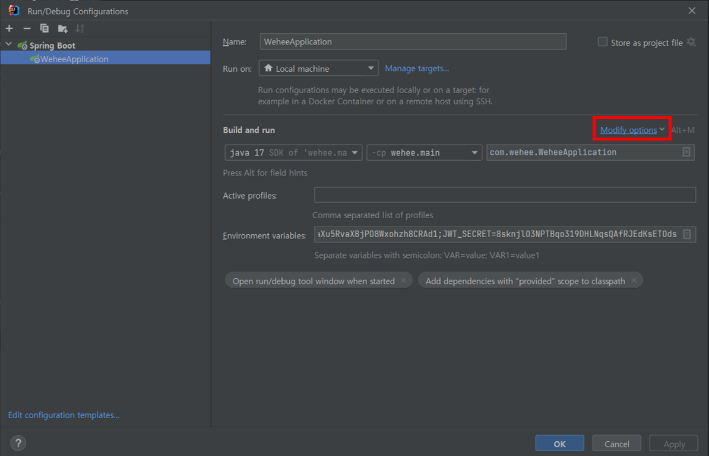
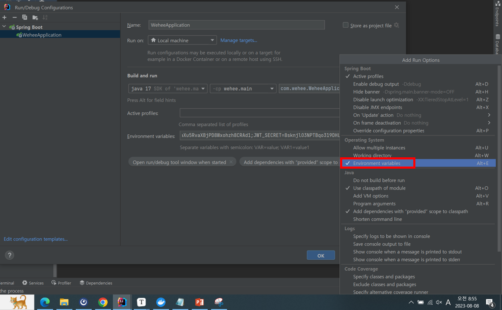
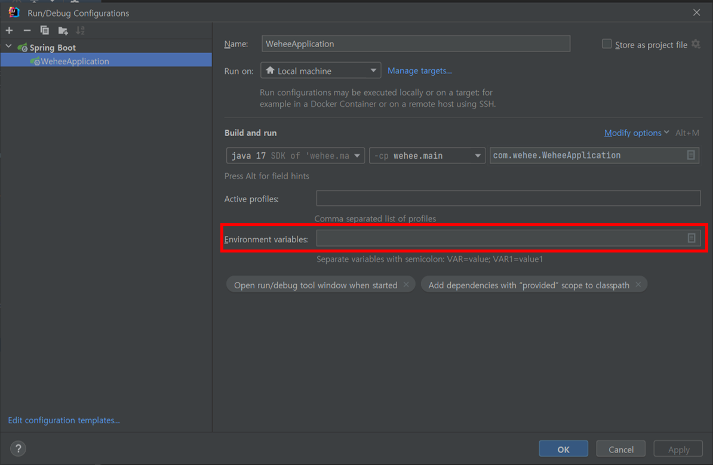
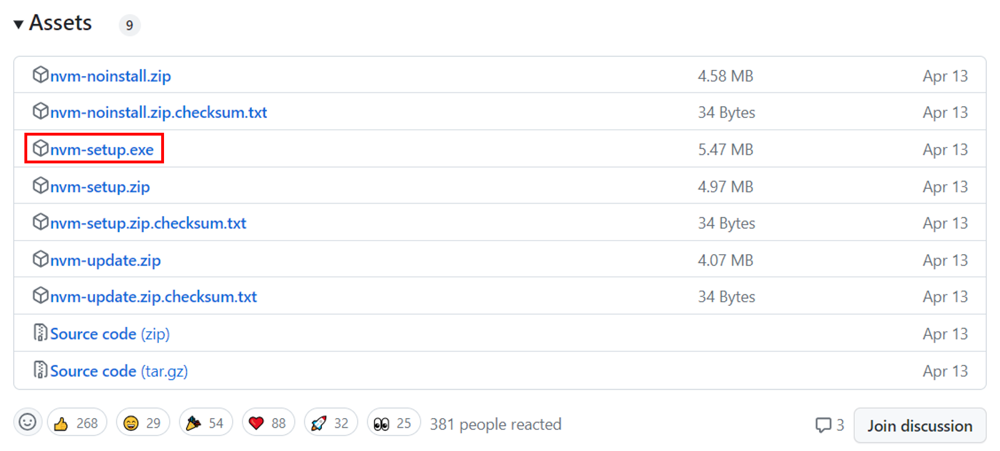
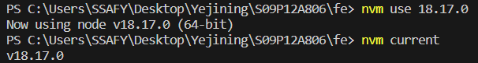
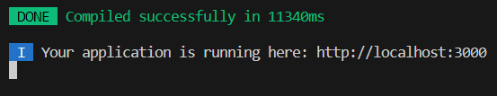

# How to Run

마지막 업데이트 날짜: 2023-08-08 <br>
작성자: 김예진

> **목차**
>
> 1. [도커](#1-도커)
>    1. [도커 설치](#1-1-도커-설치)
>    2. [도커 실행](#1-2-도커-실행)
> 2. [Backend](#2-backend)
>    1. [IntelliJ에서 환경 변수 등록하기](#2-1-intellij에서-환경-변수-등록하기)
> 3. [Frontend](#3-frontend)
>    1. [NVM (Node Version Manager) 설치](#3-1-nvm-node-version-manager-설치)
>    2. [NVM 실행 후 Node.js 설치하기](#3-2-nvm-실행-후-nodejs-설치하기)
>    3. [프로젝트에 필요한 패키지 설치하기](#3-3-프로젝트에-필요한-패키지-설치하기)
>    4. [프로젝트 실행하기](#3-4-프로젝트-실행하기)

# 1. 도커

> **To Do 요약**
>
> 1. 도커 설치
> 2. `.env` 파일 받기
> 3. `docker-compose -f dependencies.yml up -d` 실행

Spring Boot 프로젝트는 각종 데이터베이스와 메시지 브로커 등과 연동되어 실행됩니다. 이때 사용하는 DB, 메시지 브로커 등을 로컬이나 클라우드 위에 직접 설치해서 사용할 수도 있지만, 도커 컨테이너를 생성해 관리하는 것이 가장 간편합니다. 이 장에서는 윈도우 환경에 도커를 설치하고 실행하는 방법을 안내합니다. 도커에 대해 더 알고싶다면 [WeHee Docker 문서](../research/infra/docker.md)를 참조해주세요.

## 1-1. 도커 설치

[Docker Desktop](https://www.docker.com/products/docker-desktop/)에 들어가 윈도우용 도커를 설치합니다. 도커를 설치하고 실행하려면 WSL을 설정해야 하는데, 그 설정은 [여기](https://velog.io/@hanjuli94/%EC%9C%88%EB%8F%84%EC%9A%B0%EC%97%90%EC%84%9C-%EB%8F%84%EC%BB%A4-%EC%8B%A4%EC%8A%B5%ED%95%98%EA%B8%B0)를 참조해서 하시면 됩니다.



도커 설치를 완료하면 다음과 같은 화면이 나옵니다. 저 위 사진상으로는 docker-compose 밑에 RabbitMQ와 MySQL이 컨테이너로 실행되고 있네요. WeHee에서는 앞으로 Cassandra와 Redis가 추가적으로 컨테이너로 올라갈 예정입니다.

## 1-2. 도커 실행



위의 폴더 구조는 WeHee 프로젝트의 폴더 구조입니다. 여기에서 도커에 대한 모든 정보는 `docker-compose` 내부의 `dependencies`안에 들어가게 됩니다.

```yml
version: '3.8'
services:
  mysql:
    image: "mysql:8.0.34"
    restart: always
    ports:
      - "3306:3306"
    environment:
      MYSQL_USER: "${MYSQL_USER}"
      MYSQL_PASSWORD: "${MYSQL_PASSWORD}"
      MYSQL_DATABASE: "${MYSQL_DATABASE}"
      MYSQL_ROOT_PASSWORD: "${MYSQL_ROOT_PASSWORD}"
      TZ: Asia/Seoul
    command:
      - --character-set-server=utf8mb4
      - --collation-server=utf8mb4_unicode_ci
    volumes:
      - ./mysql-init-files/:/docker-entrypoint-initdb.d/
      - ./mysql/data:/var/lib/mysql
  rabbitmq-stomp:
    image: "rabbitmq:3.12"
    ports:
      - "5672:5672"
      - "15672:15672"
      - "61613:61613"
```


 2023-808-08 기준으로 `dependencies.yml`은 다음과 같이 구성되어 있습니다. DB 사용자의 이름과 암호, DB 이름 등의 민감한 정보가 모두 환경변수로 관리되고 있는 것을 보실 수 있습니다. 나중에 이 `docker-compose/dependencies.yml` 파일을 실행할 때 이 환경변수를 모두 등록해주어야 하는데요, yml 파일이 있는 위치에 `.env` 파일을 추가하면 됩니다. 이 `.env` 파일은 저에게 요청하시면 MM으로 따로 드리겠습니다.

```bash
docker-compose -f dependencies.yml up -d
```

드디어 실행 파트입니다. `dependencies.yml`이 위치한 폴더로 이동해 아무 bash나 실행시킨 후 다음의 명령어를 입력하시면 됩니다.

# 2. Backend

> **요약**
>
> 1. 환경 변수 문자열 받기
> 2. IntelliJ에 환경 변수 등록

```yml
# application.yml
spring:
  datasource:
    url: ${DB_URL}
    username: ${DB_USERNAME}
    password: ${DB_PASSWORD}
  security:
    oauth2.client:
      registration:
        google:
          clientId: ${GOOGLE_CLIENT_ID}
          clientSecret: ${GOOGLE_CLIENT_SECRET}
        naver:
          clientId: ${NAVER_CLIENT_ID}
          clientSecret: ${NAVER_CLIENT_SECRET}
        kakao:
          clientId: ${KAKAO_CLIENT_ID}
          clientSecret: ${KAKAO_CLIENT_SECRET}

```

Spring Boot 프로젝트를 실행할 때 `application.yml`에서는 여러 가지 환경변수들을 관리할 수 있습니다. 이때 외부에 드러내기 민감한 정보들은 다음과 같이 변수로 보호해주는데요, 프로젝트 실행 시에는 어떻게든 이 환경 변수를 시스템에게 알려주어야 합니다.

## 2-1. IntelliJ에서 환경 변수 등록하기



IntelliJ를 실행하면 우측 상단에 있는 Configuration 버튼을 클릭하고 `Edit Configurations...`를 선택해줍니다.



환경 변수를 입력하기 위한 선택을 위해 `Modify options`를 클릭합니다.



`Environment variables`를 선택합니다.



이제 환경 변수를 등록할 수 있습니다. 여기에 환경변수를 등록합니다. 등록될 정보는 저에게 MM 해주시면 바로 보내드리겠습니다.

# 3. Frontend

React를 실행하기 위해서는 Node.js가 설치되어 있어야 합니다. 로컬에 바로 Node.js를 설치하는 방법도 있지만 각 프로젝트마다 버전이 달라지기 때문에 여러 Node.js 버전들을 쉽게 다운받고 사용하게 해주는 nvm을 설치하면 더욱 좋습니다.

> **요약**
>
> 1. Node.js 버전 관리를 위한 NVM 설치
> 2. Frontend 프로젝트 실행을 위한 패키지 설치
> 3. 프로젝트 실행

## 3-1. NVM (Node Version Manager) 설치

1. [nvm-windows 레포](https://github.com/coreybutler/nvm-windows/releases)로 이동합니다.
2. 스크롤을 내리다보면 `nvm-setup.exe`를 다운받는 곳이 나옵니다. 해당 파일을 다운로드 받습니다.
   
3. 다운받은 `nvm-setup.exe`를 실행해 NVM을 설치합니다.

## 3-2. NVM 실행 후 Node.js 설치하기

1. 관리자 권한으로 PowerShell 혹은 CMD를 실행합니다.
2. `vnm install 18.17.0`을 실행해 Node.js 18.17.0 버전을 다운로드 받습니다.
3. `nvm use 18.17.0`을 실행해 사용할 Node.js 버전을 18.17.0로 설정합니다.
4. `nvm current`명령어를 이용해 Node.js 버전이 잘 설정되었는지 확인합니다.
   

## 3-3. 프로젝트에 필요한 패키지 설치하기

### npm 설치하기

```bash
npm install
```

Node.js 버전을 18.17.0으로 설정했다면 Frontend 프로젝트가 있는 폴더로 이동한 후 위와 같은 명령어로 프로젝트 실행을 위한 패키지를 설치합니다.

## 3-4. 프로젝트 실행하기

```bash
npm start
```

### 프로젝트 실행 성공 화면

